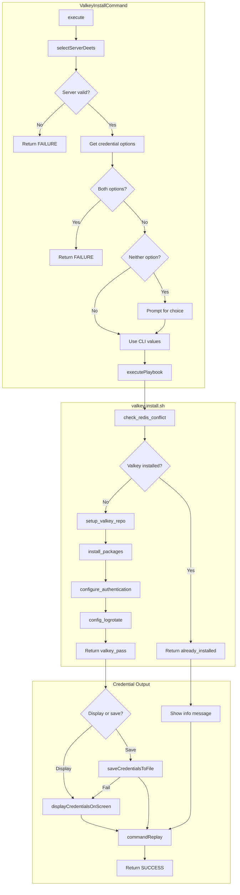

# Schematic: ValkeyInstallCommand.php

> Auto-generated schematic. Last updated: 2025-12-21

## Overview

Installs Valkey server on a remote server via SSH playbook execution. Handles credential output preference (display on screen or save to file) and returns generated credentials after fresh installation.

## Logic Flow

### Entry Points

| Method | Access | Description |
|--------|--------|-------------|
| `execute()` | protected | Main command entry point |

### Execution Flow

1. **Display header** - Output "Install Valkey" heading
2. **Select server** - Use `selectServerDeets()` trait method to get server with info
3. **Collect credential output preference** - Determine how to handle credentials:
   - Get `--display-credentials` boolean flag
   - Get `--save-credentials` path option
   - Check for mutual exclusion conflict
   - If neither provided, prompt user to choose display or save (with path prompt)
4. **Execute playbook** - Run `valkey-install` playbook via SSH
5. **Handle credentials** - If fresh install (not already_installed):
   - Validate credentials were returned
   - Display on screen or save to file based on preference
   - Fallback to display if file save fails
6. **Command replay** - Output non-interactive equivalent command

### Decision Points

| Line | Condition | True Path | False Path |
|------|-----------|-----------|------------|
| 56 | `is_int($server) \|\| null === $server->info` | Return FAILURE | Continue |
| 69 | Both `--display-credentials` and `--save-credentials` provided | Return FAILURE (conflict) | Continue |
| 75 | Neither credential option provided | Show interactive prompt | Use CLI values |
| 108 | `is_int($result)` | Return playbook failure | Continue |
| 116 | `!($result['already_installed'] ?? false)` | Process credentials | Show "already installed" |
| 119 | Credentials null or empty | Return FAILURE | Continue |
| 128 | `$displayCredentials` | Display on screen | Save to file |

### Exit Conditions

| Condition | Return | Output |
|-----------|--------|--------|
| Server selection fails | FAILURE | Trait handles error |
| Conflicting credential options | FAILURE | "Cannot use both..." |
| Playbook execution fails | FAILURE | Playbook error |
| Missing credentials after install | FAILURE | "credentials were not returned" |
| Already installed | SUCCESS | Info message |
| Fresh install completed | SUCCESS | Credentials displayed/saved |

## Interaction Diagram

## Dependencies

### Direct Imports

| File/Class | Usage |
|------------|-------|
| `BaseCommand` | Parent class providing command infrastructure |
| `PathOperationsTrait` | Provides `validatePathInput()` for credential file path validation |
| `PlaybooksTrait` | Provides `executePlaybook()` for remote script execution |
| `ServersTrait` | Provides `selectServerDeets()` for server selection with info |
| `AsCommand` | Symfony attribute for command registration |
| `Command` | Symfony constants (SUCCESS, FAILURE) |
| `InputInterface` | Symfony input handling |
| `InputOption` | Symfony option definition constants |
| `OutputInterface` | Symfony output handling |

### Coupled Files

| File | Coupling Type | Description |
|------|---------------|-------------|
| `playbooks/valkey-install.sh` | Playbook | Remote installation script executed via SSH |
| `app/Traits/ServersTrait.php` | Trait | Server selection and validation |
| `app/Traits/PlaybooksTrait.php` | Trait | Playbook execution via SshService |
| `app/Traits/PathOperationsTrait.php` | Trait | Path validation for credential save location |
| `app/Services/IoService.php` | Service | User prompts and validated option handling |

## Data Flow

### Inputs

| Source | Data | Type |
|--------|------|------|
| CLI Option | `--server` | Server name string |
| CLI Option | `--display-credentials` | Boolean flag |
| CLI Option | `--save-credentials` | File path string |
| Interactive | Credential output preference | Choice (display/save) |
| Interactive | Save path | File path string |

### Outputs

| Destination | Data | Format |
|-------------|------|--------|
| Console | Valkey password and connection string | Formatted text |
| File | Credentials with comments | ENV-style file (0600 perms) |
| Console | Command replay | Non-interactive command string |

### Side Effects

| Effect | Description |
|--------|-------------|
| Remote: Valkey installed | valkey-server package installed on target server |
| Remote: Authentication configured | Password set in `/etc/valkey/valkey.conf` |
| Remote: Logrotate configured | `/etc/logrotate.d/valkey-deployer` created |
| Local: Credential file created | If `--save-credentials` used, file with 0600 perms |

## Notes

- The command uses the same credential validation pattern as MySQL/MariaDB/PostgreSQL install commands
- Credential path validation uses `PathOperationsTrait::validatePathInput()` during the interactive prompt
- Conflict checking (both options provided) happens before the interactive fallback, matching other install commands
- The playbook checks for Redis conflict since both use port 6379
- Connection string uses `redis://` protocol since Valkey is Redis-compatible
- File save includes try-catch with display fallback if write fails
