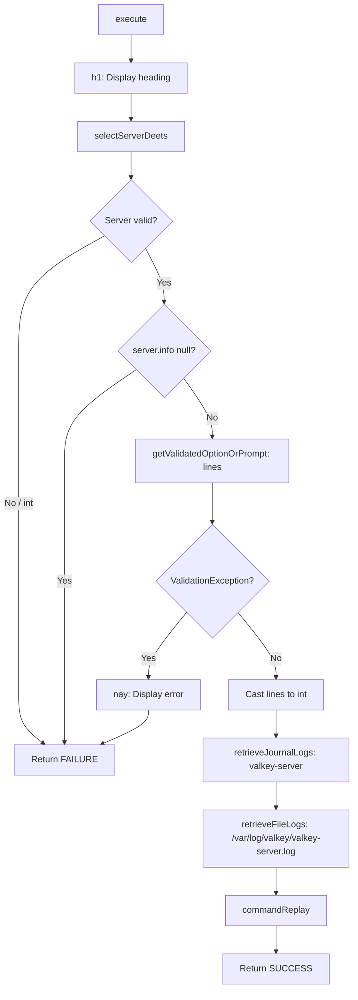

# ValkeyLogsCommand

## Purpose

Displays Valkey service status by retrieving both journalctl logs and file-based logs from the specified server.

## Type

Command (Symfony Console)

## Dependencies

| Dependency | Type | Purpose |
|------------|------|---------|
| `BaseCommand` | Parent | Command infrastructure, output methods, DI |
| `LogsTrait` | Trait | Log retrieval methods, line count validation |
| `ServersTrait` | Trait | Server selection, info retrieval |
| `IoService` | Service | Input/output, prompts, validation |
| `SshService` | Service | Remote command execution (via traits) |
| `ServerRepository` | Repository | Server lookup (via traits) |

## Execution Flow

## Inputs

| Option | Type | Required | Default | Description |
|--------|------|----------|---------|-------------|
| `--server` | VALUE_REQUIRED | No | Prompt | Server name to query |
| `--lines`, `-n` | VALUE_REQUIRED | No | 50 (prompt default) | Number of log lines |
| `--env` | VALUE_OPTIONAL | No | .env | Custom env file path |
| `--inventory` | VALUE_OPTIONAL | No | deployer.yml | Custom inventory path |

## Outputs

- Console heading and separator
- Server details (name, host, port, user, key)
- Valkey service journal logs
- Valkey file logs from `/var/log/valkey/valkey-server.log`
- Command replay hint

## Side Effects

- Establishes SSH connection to remote server
- Executes `journalctl` and `tail` commands remotely
- No persistent state changes

## Error Handling

| Scenario | Handler | User Message |
|----------|---------|--------------|
| No servers in inventory | `selectServerDeets` | Info with guidance to provision/add |
| Invalid server selection | `ValidationException` catch | Validation error message |
| SSH connection failure | `RuntimeException` in traits | SSH error message |
| Invalid line count | `ValidationException` catch | "Must be a positive number" or "Cannot exceed 1000 lines" |
| Log file not found | `retrieveFileLogs` | "No logs found or file does not exist" |

## Validation

- `--server`: Must exist in inventory (via `validateServerSelection`)
- `--lines`: Must be positive integer, max 1000 (via `validateLineCount`)

## Pattern Compliance

Follows the standard status command pattern established by:

- `MysqlLogsCommand`
- `RedisLogsCommand`
- `MariadbLogsCommand`
- `PostgresqlLogsCommand`

All use identical structure: server selection, line count prompt, journal logs, file logs, command replay.
