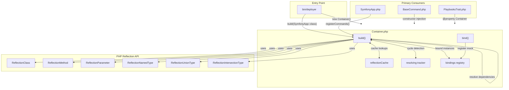

# Schematic: Container.php

> Auto-generated schematic. Last updated: 2025-12-26

## Overview

The Container class is a lightweight dependency injection container that uses PHP reflection to automatically resolve and wire constructor dependencies. It serves as the foundational infrastructure for the DeployerPHP CLI, enabling automatic instantiation of commands, services, and other objects without manual dependency configuration.

## Logic Flow

### Entry Points

| Method | Purpose |
|--------|---------|
| `build(string $className)` | Primary entry point - creates class instance with auto-wired dependencies |
| `bind(string $className, object $instance)` | Register pre-built instance (primarily for testing/mocks) |

### Execution Flow

**`build()` Method (Lines 59-85):**

1. Check if class has a bound instance in `$bindings` - return immediately if found
2. Guard against circular dependencies via `$resolving` tracking array
3. Guard against non-existent classes
4. Retrieve cached reflection data (or build and cache if missing)
5. Guard against non-instantiable classes (abstract, interface, trait)
6. Mark class as "resolving" to detect cycles
7. If no constructor: instantiate with `newInstance()`
8. If has constructor: recursively resolve all parameters via `buildDependencies()`
9. Remove class from "resolving" tracker in `finally` block
10. Return the constructed instance

**`buildDependencies()` (Lines 101-104):**

Maps each `ReflectionParameter` through `buildParameter()` to resolve values.

**`buildParameter()` (Lines 109-140):**

1. Get parameter type via reflection
2. Handle union types: iterate arms, try to resolve first non-builtin class type
3. Handle intersection types: fall back to default value (cannot generically construct)
4. Handle named types: if builtin (string, int, etc), use default; if class, resolve recursively
5. Handle untyped: use default value

### Decision Points

| Location | Condition | True Branch | False Branch |
|----------|-----------|-------------|--------------|
| Line 62 | Bound instance exists | Return bound instance | Continue resolution |
| Line 77 | No constructor | `newInstance()` | `newInstanceArgs()` with resolved deps |
| Line 113 | Union type | Try each arm until success | Continue to next check |
| Line 130 | Intersection type | Return default value | Continue to next check |
| Line 135 | Builtin or no type | Return default value | Resolve class dependency |

### Exit Conditions

| Condition | Result |
|-----------|--------|
| Bound instance found | Return cached instance |
| Circular dependency detected | Throw RuntimeException with chain |
| Class does not exist | Throw RuntimeException |
| Class not instantiable | Throw RuntimeException |
| Cannot resolve parameter | Throw RuntimeException |
| Successful construction | Return new instance |

## Interaction Diagram

## Dependencies

### Direct Imports

| File/Class | Usage |
|------------|-------|
| `ReflectionClass` | Inspect class metadata, constructor, instantiability |
| `ReflectionIntersectionType` | Detect intersection types (fall back to defaults) |
| `ReflectionNamedType` | Extract class names from typed parameters |
| `ReflectionParameter` | Access constructor parameter info |
| `ReflectionUnionType` | Handle union types by trying each arm |

### Coupled Files

| File | Coupling Type | Description |
|------|---------------|-------------|
| `bin/deployer` | Entry | Creates Container instance, calls `build(SymfonyApp::class)` |
| `app/SymfonyApp.php` | Consumer | Receives Container via constructor, uses `build()` to instantiate commands |
| `app/Contracts/BaseCommand.php` | Consumer | Receives Container via constructor for use in commands |
| `app/Traits/PlaybooksTrait.php` | Consumer | Declares Container as `@property` for trait usage |
| All Command classes | Consumer | Instantiated by Container with auto-wired dependencies |
| All Service classes | Consumer | Instantiated by Container as dependencies of commands |

## Data Flow

### Inputs

| Source | Data | Purpose |
|--------|------|---------|
| `build()` caller | `class-string` | Class to instantiate |
| `bind()` caller | `class-string`, `object` | Mock/stub registration for testing |

### Outputs

| Destination | Data | Purpose |
|-------------|------|---------|
| Caller | Object instance | Fully constructed object with resolved dependencies |

### Side Effects

| Effect | Description |
|--------|-------------|
| Reflection caching | Populates `$reflectionCache` on first access to reduce reflection overhead |
| Resolving tracking | Temporarily modifies `$resolving` during dependency resolution (cleaned in `finally`) |
| Bindings storage | `bind()` adds entries to `$bindings` map |

## Notes

**Architectural Notes:**

- The Container is stateless except for caches and explicit bindings
- Circular dependency detection uses a simple tracking array cleared after each `build()` call
- All exceptions are `\RuntimeException` with descriptive messages including context
- Namespace: `DeployerPHP`

**Performance Considerations:**

- Reflection data is cached per-class to avoid repeated reflection calls
- The caching uses null coalescing assignment (`??=`) for lazy initialization

**Testing Support:**

- `bind()` method enables dependency substitution for unit testing
- Fluent interface (`return $this`) allows chained binding calls

**Type System Handling:**

- Union types: attempts each non-builtin arm in order until one succeeds
- Intersection types: not constructable, requires default value
- Nullable types: handled via default value mechanism
- Untyped parameters: requires default value or throws

**Limitations:**

- Cannot resolve parameters without class types (scalar, array) unless they have defaults
- Cannot construct intersection types (requires manual binding or default)
- Does not support constructor argument overrides (all args must be resolvable)
