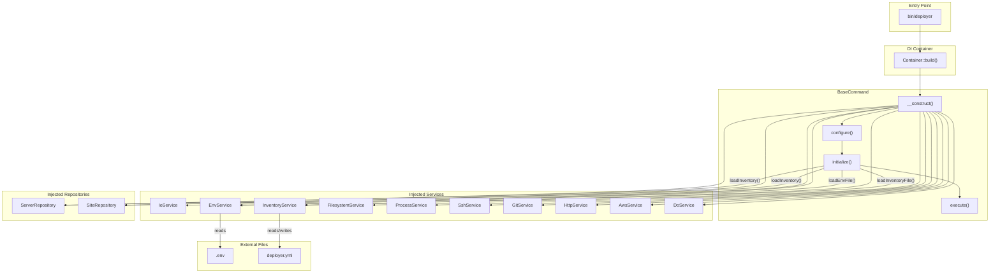
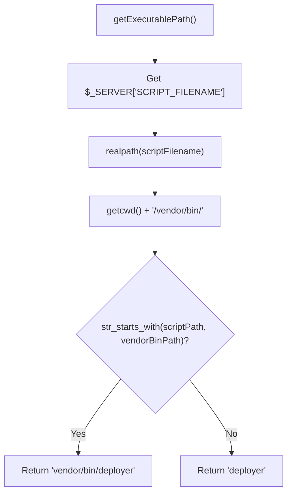
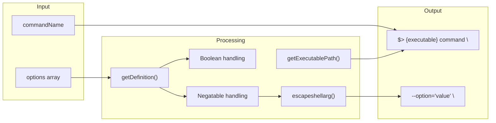

# Schematic: BaseCommand.php

> Auto-generated schematic. Last updated: 2025-12-28

## Overview

`BaseCommand` is the abstract foundation class for all CLI commands in the DeployerPHP application. It provides dependency injection of core services, automatic initialization of environment/inventory systems, and standardized console I/O helper methods. All commands in the application extend this class.

## Logic Flow

### Entry Points

| Method | Visibility | Purpose |
|--------|------------|---------|
| `__construct()` | public | Receives all injected services via DI container |
| `configure()` | protected | Adds global `--env` and `--inventory` options |
| `initialize()` | protected | Initializes I/O, env, inventory, and repositories before execution |
| `execute()` | protected | Base execution logic (displays env/inventory status) |

### Execution Flow

1. **Construction Phase** (via `Container::build()`)
   - Container auto-wires all 13 constructor dependencies
   - Calls `parent::__construct()` to initialize Symfony Command

2. **Configuration Phase** (via `configure()`)
   - Adds `--env` option for custom `.env` path
   - Adds `--inventory` option for custom `deployer.yml` path
   - Subclasses call `parent::configure()` then add their own options

3. **Initialization Phase** (via `initialize()`)
   - Initializes IoService with command context (line 108)
   - Sets custom env path if provided via `--env` (lines 113-116)
   - Loads `.env` file into EnvService
   - Sets custom inventory path if provided via `--inventory` (lines 121-124)
   - Loads/creates `deployer.yml` inventory file
   - Populates ServerRepository and SiteRepository from inventory (lines 129-130)

4. **Execution Phase** (via `execute()`)
   - Base implementation displays env/inventory status (lines 145-151)
   - Subclasses override to implement command logic
   - Returns `Command::SUCCESS` or `Command::FAILURE`

### Decision Points

| Location | Condition | Branch |
|----------|-----------|--------|
| Line 114 | `--env` option provided | Sets custom env path |
| Line 122 | `--inventory` option provided | Sets custom inventory path |

### Exit Conditions

- `execute()` returns `Command::SUCCESS` (base implementation)
- Subclasses may return `Command::FAILURE` on errors
- Exceptions propagate if services throw during initialization

## Interaction Diagram

## Dependencies

### Direct Imports

| File/Class | Usage |
|------------|-------|
| `DeployerPHP\Container` | DI container for building dependencies |
| `DeployerPHP\Repositories\ServerRepository` | Server inventory access |
| `DeployerPHP\Repositories\SiteRepository` | Site inventory access |
| `DeployerPHP\Services\AwsService` | AWS API integration |
| `DeployerPHP\Services\DoService` | DigitalOcean API integration |
| `DeployerPHP\Services\EnvService` | Environment variable management |
| `DeployerPHP\Services\FilesystemService` | File system operations |
| `DeployerPHP\Services\GitService` | Git operations |
| `DeployerPHP\Services\HttpService` | HTTP client operations |
| `DeployerPHP\Services\InventoryService` | YAML inventory CRUD |
| `DeployerPHP\Services\IoService` | Console I/O and prompts |
| `DeployerPHP\Services\ProcessService` | Process execution |
| `DeployerPHP\Services\SshService` | SSH connections |
| `Symfony\Component\Console\Command\Command` | Parent class |
| `Symfony\Component\Console\Input\InputInterface` | Console input |
| `Symfony\Component\Console\Input\InputOption` | Option definitions |
| `Symfony\Component\Console\Output\OutputInterface` | Console output |

### Coupled Files

| File | Coupling Type | Description |
|------|---------------|-------------|
| `.env` | Config | Environment variables loaded via EnvService |
| `deployer.yml` | Data | Inventory file for servers/sites via InventoryService |
| `app/SymfonyApp.php` | Registration | Registers all commands extending BaseCommand |
| `app/Container.php` | DI | Builds BaseCommand subclasses with dependencies |
| `app/Traits/*.php` | Trait | Traits use `$this->io`, `$this->servers`, etc. |
| All `*Command.php` files | Inheritance | All commands extend BaseCommand |

## Data Flow

### Inputs

| Source | Data | Method |
|--------|------|--------|
| CLI Options | `--env` path | `$input->getOption('env')` |
| CLI Options | `--inventory` path | `$input->getOption('inventory')` |
| Symfony | `InputInterface` | Passed to `initialize()` |
| Symfony | `OutputInterface` | Passed to `initialize()` |
| DI Container | 13 services/repos | Constructor injection |

### Outputs

| Destination | Data | Method |
|-------------|------|--------|
| Console | Env status | `$this->out()` in `execute()` |
| Console | Inventory status | `$this->out()` in `execute()` |
| Subclasses | All services | Protected readonly properties |

### Side Effects

| Effect | Location | Description |
|--------|----------|-------------|
| IoService initialized | Line 108 | Sets command context for I/O operations |
| EnvService initialized | Lines 113-116 | Loads `.env` file |
| InventoryService initialized | Lines 121-124 | Loads/creates `deployer.yml` |
| Repositories populated | Lines 129-130 | Servers and sites loaded from inventory |

## I/O Helper Methods

BaseCommand provides standardized output methods that wrap IoService:

| Method | Symbol | Purpose |
|--------|--------|---------|
| `hr()` | `----` | Horizontal rule separator |
| `h1(string)` | `#` | Main heading with underline |
| `h2(string)` | `##` | Secondary heading |
| `info(string)` | `i` | Info message |
| `yay(string)` | `check` | Success message |
| `warn(string)` | `!` | Warning message |
| `nay(string)` | `X` | Red error message |
| `ul(lines)` | `*` | Bulleted list |
| `ol(lines)` | `1.` | Numbered list |
| `out(lines)` | none | Raw output lines |
| `displayDeets(array)` | none | Key-value pairs with alignment |
| `getExecutablePath()` | none | Detects global vs project-level install path |
| `commandReplay(name, options)` | `$>` | Non-interactive command hint |

## Executable Path Detection

The `getExecutablePath()` method (lines 308-322) detects the installation context:

**Detection Logic:**

1. Gets the actual script filename from `$_SERVER['SCRIPT_FILENAME']`
2. Resolves to real path via `realpath()`
3. Compares against current working directory's `vendor/bin/` path
4. Returns `vendor/bin/deployer` for project-level installs
5. Returns `deployer` for global Composer installs

## Command Replay

The `commandReplay()` method (lines 329-381) generates CLI replay hints:

Handles:

- **Executable detection**: Uses `getExecutablePath()` for context-aware path
- Boolean flags (VALUE_NONE): `--yes`
- Negatable flags: `--flag` or `--no-flag`
- String values: `--option='escaped value'`

## Inheritance Contract

Commands extending BaseCommand must:

1. Call `parent::__construct()` in constructor (handled by Container DI)
2. Call `parent::configure()` in `configure()` to inherit global options
3. Override `execute()` for command logic (optionally call parent first)
4. Use `$this->io` for all console I/O (never SymfonyStyle directly)
5. Use helper methods (`yay()`, `nay()`, etc.) for standardized output
6. Call `commandReplay()` before returning SUCCESS

## Notes

- **Namespace**: `DeployerPHP\Contracts`
- **Stateful Services**: IoService, EnvService, and InventoryService are stateful and must be initialized in the correct order during `initialize()`
- **Repository Loading**: Repositories depend on InventoryService being loaded first (lines 129-130 after line 124)
- **No Direct I/O**: Commands should never use SymfonyStyle directly; all output goes through BaseCommand helpers which delegate to IoService
- **Protected Properties**: All injected dependencies are `protected readonly`, accessible to subclasses but immutable
- **Global Options**: `--env` and `--inventory` are available on every command via `configure()`
- **Executable Path Detection**: `getExecutablePath()` uses `$_SERVER['SCRIPT_FILENAME']` and `realpath()` to distinguish between global Composer installs and project-level vendor installs, enabling accurate command replay hints
