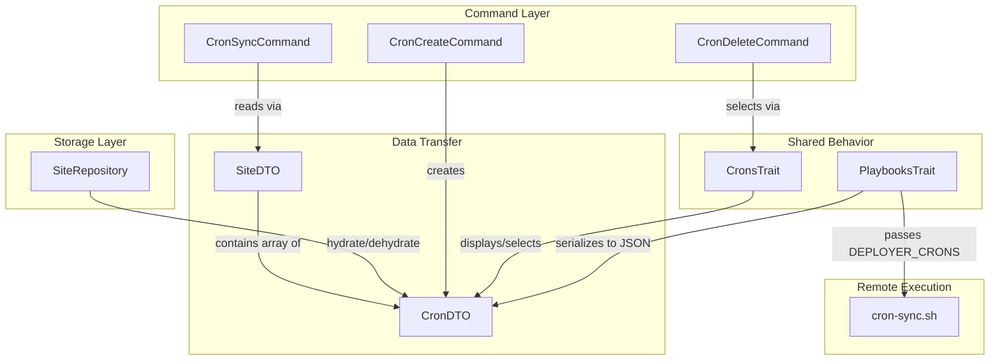

# Schematic: CronDTO.php

> Auto-generated schematic. Last updated: 2025-12-19

## Overview

Immutable data transfer object representing a cron job configuration for a site. Encapsulates the cron script path (relative to `.deployer/crons/`) and schedule expression. Used as a nested structure within SiteDTO.

## Logic Flow

### Entry Points

| Method | Purpose |
|--------|---------|
| `__construct()` | Create new CronDTO instance with script path and schedule |

### Execution Flow

**Constructor:**

1. Accepts required `script` parameter (path within `.deployer/crons/`)
2. Accepts required `schedule` parameter (cron expression like `* * * * *`)
3. Both properties are readonly (immutable DTO pattern)

### Decision Points

None. CronDTO is a pure data container with no logic.

### Exit Conditions

Constructor returns immediately after property assignment. No exceptions thrown.

## Interaction Diagram

## Dependencies

### Direct Imports

None. CronDTO is a self-contained data class.

### Coupled Files

| File | Coupling Type | Description |
|------|---------------|-------------|
| `app/DTOs/SiteDTO.php` | Composition | Contains `array<int, CronDTO>` as `$crons` property |
| `app/Repositories/SiteRepository.php` | Data | Hydrates/dehydrates CronDTO via `hydrateCronDTO()`/`dehydrateCronDTO()` |
| `app/Traits/CronsTrait.php` | Data | Uses CronDTO for display (`displayCronDeets()`) and selection (`selectCron()`) |
| `app/Traits/PlaybooksTrait.php` | Data | Serializes CronDTO array to JSON for `DEPLOYER_CRONS` environment variable |
| `app/Console/Cron/CronCreateCommand.php` | Data | Creates CronDTO instances from user input |
| `playbooks/cron-sync.sh` | Config | Consumes `DEPLOYER_CRONS` JSON to configure crontab entries |

## Data Flow

### Inputs

| Source | Data | Purpose |
|--------|------|---------|
| `CronCreateCommand` | User input (script, schedule) | Create new cron job entry |
| `SiteRepository::hydrateCronDTO()` | Inventory array data | Reconstitute DTO from storage |

### Outputs

| Consumer | Data | Purpose |
|----------|------|---------|
| `SiteRepository::dehydrateCronDTO()` | `script`, `schedule` | Persist to inventory as nested array under site |
| `PlaybooksTrait::executePlaybook()` | JSON-encoded array | Pass to playbook via `DEPLOYER_CRONS` env var |
| `CronsTrait::displayCronDeets()` | `script`, `schedule` | Display cron details to user |

### Side Effects

None. CronDTO is immutable and has no side effects.

## Notes

**Immutability Pattern:**

- All properties are `readonly`
- No methods modify state
- Safe for concurrent access and caching

**Nested Structure:**

- CronDTO is not stored independently
- Always nested within SiteDTO's `$crons` array
- Inventory structure: `sites[].crons[].{script, schedule}`

**Property Semantics:**

- `script`: Relative path within `.deployer/crons/` (e.g., `scheduler.sh`, `cleanup/daily.sh`)
- `schedule`: Standard cron expression with 5 fields (minute hour day month weekday)

**Validation:**

- No validation in DTO itself
- Validation performed in `CronsTrait` validators:
  - `validateCronScriptInput()`: Checks script exists in available scripts
  - `validateScheduleInput()`: Validates cron expression format
  - `validateCronSelection()`: Checks cron exists for site

**Playbook Integration:**

- `PlaybooksTrait::executePlaybook()` auto-injects `DEPLOYER_CRONS` when context is `SiteServerDTO`
- Format: JSON array of `{script, schedule}` objects
- Consumed by `cron-sync.sh` to configure crontab
