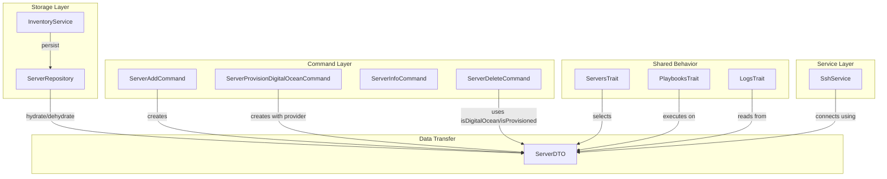

# Schematic: ServerDTO.php

> Auto-generated schematic. Last updated: 2025-12-18

## Overview

Immutable data transfer object representing a server in the deployer inventory. Encapsulates server connection details (host, port, SSH credentials) and cloud provider metadata (DigitalOcean droplet ID). Provides computed methods for detecting provisioned servers.

## Logic Flow

### Entry Points

| Method | Purpose |
|--------|---------|
| `__construct()` | Create new ServerDTO instance with server properties |
| `isDigitalOcean()` | Check if server was provisioned via DigitalOcean |
| `isProvisioned()` | Check if server was provisioned via any cloud provider |
| `withInfo()` | Create new instance with additional runtime info |

### Execution Flow

**Constructor:**

1. Accepts required `name` and `host` parameters
2. Accepts optional parameters with sensible defaults: `port=22`, `username='root'`
3. Accepts nullable cloud provider fields: `privateKeyPath`, `provider`, `dropletId`, `info`
4. All properties are readonly (immutable DTO pattern)

**isDigitalOcean():**

1. Checks if `provider` equals `'digitalocean'`
2. AND checks if `dropletId` is not null
3. Returns boolean result

**isProvisioned():**

1. Delegates to `isDigitalOcean()`
2. Designed for extensibility when adding new cloud providers

**withInfo():**

1. Creates new ServerDTO instance
2. Copies all existing properties
3. Replaces `info` with provided array
4. Returns new immutable instance

### Decision Points

| Method | Condition | Result |
|--------|-----------|--------|
| `isDigitalOcean()` | `provider === 'digitalocean' && dropletId !== null` | `true` |
| `isDigitalOcean()` | Otherwise | `false` |
| `isProvisioned()` | `isDigitalOcean() === true` | `true` |
| `isProvisioned()` | No cloud provider detected | `false` |

### Exit Conditions

All methods return values directly. No exceptions are thrown from this DTO.

## Interaction Diagram

## Dependencies

### Direct Imports

None. ServerDTO is a self-contained data class.

### Coupled Files

| File | Coupling Type | Description |
|------|---------------|-------------|
| `app/Repositories/ServerRepository.php` | Data | Hydrates/dehydrates ServerDTO for inventory storage |
| `app/Services/SshService.php` | Data | Uses ServerDTO properties for SSH connections |
| `app/Console/Server/ServerDeleteCommand.php` | Logic | Calls `isDigitalOcean()` and `isProvisioned()` for deletion flow |
| `app/Traits/ServersTrait.php` | Data | Returns ServerDTO from selection methods |
| `app/Traits/PlaybooksTrait.php` | Data | Uses ServerDTO for playbook execution context |
| `app/Traits/LogsTrait.php` | Data | Uses ServerDTO for log retrieval |
| `app/DTOs/SiteServerDTO.php` | Composition | Composes ServerDTO with SiteDTO |

## Data Flow

### Inputs

| Source | Data | Purpose |
|--------|------|---------|
| `ServerRepository::hydrateServerDTO()` | Inventory array data | Reconstitute DTO from storage |
| `ServerAddCommand` | User input | Create new server entries |
| `ServerProvisionDigitalOceanCommand` | API response + user input | Create with DigitalOcean metadata |

### Outputs

| Consumer | Data | Purpose |
|----------|------|---------|
| `ServerRepository::dehydrateServerDTO()` | DTO properties | Persist to inventory |
| `SshService` | `host`, `port`, `username`, `privateKeyPath` | Establish SSH connection |
| Commands | `name`, `host`, provider status | Display and decision logic |

### Side Effects

None. ServerDTO is immutable and has no side effects. The `withInfo()` method returns a new instance rather than modifying state.

## Notes

**Immutability Pattern:**

- All properties are `readonly`
- `withInfo()` demonstrates immutable update pattern
- Safe for concurrent access and caching

**Provider Detection Design:**

- `isProvisioned()` exists as abstraction layer
- Currently delegates to `isDigitalOcean()`
- Extensible for future providers (AWS, Linode, etc.)
- Centralizes provider detection logic (previously duplicated in commands)

**Property Defaults:**

- `port: 22` - Standard SSH port
- `username: 'root'` - Common for cloud VMs
- Nullable fields allow representing both manually-added and provisioned servers

**Validation:**

- No validation in DTO itself
- Validation performed in `ServerRepository` and input validators
- DTO trusts data passed to constructor
