# Schematic: SiteDTO.php

> Auto-generated schematic. Last updated: 2025-12-19 (phpVersion now required non-nullable)

## Overview

Immutable data transfer object representing a site in the deployer inventory. Encapsulates site identity (domain), git configuration (repo/branch), server association, PHP version configuration, and nested collections of cron jobs and supervisor programs. Serves as the central data structure for all site-related operations.

## Logic Flow

### Entry Points

| Method | Purpose |
|--------|---------|
| `__construct()` | Create new SiteDTO instance with site properties |

### Execution Flow

**Constructor:**

1. Accepts required parameters: `domain`, `server`, `phpVersion`
2. Accepts optional nullable parameters: `repo`, `branch`
3. Accepts optional array parameters with empty defaults: `crons=[]`, `supervisors=[]`
4. All properties are readonly (immutable DTO pattern)

### Decision Points

None. SiteDTO is a pure data container with no conditional logic.

### Exit Conditions

Constructor returns the constructed instance. No exceptions are thrown from this DTO.

## Interaction Diagram

```mermaid
flowchart TD
    subgraph Storage["Storage Layer"]
        SiteRepository["SiteRepository"]
        InventoryService["InventoryService"]
    end

    subgraph DTOs["Data Transfer Objects"]
        SiteDTO["SiteDTO"]
        CronDTO["CronDTO"]
        SupervisorDTO["SupervisorDTO"]
        SiteServerDTO["SiteServerDTO"]
        ServerDTO["ServerDTO"]
    end

    subgraph Commands["Command Layer"]
        SiteCreateCommand["SiteCreateCommand"]
        SiteDeleteCommand["SiteDeleteCommand"]
        SiteDeployCommand["SiteDeployCommand"]
        SiteHttpsCommand["SiteHttpsCommand"]
        CronCommands["Cron*Command"]
        SupervisorCommands["Supervisor*Command"]
    end

    subgraph Traits["Shared Behavior"]
        SitesTrait["SitesTrait"]
        CronsTrait["CronsTrait"]
        SupervisorsTrait["SupervisorsTrait"]
        PlaybooksTrait["PlaybooksTrait"]
    end

    SiteRepository -->|hydrate/dehydrate| SiteDTO
    InventoryService -->|persist| SiteRepository

    SiteDTO -->|contains| CronDTO
    SiteDTO -->|contains| SupervisorDTO
    SiteServerDTO -->|composes| SiteDTO
    SiteServerDTO -->|composes| ServerDTO

    SiteCreateCommand -->|creates| SiteDTO
    SiteDeployCommand -->|updates repo/branch| SiteDTO
    CronCommands -->|modifies crons| SiteDTO
    SupervisorCommands -->|modifies supervisors| SiteDTO

    SitesTrait -->|selects/validates| SiteDTO
    CronsTrait -->|manages crons| SiteDTO
    SupervisorsTrait -->|manages supervisors| SiteDTO
    PlaybooksTrait -->|executes on| SiteDTO
```

## Dependencies

### Direct Imports

None. SiteDTO is a self-contained data class.

### Coupled Files

| File | Coupling Type | Description |
|------|---------------|-------------|
| `app/Repositories/SiteRepository.php` | Data | Hydrates/dehydrates SiteDTO for inventory storage; manages cron/supervisor CRUD |
| `app/DTOs/CronDTO.php` | Composition | SiteDTO contains array of CronDTO objects |
| `app/DTOs/SupervisorDTO.php` | Composition | SiteDTO contains array of SupervisorDTO objects |
| `app/DTOs/SiteServerDTO.php` | Composition | Composes SiteDTO with ServerDTO for combined operations |
| `app/Traits/SitesTrait.php` | Data | Returns SiteDTO from selection methods; validates site properties |
| `app/Traits/CronsTrait.php` | Data | Uses SiteDTO.crons for cron management |
| `app/Traits/SupervisorsTrait.php` | Data | Uses SiteDTO.supervisors for supervisor management |
| `app/Traits/PlaybooksTrait.php` | Data | Uses SiteDTO for playbook execution context |
| `app/Traits/SiteSharedPathsTrait.php` | Data | Uses SiteDTO.domain for path resolution |
| `app/Console/Site/SiteCreateCommand.php` | Logic | Creates new SiteDTO instances |
| `app/Console/Site/SiteDeployCommand.php` | Logic | Updates SiteDTO with repo/branch after deployment |

## Data Flow

### Inputs

| Source | Data | Purpose |
|--------|------|---------|
| `SiteRepository::hydrateSiteDTO()` | Inventory array data | Reconstitute DTO from storage |
| `SiteCreateCommand` | User input (domain, server) | Create new site entries |
| `SiteDeployCommand` | Git repo/branch | Update site with deployment info |
| `SiteRepository::addCron()` | CronDTO | Rebuild SiteDTO with new cron |
| `SiteRepository::addSupervisor()` | SupervisorDTO | Rebuild SiteDTO with new supervisor |

### Outputs

| Consumer | Data | Purpose |
|----------|------|---------|
| `SiteRepository::dehydrateSiteDTO()` | DTO properties | Persist to inventory |
| `SitesTrait::getSiteRootPath()` | `domain` | Construct remote paths |
| Playbooks | `domain`, `repo`, `branch`, `phpVersion` | Deploy and configure sites |
| Commands | All properties | Display and decision logic |

### Side Effects

None. SiteDTO is immutable and has no side effects.

## Notes

**Immutability Pattern:**

- All properties are `readonly`
- SiteRepository creates new SiteDTO instances when modifying crons/supervisors
- Safe for concurrent access and caching

**Nullable Fields:**

- `repo` and `branch` are nullable to represent sites before first deployment
- `ensureSiteDeployed()` in SitesTrait checks for null repo/branch

**Required Fields:**

- `phpVersion` is now a required non-nullable string (breaking change)
- Sites must always have an explicit PHP version configured

**Nested Collections:**

- `crons` and `supervisors` are arrays of child DTOs
- SiteRepository handles hydration/dehydration of nested objects
- Empty arrays as defaults allow creation without child resources

**Property Defaults:**

| Property | Default | Meaning |
|----------|---------|---------|
| `repo` | `null` | Site not yet deployed |
| `branch` | `null` | Site not yet deployed |
| `phpVersion` | (required) | PHP version (e.g. "8.3") - no default |
| `crons` | `[]` | No cron jobs configured |
| `supervisors` | `[]` | No supervisor programs configured |

**Validation:**

- No validation in DTO itself
- Validation performed in `SitesTrait` and `SiteRepository`
- DTO trusts data passed to constructor
