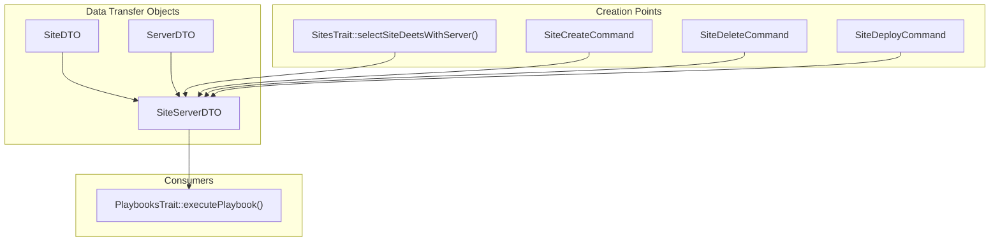
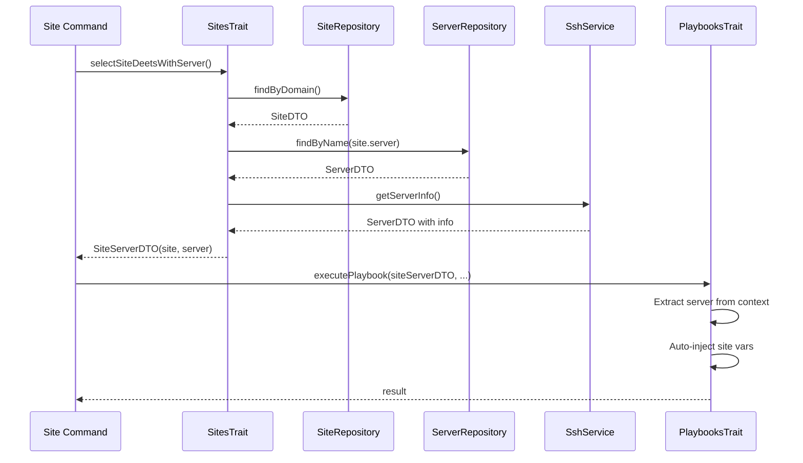

# Schematic: SiteServerDTO.php

> Auto-generated schematic. Last updated: 2025-12-19

## Overview

`SiteServerDTO` is a readonly composite data transfer object that bundles a `SiteDTO` and its associated `ServerDTO` into a single immutable unit. It serves as a convenience wrapper for operations that require both site configuration and server connection details, eliminating the need to pass these objects separately through the call stack.

## Logic Flow

### Entry Points

This is a pure data class with no behavioral logic. The only entry point is the constructor:

| Method | Parameters | Purpose |
|--------|------------|---------|
| `__construct()` | `SiteDTO $site`, `ServerDTO $server` | Create composite DTO |

### Execution Flow

1. Constructor receives `SiteDTO` and `ServerDTO` instances
2. Properties are assigned via constructor promotion
3. Object becomes immutable (`readonly` class)

### Decision Points

None. This is a pure value object with no conditional logic.

### Exit Conditions

Not applicable. As a DTO, it has no execution lifecycle.

## Interaction Diagram



## Dependencies

### Direct Imports

| File/Class | Usage |
|------------|-------|
| `Deployer\DTOs\SiteDTO` | Composed as `$site` property |
| `Deployer\DTOs\ServerDTO` | Composed as `$server` property |

### Coupled Files

| File | Coupling Type | Description |
|------|---------------|-------------|
| `app/Traits/SitesTrait.php` | Factory | Creates `SiteServerDTO` via `selectSiteDeetsWithServer()` |
| `app/Traits/PlaybooksTrait.php` | Consumer | Accepts as `$context` parameter, extracts site/server data |
| `app/Console/Site/SiteCreateCommand.php` | Factory | Creates after site provisioning |
| `app/Console/Site/SiteDeleteCommand.php` | Factory | Creates before site deletion |
| `app/Console/Site/SiteDeployCommand.php` | Factory | Creates for deployment operations |

## Data Flow

### Inputs

| Property | Type | Source |
|----------|------|--------|
| `site` | `SiteDTO` | Site configuration from `SiteRepository` |
| `server` | `ServerDTO` | Server details from `ServerRepository`, often enriched with `info` |

### Outputs

This DTO is consumed by:

1. **PlaybooksTrait::executePlaybook()** - Extracts server connection details and auto-injects site-specific environment variables:
   - `DEPLOYER_SITE_DOMAIN` from `$site->domain`
   - `DEPLOYER_PHP_VERSION` from `$site->phpVersion`
   - `DEPLOYER_SITE_REPO` from `$site->repo`
   - `DEPLOYER_SITE_BRANCH` from `$site->branch`
   - `DEPLOYER_CRONS` from `$site->crons`
   - `DEPLOYER_SUPERVISORS` from `$site->supervisors`

2. **Site Commands** - Access individual properties for:
   - SSH connections via `$server`
   - Display/logging via `$site`
   - Playbook execution via the composite object

### Side Effects

None. This is a pure, immutable data container.

## Usage Pattern



## Type Union Pattern

`SiteServerDTO` enables a union type pattern in `PlaybooksTrait`:

```php
protected function executePlaybook(
    ServerDTO|SiteServerDTO $context,  // Union accepts both
    ...
): array|int {
    // Context detection
    $server = $context instanceof SiteServerDTO
        ? $context->server  // Extract from composite
        : $context;         // Use directly

    // Conditional site var injection
    if ($context instanceof SiteServerDTO) {
        $site = $context->site;
        // Auto-inject site-specific environment variables
    }
}
```

This allows playbooks to run in either:

- **Server context** (`ServerDTO`) - For server-level operations
- **Site context** (`SiteServerDTO`) - For site-level operations with auto-injected site vars

## Notes

- **Immutability**: The `readonly` class modifier ensures all properties are immutable after construction
- **No Validation**: Unlike `ServerDTO` which has methods like `isDigitalOcean()`, this DTO is purely structural with no business logic
- **Composition Over Inheritance**: This pattern avoids complex inheritance hierarchies by composing two independent DTOs
- **Return Type Union**: Methods returning `SiteServerDTO|int` use the int for `Command::SUCCESS`/`Command::FAILURE` status codes
