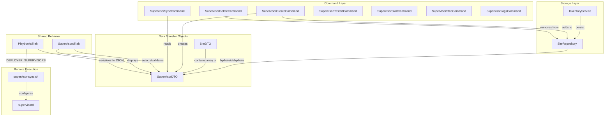

# Schematic: SupervisorDTO.php

> Auto-generated schematic. Last updated: 2025-12-19

## Overview

Immutable data transfer object representing a supervisor program configuration. Encapsulates process management settings (program name, script path, autostart/autorestart behavior, stop wait seconds, and process count) for sites managed by supervisord. Used throughout the supervisor command domain and persisted as nested data within SiteDTO.

## Logic Flow

### Entry Points

| Method | Purpose |
|--------|---------|
| `__construct()` | Create new SupervisorDTO instance with supervisor configuration |

### Execution Flow

**Constructor:**

1. Accepts required parameters: `program`, `script`
2. Accepts optional parameters with defaults: `autostart=true`, `autorestart=true`, `stopwaitsecs=3600`, `numprocs=1`
3. All properties are readonly (immutable DTO pattern)

### Decision Points

None. SupervisorDTO is a pure data container with no conditional logic.

### Exit Conditions

Constructor returns the constructed instance. No exceptions are thrown from this DTO.

## Interaction Diagram



## Dependencies

### Direct Imports

None. SupervisorDTO is a self-contained data class.

### Coupled Files

| File | Coupling Type | Description |
|------|---------------|-------------|
| `app/DTOs/SiteDTO.php` | Composition | SiteDTO contains array of SupervisorDTO objects |
| `app/Repositories/SiteRepository.php` | Data | Hydrates/dehydrates SupervisorDTO for inventory storage |
| `app/Traits/SupervisorsTrait.php` | Data | Uses SupervisorDTO for selection, display, and validation |
| `app/Traits/PlaybooksTrait.php` | Data | Serializes SupervisorDTO to JSON for DEPLOYER_SUPERVISORS env var |
| `app/Console/Supervisor/SupervisorCreateCommand.php` | Logic | Creates new SupervisorDTO instances |
| `app/Console/Supervisor/SupervisorDeleteCommand.php` | Logic | Deletes SupervisorDTO via repository |
| `app/Console/Supervisor/SupervisorSyncCommand.php` | Logic | Syncs SupervisorDTO configs to server |
| `playbooks/supervisor-sync.sh` | Config | Parses JSON array of SupervisorDTO data to generate supervisord configs |

## Data Flow

### Inputs

| Source | Data | Purpose |
|--------|------|---------|
| `SiteRepository::hydrateSupervisorDTO()` | Inventory array data | Reconstitute DTO from storage |
| `SupervisorCreateCommand` | User input (program, script, options) | Create new supervisor entries |

### Outputs

| Consumer | Data | Purpose |
|----------|------|---------|
| `SiteRepository::dehydrateSupervisorDTO()` | DTO properties | Persist to inventory |
| `PlaybooksTrait::executePlaybook()` | JSON-encoded array | Pass to remote playbook as DEPLOYER_SUPERVISORS |
| `SupervisorsTrait::displaySupervisorDeets()` | All properties | Display configuration to user |
| `supervisor-sync.sh` | program, script, autostart, autorestart, stopwaitsecs, numprocs | Generate supervisord .conf files |

### Side Effects

None. SupervisorDTO is immutable and has no side effects.

## Notes

**Immutability Pattern:**

- All properties are `readonly`
- SiteRepository creates new SiteDTO instances when adding/removing supervisors
- Safe for concurrent access and caching

**Property Semantics:**

| Property | Type | Default | Description |
|----------|------|---------|-------------|
| `program` | string | (required) | Unique identifier for the supervisor program; combined with domain for final name (e.g., `example.com-queue-worker`) |
| `script` | string | (required) | Script path within `.deployer/supervisors/` directory (e.g., `queue-worker.sh`) |
| `autostart` | bool | `true` | Start program automatically when supervisord starts |
| `autorestart` | bool | `true` | Restart program automatically if it exits |
| `stopwaitsecs` | int | `3600` | Seconds to wait for graceful stop before SIGKILL (1 hour default for long-running jobs) |
| `numprocs` | int | `1` | Number of process instances to spawn |

**Serialization Formats:**

1. **Inventory Storage** (via `SiteRepository`):

```php
[
    'program' => 'queue-worker',
    'script' => 'queue-worker.sh',
    'autostart' => true,
    'autorestart' => true,
    'stopwaitsecs' => 3600,
    'numprocs' => 1,
]
```

1. **Playbook Execution** (via `PlaybooksTrait`):

```json
[{"program":"queue-worker","script":"queue-worker.sh","autostart":true,"autorestart":true,"stopwaitsecs":3600,"numprocs":1}]
```

**Supervisord Configuration:**

The playbook `supervisor-sync.sh` uses SupervisorDTO data to generate:

- `/etc/supervisor/conf.d/{domain}-{program}.conf` - supervisord program config
- `/etc/logrotate.d/{domain}-{program}` - log rotation config

**Validation:**

- No validation in DTO itself
- Validation performed in `SupervisorsTrait` validators:
  - `validateProgramInput()` - alphanumeric, underscores, hyphens only
  - `validateNumprocsInput()` - positive integer >= 1
  - `validateStopWaitSecsInput()` - positive integer >= 1
  - `validateSupervisorScriptInput()` - script must exist in available scripts
- DTO trusts data passed to constructor

**Consumer Commands:**

| Command | Purpose |
|---------|---------|
| `supervisor:create` | Creates SupervisorDTO, adds to site via repository |
| `supervisor:delete` | Removes SupervisorDTO from site via repository |
| `supervisor:sync` | Syncs all SupervisorDTOs to server supervisord |
| `supervisor:start` | Starts supervisor program on server |
| `supervisor:stop` | Stops supervisor program on server |
| `supervisor:restart` | Restarts supervisor program on server |
| `supervisor:logs` | Shows status of supervisor programs on server |
