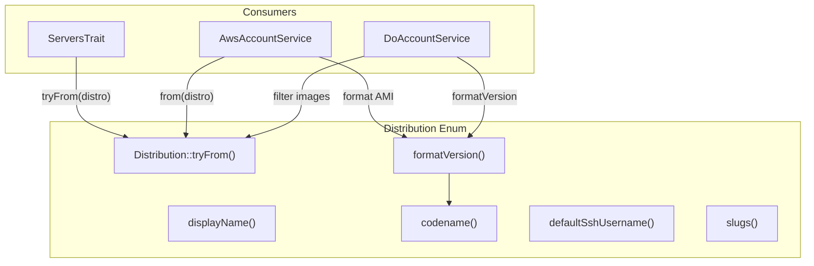

# Schematic: Distribution.php

> Auto-generated schematic. Last updated: 2025-12-26

## Overview

A PHP 8 backed enum representing supported Linux distributions for server provisioning. Provides centralized distribution configuration including display names, codenames, version formatting, and SSH username defaults. Only Debian-family distributions (Ubuntu, Debian) are supported.

## Logic Flow

### Entry Points

| Method | Purpose |
|--------|---------|
| `displayName()` | Get human-readable distribution name |
| `codename(string $version)` | Get codename for a specific version |
| `formatVersion(string $version)` | Format version with codename for display |
| `defaultSshUsername()` | Get default SSH username for distribution |
| `slugs()` | Static: Get all distribution slug values as array |

### Execution Flow

**Distribution Detection Pattern:**

1. External code calls `Distribution::tryFrom($distroString)` to parse a distribution slug
2. If valid, returns `Distribution` case; otherwise `null`
3. Caller can use `displayName()`, `codename()`, or `formatVersion()` for display

**Version Formatting:**

1. `formatVersion()` calls `codename()` to get version codename
2. Formats based on distribution type:
   - Ubuntu: `"Ubuntu {version} LTS ({codename})"`
   - Debian: `"Debian {version} ({codename})"`

### Decision Points

| Method | Condition | Result |
|--------|-----------|--------|
| `displayName()` | UBUNTU | "Ubuntu" |
| `displayName()` | DEBIAN | "Debian" |
| `codename()` | Known version | Specific codename from const arrays |
| `codename()` | Unknown version | "LTS" (Ubuntu) or "Stable" (Debian) |
| `defaultSshUsername()` | UBUNTU | "ubuntu" |
| `defaultSshUsername()` | DEBIAN | "admin" |

### Exit Conditions

- `displayName()`: Always returns string (exhaustive match)
- `codename()`: Always returns string (falls back to default)
- `formatVersion()`: Always returns formatted string
- `defaultSshUsername()`: Always returns string (exhaustive match)
- `slugs()`: Always returns array of all case values

## Interaction Diagram

## Dependencies

### Direct Imports

None. This enum is self-contained.

### Coupled Files

| File | Coupling Type | Description |
|------|---------------|-------------|
| `playbooks/*.sh` | Config | Playbooks use distribution-specific logic |

## Data Flow

### Inputs

| Source | Data | Method |
|--------|------|--------|
| Server info response | Distribution slug string | `tryFrom()` |
| Cloud provider APIs | Image distribution field | `tryFrom()`, `from()` |
| Version strings | Version number | `codename()`, `formatVersion()` |

### Outputs

| Target | Data | Method |
|--------|------|--------|
| UI/Display | Human-readable name | `displayName()` |
| UI/Display | Version codename | `codename()` |
| UI/Display | Formatted version string | `formatVersion()` |
| SSH connections | Default username | `defaultSshUsername()` |
| Iteration | All slug values | `slugs()` |

### Side Effects

None. This is a pure value object with no state mutations or external calls.

## Enum Cases

| Case | Value | Display Name | Default SSH User |
|------|-------|--------------|------------------|
| `UBUNTU` | `'ubuntu'` | Ubuntu | ubuntu |
| `DEBIAN` | `'debian'` | Debian | admin |

## Codename Constants

### Ubuntu Codenames (UBUNTU_CODENAMES)

| Version | Codename |
|---------|----------|
| 20.04 | Focal Fossa |
| 22.04 | Jammy Jellyfish |
| 24.04 | Noble Numbat |
| 26.04 | TBD |

### Debian Codenames (DEBIAN_CODENAMES)

| Version | Codename |
|---------|----------|
| 10 | Buster |
| 11 | Bullseye |
| 12 | Bookworm |
| 13 | Trixie |
| 14 | Forky |

## Notes

- The `DistributionFamily` enum was removed; this enum now handles all distribution logic directly
- Only Ubuntu and Debian are supported; no RHEL-family distributions are included
- The `isSupported()` and `family()` methods were removed as dead code
- The `tryFrom()` method is inherited from PHP's BackedEnum trait and returns `null` for unknown slugs
- Unknown versions fallback gracefully to "LTS" (Ubuntu) or "Stable" (Debian) codenames
