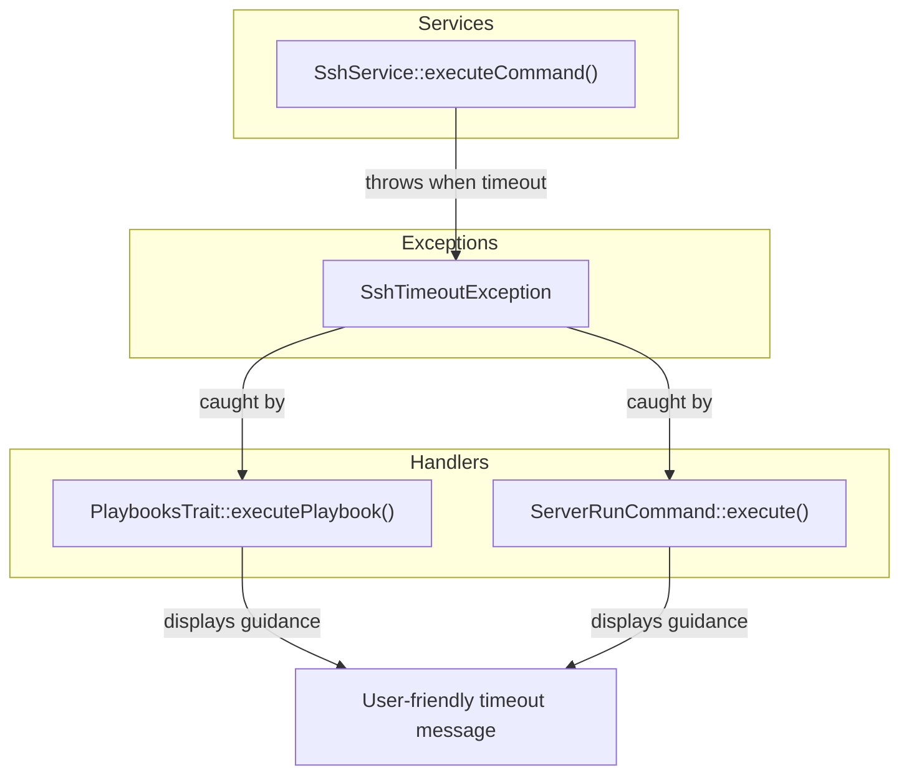

# Schematic: SshTimeoutException.php

> Auto-generated schematic. Last updated: 2025-12-19

## Overview

Custom exception class for SSH command timeout scenarios. Extends `\RuntimeException` to signal when remote command execution exceeds the configured timeout threshold. Provides a specialized exception type that callers can catch to handle timeout conditions differently from general runtime errors.

## Logic Flow

### Entry Points

| Method | Purpose |
|--------|---------|
| `__construct()` | Create exception with optional message, code, and previous throwable |

### Execution Flow

1. Constructor receives optional parameters with sensible defaults
2. Calls parent `\RuntimeException` constructor with all parameters
3. Exception is ready to be thrown

### Decision Points

None - this is a simple value-carrying exception class with no branching logic.

### Exit Conditions

Not applicable - exception class instantiation completes synchronously.

## Interaction Diagram



## Dependencies

### Direct Imports

| File/Class | Usage |
|------------|-------|
| `\RuntimeException` | Parent class - standard PHP exception |

### Coupled Files

| File | Coupling Type | Description |
|------|---------------|-------------|
| `app/Services/SshService.php` | Thrower | Throws when `SSH2::exec()` returns false (timeout) |
| `app/Traits/PlaybooksTrait.php` | Handler | Catches and displays user-friendly timeout guidance |
| `app/Console/Server/ServerRunCommand.php` | Handler | Catches and displays timeout troubleshooting steps |

## Data Flow

### Inputs

| Parameter | Type | Default | Description |
|-----------|------|---------|-------------|
| `$message` | `string` | `'SSH command timed out'` | Human-readable error description |
| `$code` | `int` | `0` | Error code for programmatic handling |
| `$previous` | `?\Throwable` | `null` | Previous exception for chaining |

### Outputs

Standard exception object that carries:

- Error message accessible via `getMessage()`
- Error code accessible via `getCode()`
- Previous exception accessible via `getPrevious()`
- Stack trace accessible via `getTrace()` / `getTraceAsString()`

### Side Effects

None - exception instantiation is pure and stateless.

## Notes

**Design Pattern**: This exception follows the codebase pattern of typed exceptions for specific error conditions. It enables callers to distinguish timeout failures from other SSH errors and provide targeted user guidance.

**Usage Context**: Only thrown by `SshService::executeCommand()` when phpseclib's `SSH2::exec()` returns `false`, indicating the configured timeout was exceeded. The default timeout in `executeCommand()` is 300 seconds (5 minutes).

**Handler Behavior**: Both handlers (`PlaybooksTrait` and `ServerRunCommand`) display user-friendly guidance suggesting:

- Operations are idempotent (safe to retry)
- Server may have slow network or high load
- Users can check server status via `server:info`

**Inheritance Hierarchy**:

```
\Throwable
  \Exception
    \RuntimeException
      Deployer\Exceptions\SshTimeoutException
```

**Related Exception**: `ValidationException` is the other custom exception in the codebase, used for input validation failures.
