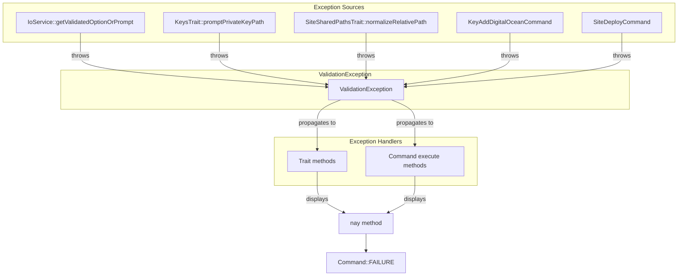
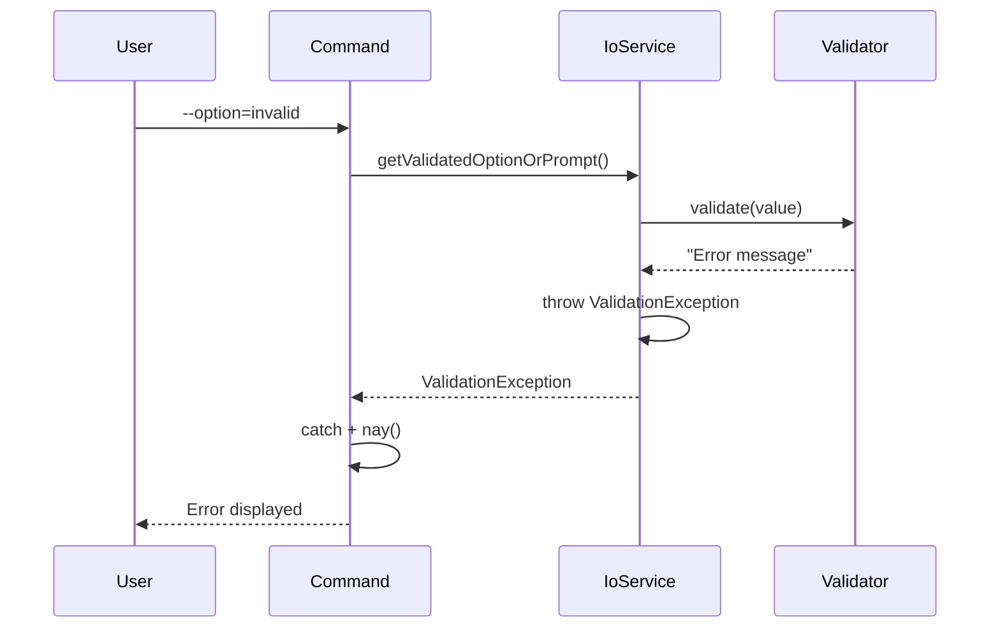

# Schematic: ValidationException.php

> Auto-generated schematic. Last updated: 2025-12-19

## Overview

`ValidationException` is a custom exception class that signals user input validation failures. It extends `RuntimeException` and is primarily thrown by `IoService::getValidatedOptionOrPrompt()` when CLI option validation fails. Commands catch this exception to display user-friendly error messages.

## Logic Flow

### Entry Points

This is an exception class with no explicit entry points. It is instantiated and thrown by:

1. `IoService::getValidatedOptionOrPrompt()` - Primary source (line 136)
2. Various traits and commands that throw validation errors directly

### Execution Flow

1. **Instantiation**: Created with an error message describing the validation failure
2. **Propagation**: Thrown up the call stack
3. **Handling**: Caught by commands, which display the message via `$this->nay()`

### Decision Points

None - this is a data container class with no logic.

### Exit Conditions

Exception terminates when caught. Standard pattern:

```php
try {
    $value = $this->io->getValidatedOptionOrPrompt(...);
} catch (ValidationException $e) {
    $this->nay($e->getMessage());
    return Command::FAILURE;
}
```

## Interaction Diagram



## Dependencies

### Direct Imports

| File/Class         | Usage                                    |
| ------------------ | ---------------------------------------- |
| `\RuntimeException` | Parent class providing exception behavior |

### Coupled Files

| File | Coupling Type | Description |
| ---- | ------------- | ----------- |
| `app/Services/IoService.php` | Thrower | Primary source - throws when CLI option validation fails |
| `app/Traits/KeysTrait.php` | Thrower | Throws when no default SSH key found |
| `app/Traits/SiteSharedPathsTrait.php` | Thrower | Throws on path validation failures |
| `app/Console/Key/KeyAddDigitalOceanCommand.php` | Thrower | Throws when SSH public key not found |
| `app/Console/Site/SiteDeployCommand.php` | Thrower | Throws on deploy validation failures |
| `app/Console/Site/SiteSharedPushCommand.php` | Thrower | Throws when local file not found |
| `app/Traits/ServersTrait.php` | Catcher | Catches in selectServerDeets() |
| `app/Traits/SitesTrait.php` | Catcher | Catches in selectSiteDeets() |
| `app/Traits/SupervisorsTrait.php` | Catcher | Catches in selectSupervisor() |
| `app/Traits/CronsTrait.php` | Catcher | Catches in selectCron() |
| `app/Traits/DigitalOceanTrait.php` | Catcher | Catches in selectKey() |
| All command execute() methods | Catcher | Primary catch points for validation errors |

## Data Flow

### Inputs

| Source | Data | Description |
| ------ | ---- | ----------- |
| Validators | Error message string | User-friendly validation error |

### Outputs

| Destination | Data | Description |
| ----------- | ---- | ----------- |
| `nay()` method | `getMessage()` | Displayed to user as error |

### Side Effects

None - pure exception class.

## Architectural Pattern



## Usage Patterns

### Pattern 1: IoService Validation (Most Common)

```php
try {
    $name = $this->io->getValidatedOptionOrPrompt(
        'name',
        fn ($validate) => $this->io->promptText(label: 'Name:', validate: $validate),
        fn ($value) => $this->validateNameInput($value)
    );
} catch (ValidationException $e) {
    $this->nay($e->getMessage());
    return Command::FAILURE;
}
```

### Pattern 2: Direct Throw from Trait/Command

```php
// In trait - throw for exceptional validation failure
if (null === $resolvedPath) {
    throw new ValidationException('No default SSH key found. Create ~/.ssh/id_ed25519 or specify a path.');
}
```

### Pattern 3: Trait Catch and Handle

```php
// In trait method - catch and handle locally
protected function selectServerDeets(): ServerDTO|int
{
    try {
        $name = $this->io->getValidatedOptionOrPrompt(...);
    } catch (ValidationException $e) {
        $this->nay($e->getMessage());
        return Command::FAILURE;
    }
    return $this->servers->findByName($name);
}
```

## Notes

- **Empty class intentional**: The class body is empty because `RuntimeException` provides all needed functionality (message storage, stack trace, previous exception chaining)
- **Exception vs. return value**: The project uses exceptions for validation failures in CLI mode to avoid repetitive null checks; interactive prompts re-prompt until valid, so they never throw
- **Message quality**: Validators should return complete, user-facing error messages since they are displayed directly via `nay()` without additional context
- **Catch granularity**: Commands should catch at the execute() level, grouping multiple validated inputs in a single try-catch block
- **No trait catch propagation**: By project convention, traits typically let `ValidationException` propagate unless they need to return `Command::FAILURE` (like `selectServerDeets()`)
