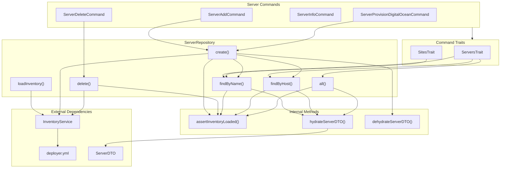

# Schematic: ServerRepository.php

> Auto-generated schematic. Last updated: 2025-12-19

## Overview

ServerRepository provides CRUD operations for servers using YAML inventory storage. It manages servers as an array of objects under the `servers` key in `deployer.yml`. The repository uses a hydrate/dehydrate pattern to convert between ServerDTO objects and raw inventory arrays, with lazy loading via `loadInventory()`.

## Logic Flow

### Entry Points

| Method | Purpose | Returns |
|--------|---------|---------|
| `loadInventory()` | Initialize repository with InventoryService | `void` |
| `create()` | Add new server to inventory | `void` |
| `delete()` | Remove server by name | `void` |
| `findByName()` | Lookup server by name | `?ServerDTO` |
| `findByHost()` | Lookup server by host | `?ServerDTO` |
| `all()` | Get all servers | `array<ServerDTO>` |

### Execution Flow

#### Initialization Flow (`loadInventory`)

```
1. Store InventoryService reference in $this->inventory
2. Get 'servers' key from inventory
   |- Not array: Initialize empty array, persist to inventory
   +- Is array: Use as-is
3. Cache servers array in $this->servers
```

#### Create Flow

```
1. assertInventoryLoaded() - Ensure inventory initialized
2. findByName() - Check for duplicate name
   |- Exists: Throw RuntimeException "Server '{name}' already exists"
   +- Not found: Continue
3. findByHost() - Check for duplicate host
   |- Exists: Throw RuntimeException "Host '{host}' is already used by server '{name}'"
   +- Not found: Continue
4. dehydrateServerDTO() - Convert DTO to array
5. Append to $this->servers
6. inventory->set() - Persist to YAML
```

#### Delete Flow

```
1. assertInventoryLoaded()
2. Filter $this->servers, excluding matching name
3. Update $this->servers with filtered array
4. inventory->set() - Persist to YAML
```

### Decision Points

| Location | Condition | True Branch | False Branch |
|----------|-----------|-------------|--------------|
| `loadInventory()` | `!is_array($servers)` | Initialize empty array | Use existing array |
| `create()` | `null !== $existingName` | Throw "already exists" | Continue |
| `create()` | `null !== $existingHost` | Throw "host already used" | Add server |
| `findByName()` | Name matches | Return hydrated DTO | Continue loop |
| `findByHost()` | Host matches | Return hydrated DTO | Continue loop |
| `hydrateServerDTO()` | Type checks on each field | Use stored value | Use default value |

### Exit Conditions

| Method | Success | Failure |
|--------|---------|---------|
| `loadInventory()` | Void return | N/A |
| `create()` | Void return | Throws if inventory not loaded, name exists, or host exists |
| `delete()` | Void return (silent if not found) | Throws if inventory not loaded |
| `findByName()` | `ServerDTO` | `null` if not found, throws if inventory not loaded |
| `findByHost()` | `ServerDTO` | `null` if not found, throws if inventory not loaded |
| `all()` | `array<ServerDTO>` (may be empty) | Throws if inventory not loaded |

## Interaction Diagram



## Dependencies

### Direct Imports

| File/Class | Usage |
|------------|-------|
| `Deployer\DTOs\ServerDTO` | Primary entity, hydrated/dehydrated |
| `Deployer\Services\InventoryService` | YAML storage backend |

### Coupled Files

| File | Coupling Type | Description |
|------|---------------|-------------|
| `app/Contracts/BaseCommand.php` | Injection | Injects ServerRepository into all commands |
| `app/Traits/ServersTrait.php` | Consumer | Uses `findByName()`, `findByHost()`, `all()` for validation and selection |
| `app/Traits/SitesTrait.php` | Consumer | Uses `findByName()` to resolve server for site operations |
| `app/Console/Server/ServerAddCommand.php` | Consumer | Uses `create()` |
| `app/Console/Server/ServerDeleteCommand.php` | Consumer | Uses `delete()` |
| `app/Console/Server/ServerProvisionDigitalOceanCommand.php` | Consumer | Uses `create()` |
| `app/Repositories/SiteRepository.php` | Sibling | Same pattern, sites reference servers by name |
| `deployer.yml` | Data | YAML inventory file storing servers under `servers` key |

## Data Flow

### Inputs

| Source | Data | Method |
|--------|------|--------|
| `InventoryService` | Raw YAML array under `servers` key | `loadInventory()` |
| Commands | `ServerDTO` instance | `create()` |
| Commands | Server name string | `findByName()`, `delete()` |
| Commands | Server host string | `findByHost()` |

### Outputs

| Destination | Data | Method |
|-------------|------|--------|
| `InventoryService` | Serialized server array | `create()`, `delete()` |
| Commands | `ServerDTO` | `findByName()`, `findByHost()` |
| Commands | `array<ServerDTO>` | `all()` |

### Side Effects

| Method | Side Effect |
|--------|-------------|
| `loadInventory()` | Initializes empty `servers` array in YAML if missing |
| `create()` | Writes to `deployer.yml` via InventoryService |
| `delete()` | Writes to `deployer.yml` via InventoryService |

## Hydrate/Dehydrate Pattern

### Dehydration (DTO to Array)

```php
// dehydrateServerDTO() - Lines 157-168
return [
    'name' => $server->name,
    'host' => $server->host,
    'port' => $server->port,
    'username' => $server->username,
    'privateKeyPath' => $server->privateKeyPath,
    'provider' => $server->provider,
    'dropletId' => $server->dropletId,
];
```

### Hydration (Array to DTO)

```php
// hydrateServerDTO() - Lines 175-194
// Extract with defaults
$name = $data['name'] ?? '';
$port = $data['port'] ?? 22;
$username = $data['username'] ?? 'root';

// Type-safe construction
new ServerDTO(
    name: is_string($name) ? $name : '',
    host: is_string($host) ? $host : '',
    port: is_int($port) ? $port : 22,
    username: is_string($username) ? $username : 'root',
    privateKeyPath: is_string($privateKeyPath) ? $privateKeyPath : null,
    provider: is_string($provider) ? $provider : null,
    dropletId: is_int($dropletId) ? $dropletId : null,
);
```

## Storage Format

```yaml
# deployer.yml
servers:
  - name: web-1
    host: 192.168.1.100
    port: 22
    username: root
    privateKeyPath: ~/.ssh/id_ed25519
    provider: digitalocean
    dropletId: 123456789
  - name: staging
    host: staging.example.com
    port: 2222
    username: deploy
```

## Notes

- **Silent Delete**: `delete()` silently succeeds if the server name is not found, unlike `create()` which throws on duplicates.

- **Dual Uniqueness Constraint**: `create()` enforces uniqueness on both `name` AND `host` fields, preventing duplicate servers or host conflicts.

- **No Update Method**: Unlike SiteRepository, ServerRepository has no `update()` method. Server modifications require delete + create.

- **Type Safety**: Hydration performs explicit type checks with sensible defaults for all fields. No required field validation (unlike SiteRepository's `php_version`).

- **Inventory Dependency**: All operations except construction require `loadInventory()` to be called first. The `assertInventoryLoaded()` guard (line 145-150) throws a clear error message if this invariant is violated.

- **Array Storage**: Servers are stored as a sequential array (not keyed by name) to properly handle special characters in server names when serialized to YAML.

- **DigitalOcean Integration**: The `provider` and `dropletId` fields support cloud-provisioned servers, enabling operations like server deletion to also remove the cloud resource.
