# Schematic: SiteRepository.php

> Auto-generated schematic. Last updated: 2025-12-19

## Overview

SiteRepository provides CRUD operations for sites using YAML inventory storage. It manages sites as an array of objects under the `sites` key in `deployer.yml`, with nested cron and supervisor configurations. The repository uses a hydrate/dehydrate pattern to convert between SiteDTO objects and raw inventory arrays.

## Logic Flow

### Entry Points

| Method | Purpose | Returns |
|--------|---------|---------|
| `loadInventory()` | Initialize repository with InventoryService | `void` |
| `create()` | Add new site to inventory | `void` |
| `update()` | Update existing site | `void` |
| `delete()` | Remove site by domain | `void` |
| `findByDomain()` | Lookup site by domain | `?SiteDTO` |
| `findByServer()` | Get all sites for a server | `array<SiteDTO>` |
| `all()` | Get all sites | `array<SiteDTO>` |
| `addCron()` | Add cron job to site | `void` |
| `deleteCron()` | Remove cron from site | `void` |
| `addSupervisor()` | Add supervisor to site | `void` |
| `deleteSupervisor()` | Remove supervisor from site | `void` |

### Execution Flow

#### Initialization Flow (`loadInventory`)

```
1. Store InventoryService reference
2. Get 'sites' key from inventory
   ├─ Not array: Initialize empty array, persist to inventory
   └─ Is array: Use as-is
3. Cache sites array in $this->sites
```

#### Create Flow

```
1. assertInventoryLoaded() - Ensure inventory initialized
2. findByDomain() - Check for duplicate
   ├─ Exists: Throw RuntimeException
   └─ Not found: Continue
3. dehydrateSiteDTO() - Convert DTO to array
4. Append to $this->sites
5. inventory->set() - Persist to YAML
```

#### Update Flow

```
1. assertInventoryLoaded()
2. Iterate $this->sites to find matching domain
   ├─ Not found: Throw RuntimeException
   └─ Found: Replace with dehydrateSiteDTO($site)
3. inventory->set() - Persist to YAML
```

#### Cron/Supervisor CRUD Flow (`addCron`, `deleteCron`, etc.)

```
1. assertInventoryLoaded()
2. findByDomain() - Get current site
   └─ Not found: Throw RuntimeException
3. Check for duplicates (add) or filter (delete)
4. Create NEW SiteDTO with modified crons/supervisors array
5. update() - Persist via update flow
```

### Decision Points

| Location | Condition | True Branch | False Branch |
|----------|-----------|-------------|--------------|
| `loadInventory()` | `!is_array($sites)` | Initialize empty array | Use existing array |
| `create()` | `null !== $existing` | Throw "already exists" | Add site |
| `update()` | `!$found` after loop | Throw "not found" | Persist update |
| `addCron()` | Duplicate script found | Throw "already exists" | Add cron |
| `addSupervisor()` | Duplicate program found | Throw "already exists" | Add supervisor |
| `hydrateSiteDTO()` | `php_version` missing/empty | Throw RuntimeException | Continue hydration |
| `hydrate*()` | Type checks on other fields | Use default value | Use stored value |

### Exit Conditions

| Method | Success | Failure |
|--------|---------|---------|
| `loadInventory()` | Void return | N/A |
| `create()` | Void return | Throws if inventory not loaded or domain exists |
| `update()` | Void return | Throws if inventory not loaded or domain not found |
| `delete()` | Void return (silent if not found) | Throws if inventory not loaded |
| `findByDomain()` | `SiteDTO` | `null` if not found, throws if php_version missing |
| `findByServer()` | `array<SiteDTO>` (may be empty) | Throws if inventory not loaded or php_version missing |
| `all()` | `array<SiteDTO>` | Throws if inventory not loaded or php_version missing |
| Cron/Supervisor methods | Void return | Throws on duplicate or not found |

## Interaction Diagram

```mermaid
flowchart TD
    subgraph SiteCommands["Site Commands"]
        SiteCreate["SiteCreateCommand"]
        SiteDelete["SiteDeleteCommand"]
        SiteDeploy["SiteDeployCommand"]
    end

    subgraph CronCommands["Cron Commands"]
        CronCreate["CronCreateCommand"]
        CronDelete["CronDeleteCommand"]
    end

    subgraph SupervisorCommands["Supervisor Commands"]
        SupervisorCreate["SupervisorCreateCommand"]
        SupervisorDelete["SupervisorDeleteCommand"]
    end

    subgraph ServerCommands["Server Commands"]
        ServerDelete["ServerDeleteCommand"]
        ServerLogs["ServerLogsCommand"]
    end

    subgraph Traits["Command Traits"]
        SitesTrait["SitesTrait"]
        ServersTrait["ServersTrait"]
    end

    subgraph SiteRepository["SiteRepository"]
        loadInv["loadInventory()"]
        create["create()"]
        update["update()"]
        delete["delete()"]
        findDomain["findByDomain()"]
        findServer["findByServer()"]
        all["all()"]
        addCron["addCron()"]
        deleteCron["deleteCron()"]
        addSupervisor["addSupervisor()"]
        deleteSupervisor["deleteSupervisor()"]
    end

    subgraph Hydration["Hydrate/Dehydrate"]
        hydrateSite["hydrateSiteDTO()"]
        dehydrateSite["dehydrateSiteDTO()"]
        hydrateCron["hydrateCronDTO()"]
        dehydrateCron["dehydrateCronDTO()"]
        hydrateSupervisor["hydrateSupervisorDTO()"]
        dehydrateSupervisor["dehydrateSupervisorDTO()"]
    end

    subgraph External["External Dependencies"]
        InventoryService["InventoryService"]
        YAML["deployer.yml"]
    end

    subgraph DTOs["Data Transfer Objects"]
        SiteDTO["SiteDTO"]
        CronDTO["CronDTO"]
        SupervisorDTO["SupervisorDTO"]
    end

    %% Trait to Repository
    SitesTrait --> findDomain
    SitesTrait --> findServer
    SitesTrait --> all
    ServersTrait --> findServer

    %% Site command usage
    SiteCreate --> create
    SiteDelete --> delete
    SiteDeploy --> update

    %% Cron command usage
    CronCreate --> addCron
    CronCreate --> findDomain
    CronDelete --> deleteCron

    %% Supervisor command usage
    SupervisorCreate --> addSupervisor
    SupervisorCreate --> findDomain
    SupervisorDelete --> deleteSupervisor

    %% Server command usage
    ServerDelete --> findServer
    ServerDelete --> delete
    ServerLogs --> findServer

    %% Repository internal flow
    create --> dehydrateSite
    update --> dehydrateSite
    findDomain --> hydrateSite
    findServer --> hydrateSite
    all --> hydrateSite
    addCron --> findDomain
    addCron --> update
    deleteCron --> findDomain
    deleteCron --> update
    addSupervisor --> findDomain
    addSupervisor --> update
    deleteSupervisor --> findDomain
    deleteSupervisor --> update

    %% Hydration chains
    hydrateSite --> hydrateCron
    hydrateSite --> hydrateSupervisor
    dehydrateSite --> dehydrateCron
    dehydrateSite --> dehydrateSupervisor

    %% DTO creation
    hydrateSite --> SiteDTO
    hydrateCron --> CronDTO
    hydrateSupervisor --> SupervisorDTO

    %% Inventory interaction
    loadInv --> InventoryService
    create --> InventoryService
    update --> InventoryService
    delete --> InventoryService
    InventoryService --> YAML
```



## Dependencies

### Direct Imports

| File/Class | Usage |
|------------|-------|
| `Deployer\DTOs\CronDTO` | Hydrated from/dehydrated to cron data |
| `Deployer\DTOs\SiteDTO` | Primary entity, hydrated/dehydrated |
| `Deployer\DTOs\SupervisorDTO` | Hydrated from/dehydrated to supervisor data |
| `Deployer\Services\InventoryService` | YAML storage backend |

### Coupled Files

| File | Coupling Type | Description |
|------|---------------|-------------|
| `app/Contracts/BaseCommand.php` | Injection | Injects SiteRepository into all commands, calls `loadInventory()` |
| `app/Traits/SitesTrait.php` | Consumer | Uses `all()`, `findByDomain()`, `findByServer()` |
| `app/Traits/ServersTrait.php` | Consumer | Uses `findByServer()` for cascade operations |
| `app/Console/Site/SiteCreateCommand.php` | Consumer | Uses `create()` |
| `app/Console/Site/SiteDeleteCommand.php` | Consumer | Uses `delete()` |
| `app/Console/Site/SiteDeployCommand.php` | Consumer | Uses `update()` |
| `app/Console/Cron/CronCreateCommand.php` | Consumer | Uses `addCron()`, `findByDomain()` |
| `app/Console/Cron/CronDeleteCommand.php` | Consumer | Uses `deleteCron()` |
| `app/Console/Supervisor/SupervisorCreateCommand.php` | Consumer | Uses `addSupervisor()`, `findByDomain()` |
| `app/Console/Supervisor/SupervisorDeleteCommand.php` | Consumer | Uses `deleteSupervisor()` |
| `app/Console/Server/ServerDeleteCommand.php` | Consumer | Uses `findByServer()`, `delete()` for cascade |
| `app/Console/Server/ServerLogsCommand.php` | Consumer | Uses `findByServer()` |
| `deployer.yml` | Data | YAML inventory file storing sites under `sites` key |
| `app/Repositories/ServerRepository.php` | Sibling | Same pattern, sites reference servers by name |

## Data Flow

### Inputs

| Source | Data | Method |
|--------|------|--------|
| `InventoryService` | Raw YAML array under `sites` key | `loadInventory()` |
| Commands | `SiteDTO` instances | `create()`, `update()` |
| Commands | Domain string | `findByDomain()`, `delete()` |
| Commands | Server name string | `findByServer()` |
| Commands | `CronDTO` | `addCron()` |
| Commands | `SupervisorDTO` | `addSupervisor()` |

### Outputs

| Destination | Data | Method |
|-------------|------|--------|
| `InventoryService` | Serialized site array | `create()`, `update()`, `delete()`, cron/supervisor methods |
| Commands | `SiteDTO` | `findByDomain()` |
| Commands | `array<SiteDTO>` | `all()`, `findByServer()` |

### Side Effects

| Method | Side Effect |
|--------|-------------|
| `loadInventory()` | Initializes empty `sites` array in YAML if missing |
| `create()` | Writes to `deployer.yml` via InventoryService |
| `update()` | Writes to `deployer.yml` via InventoryService |
| `delete()` | Writes to `deployer.yml` via InventoryService |
| `addCron()` | Writes to `deployer.yml` via update() |
| `deleteCron()` | Writes to `deployer.yml` via update() |
| `addSupervisor()` | Writes to `deployer.yml` via update() |
| `deleteSupervisor()` | Writes to `deployer.yml` via update() |

## SiteDTO Construction Locations

The repository constructs `SiteDTO` instances in 5 locations:

| Location | Line | Context |
|----------|------|---------|
| `addCron()` | 208-218 | Create updated site with new cron added |
| `deleteCron()` | 245-255 | Create updated site with cron removed |
| `addSupervisor()` | 289-299 | Create updated site with new supervisor added |
| `deleteSupervisor()` | 326-336 | Create updated site with supervisor removed |
| `hydrateSiteDTO()` | 452-460 | Deserialize from raw inventory data |

All constructions include `phpVersion: $site->phpVersion` to preserve PHP version across mutations. The cron/supervisor methods follow the immutable pattern: fetch site, modify collection, create new SiteDTO, call `update()`.

## Hydrate/Dehydrate Pattern

### Dehydration (DTO to Array)

```php
// dehydrateSiteDTO()
// Required fields always included
$data = ['domain' => ..., 'server' => ...];

// Optional fields conditionally included
if (null !== $site->repo) { $data['repo'] = $site->repo; }
if (null !== $site->branch) { $data['branch'] = $site->branch; }

// php_version always included (required field)
$data['php_version'] = $site->phpVersion;

if ([] !== $site->crons) { $data['crons'] = array_map(...); }
if ([] !== $site->supervisors) { $data['supervisors'] = array_map(...); }
```

### Hydration (Array to DTO)

```php
// hydrateSiteDTO()
// Extract with defaults
$domain = $data['domain'] ?? '';
$repo = $data['repo'] ?? null;
$phpVersion = $data['php_version'] ?? null;

// php_version is REQUIRED - throws if missing or empty
if (! is_string($phpVersion) || '' === $phpVersion) {
    throw new \RuntimeException("Site '{$domain}' is missing required 'php_version' in inventory");
}

// Type-safe construction
new SiteDTO(
    domain: is_string($domain) ? $domain : '',
    repo: is_string($repo) ? $repo : null,
    phpVersion: $phpVersion,  // Guaranteed non-empty string
    // ...nested hydration for crons/supervisors
);
```

### Nested Hydration Chain

```
hydrateSiteDTO()
├── hydrateCronDTO() for each cron
└── hydrateSupervisorDTO() for each supervisor

dehydrateSiteDTO()
├── dehydrateCronDTO() for each cron
└── dehydrateSupervisorDTO() for each supervisor
```

## Storage Format

```yaml
# deployer.yml
sites:
  - domain: example.com
    server: web-1
    repo: git@github.com:user/repo.git
    branch: main
    php_version: "8.3"
    crons:
      - script: scheduler.sh
        schedule: "* * * * *"
    supervisors:
      - program: queue-worker
        script: queue.sh
        autostart: true
        autorestart: true
        stopwaitsecs: 3600
        numprocs: 1
```

## Notes

- **Immutable DTOs**: SiteDTO, CronDTO, and SupervisorDTO are readonly classes. The cron/supervisor CRUD methods create new SiteDTO instances rather than mutating existing ones.

- **Silent Delete**: `delete()` silently succeeds if the domain is not found, unlike `update()` which throws.

- **Type Safety**: Hydration methods perform explicit type checks (`is_string()`, `is_int()`, `is_bool()`) with sensible defaults for optional fields. Required fields (`php_version`) throw `RuntimeException` if missing or invalid.

- **Inventory Dependency**: All operations except construction require `loadInventory()` to be called first. The `assertInventoryLoaded()` guard throws a clear error message if this invariant is violated.

- **Array Storage**: Sites are stored as a sequential array (not keyed by domain) to properly handle special characters in domain names when serialized to YAML.

- **Cron/Supervisor Uniqueness**: Crons are keyed by `script`, supervisors by `program`. Adding duplicates throws `RuntimeException`.
