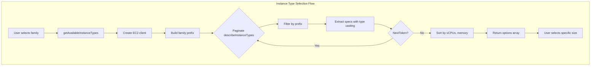
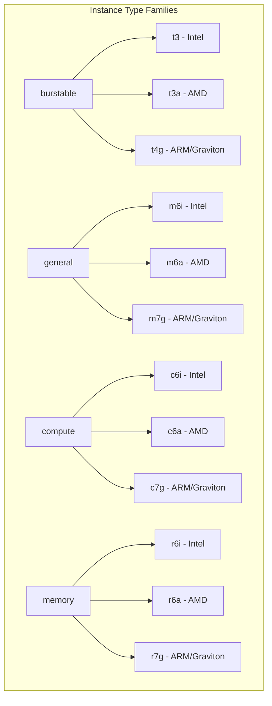

# Schematic: AwsAccountService.php

> Auto-generated schematic. Last updated: 2025-12-26

## Overview

AWS account data service that fetches account-level resources from the EC2 API. Provides methods to retrieve regions, instance type families and sizes (dynamically from AWS with pagination), AMIs (Ubuntu/Debian only), VPCs, subnets, and SSH key pairs for use in server provisioning workflows.

## Logic Flow

### Entry Points

| Method | Purpose |
|--------|---------|
| `getInstanceFamilies()` | Get instance families grouped by category with descriptions |
| `getValidFamilyNames()` | Get list of valid instance family names |
| `getAvailableRegions()` | Fetch enabled AWS regions for the account |
| `getAvailableInstanceTypes(string $family)` | Fetch instance sizes for a specific family from AWS (paginated) |
| `validateInstanceType(string $instanceType)` | Validate a full instance type exists in AWS |
| `getAvailableImages()` | Fetch latest 2 Ubuntu LTS and 2 Debian AMIs |
| `getUserVpcs()` | Fetch VPCs in the configured region |
| `getUserSubnets(string $vpcId)` | Fetch subnets for a specific VPC |
| `getPublicKeys()` | Fetch EC2 key pairs in the region |

### Execution Flow

**getInstanceFamilies()**
1. Iterate through `INSTANCE_TYPE_FAMILIES` constant (organized by category)
2. Build options array with format: `family => "family - description [category label]"`
3. Return flattened options for prompt display

**getValidFamilyNames()**
1. Iterate through `INSTANCE_TYPE_FAMILIES` constant
2. Extract all family keys (t3, t3a, t4g, m6i, etc.)
3. Return flat array of valid family names

**getAvailableRegions()**
1. Create EC2 client via `createEc2Client()`
2. Call `describeRegions()` with `AllRegions => false`
3. Map region codes to display names via `getRegionDisplayName()`
4. Sort alphabetically and return

**getAvailableInstanceTypes(string $family)** (paginated)
1. Create EC2 client
2. Build family prefix (e.g., "t3.")
3. Paginate through `describeInstanceTypes()` with MaxResults=100:
   - Fetch page of instance types
   - Filter client-side by family prefix (AWS doesn't support wildcards)
   - Extract vCPU and memory specs with explicit type casting for memory (AWS may return string)
   - Store in temporary array with type, vcpus, memory, label
   - Continue if NextToken present
4. Sort collected results by vCPUs, then memory
5. Format as `type => "type - X vCPU, YGB RAM"`

**validateInstanceType(string $instanceType)**
1. Extract family from instance type (e.g., "t3.large" -> "t3")
2. Validate format has exactly 2 parts (family.size)
3. Check family exists in `getValidFamilyNames()`
4. Query AWS for available types in that family
5. Return true if specific type exists, false otherwise

**getAvailableImages()**
1. Create EC2 client
2. Fetch Ubuntu images from Canonical (owner: 099720109477)
3. Fetch Debian images from Debian (owner: 136693071363)
4. Merge results and filter via `filterLatestImages()`:
   - Parse version from image name via `parseImageVersion()`
   - Group by distribution + version
   - Keep latest by CreationDate per version
   - Sort versions descending, limit to latest 2 per distro
5. Format descriptions via `formatImageDescription()` using `Distribution::formatVersion()`

**getUserVpcs()**
1. Create EC2 client
2. Call `describeVpcs()` with no filters
3. Extract Name tag, default status, and CIDR block
4. Return as `vpcId => "Name (default) - CIDR"`

**getUserSubnets()**
1. Create EC2 client
2. Call `describeSubnets()` filtered by VPC ID
3. Extract Name tag, AZ, CIDR, and public/private status
4. Return as `subnetId => "Name (AZ, public/private) - CIDR"`

**getPublicKeys()**
1. Create EC2 client
2. Call `describeKeyPairs()`
3. Extract key name and truncated fingerprint
4. Return as `keyName => "keyName (fingerprint...)"`

### Decision Points

| Location | Condition | Branches |
|----------|-----------|----------|
| `getAvailableInstanceTypes()` | NextToken present | Continue pagination or exit loop |
| `getAvailableInstanceTypes()` | Instance type starts with family prefix | Include in results or skip |
| `validateInstanceType()` | Format check (2 parts) | Return false if invalid format |
| `validateInstanceType()` | Family in valid list | Return false if family unknown |
| `validateInstanceType()` | Type exists in AWS | Return true/false based on AWS query |
| `parseImageVersion()` | Ubuntu LTS pattern (xx.04) | Return ['ubuntu', version] |
| `parseImageVersion()` | Debian pattern (debian-XX) | Return ['debian', version] |
| `parseImageVersion()` | No match | Return null (skip image) |
| `filterLatestImages()` | Version sorting | Keep latest 2 per distro |
| `formatMemorySize()` | Memory < 1024 MiB | Display as MB, otherwise GB |
| `getUserVpcs()` | Default VPC check | Append "(default)" or not |
| `getUserSubnets()` | MapPublicIpOnLaunch | Label as "public" or "private" |

### Exit Conditions

All public methods either:
- Return `array<string, string>` on success (for getters)
- Return `bool` for `validateInstanceType()`
- Throw `\RuntimeException` on API failure

## Interaction Diagram

```mermaid
flowchart TD
    subgraph AwsAccountService
        GIF[getInstanceFamilies]
        GVFN[getValidFamilyNames]
        GAR[getAvailableRegions]
        GAIT[getAvailableInstanceTypes]
        VIT[validateInstanceType]
        GAI[getAvailableImages]
        GUV[getUserVpcs]
        GUS[getUserSubnets]
        GPK[getPublicKeys]
        FLI[filterLatestImages]
        PIV[parseImageVersion]
        FID[formatImageDescription]
        FMS[formatMemorySize]
    end

    subgraph BaseAwsService
        CEC[createEc2Client]
    end

    subgraph "Distribution Enum"
        DFV[Distribution::formatVersion]
        DF[Distribution::from]
    end

    subgraph "AWS EC2 API"
        DR[describeRegions]
        DIT[describeInstanceTypes]
        DI[describeImages]
        DV[describeVpcs]
        DSN[describeSubnets]
        DKP[describeKeyPairs]
    end

    subgraph Constant
        ITF[INSTANCE_TYPE_FAMILIES]
    end

    GIF --> ITF
    GVFN --> ITF
    VIT --> GVFN
    VIT --> GAIT
    GAR --> CEC
    GAR --> DR
    GAIT --> CEC
    GAIT --> DIT
    GAIT --> FMS
    GAI --> CEC
    GAI --> DI
    GAI --> FLI
    FLI --> PIV
    GAI --> FID
    FID --> DF
    FID --> DFV
    GUV --> CEC
    GUV --> DV
    GUS --> CEC
    GUS --> DSN
    GPK --> CEC
    GPK --> DKP
```

## Dependencies

### Direct Imports

| File/Class | Usage |
|------------|-------|
| `BaseAwsService` | Parent class providing SDK and EC2 client creation |
| `Distribution` | Format image descriptions with version and codename |

### Coupled Files

| File | Coupling Type | Description |
|------|---------------|-------------|
| `app/Services/AwsService.php` | Facade | Aggregates this service, calls `setSdk()` and `setRegion()` |
| `app/Services/Aws/BaseAwsService.php` | Inheritance | Provides `createEc2Client()`, `getSdk()`, `getRegion()` |

## Data Flow

### Inputs

| Input | Source | Description |
|-------|--------|-------------|
| AWS SDK | `AwsService.initialize()` | Injected via `setSdk()` |
| Region | `AwsService.initialize()` | Injected via `setRegion()` |
| Family | Caller | Required for `getAvailableInstanceTypes()` |
| VPC ID | Caller | Required for `getUserSubnets()` |
| Instance Type | Caller | Required for `validateInstanceType()` |

### Outputs

All methods return `array<string, string>` where:
- Key = AWS resource identifier (region code, instance type, AMI ID, VPC ID, subnet ID, key name)
- Value = Human-readable display string

Exception: `validateInstanceType()` returns `bool`.

### Side Effects

None. This service is read-only and makes no modifications to AWS resources.

## Notes

**Instance Type Families (INSTANCE_TYPE_FAMILIES constant):**
The service organizes instance families into four categories:
- **Burstable**: t3, t3a, t4g - variable workloads, cost-effective
- **General Purpose**: m6i, m6a, m7g - balanced CPU/memory
- **Compute Optimized**: c6i, c6a, c7g - CPU-intensive workloads
- **Memory Optimized**: r6i, r6a, r7g - large databases

Each family includes Intel, AMD, and ARM/Graviton variants.

**Dynamic Instance Type Fetching with Pagination:**
The service queries AWS dynamically via `getAvailableInstanceTypes(family)` with full pagination support. AWS's `describeInstanceTypes` API doesn't support wildcard filters, so the service fetches all types in pages of 100 and filters client-side by family prefix. This ensures users always see current availability regardless of how many instance types exist.

**Type Coercion for AWS API Responses:**
AWS API may return numeric values as strings in some responses. The `getAvailableInstanceTypes()` method explicitly casts the `SizeInMiB` memory value to int (line 179) to handle this inconsistency. PHPDoc annotations document the expected mixed types from AWS.

**Two-Step Selection:**
The family/size approach enables a two-step selection UI:
1. User selects instance family (t3, m6i, etc.)
2. System queries AWS for available sizes in that family (with pagination)
3. User selects specific size (micro, small, large, xlarge, etc.)

**validateInstanceType():**
Added for backwards compatibility with direct `--instance-type` option. Validates format, checks family is known, then queries AWS to confirm the specific type exists.

**AMI Filtering:**
Only Ubuntu LTS and Debian stable images are returned. The service:
- Filters by owner ID (Canonical: 099720109477, Debian: 136693071363)
- Requires x86_64 architecture, HVM virtualization, EBS root device
- Uses regex to extract versions: Ubuntu xx.04 (LTS only), Debian major version
- Groups by distribution version and keeps only the latest AMI per version
- Limits to latest 2 versions per distribution

**Region Display Names:**
A static mapping provides human-readable region names. New AWS regions may need manual addition to this mapping.

**Pagination Notes:**
- `getAvailableInstanceTypes()`: Full pagination support with NextToken handling
- Other methods (VPCs, subnets, key pairs): No pagination - acceptable for typical account resource counts
