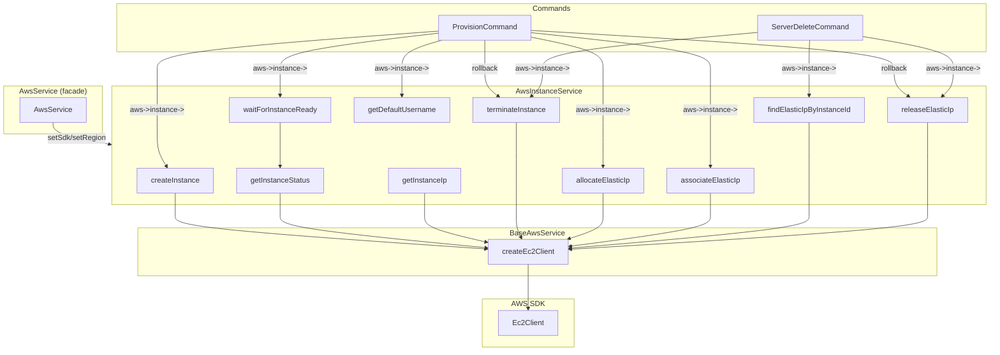

# Schematic: AwsInstanceService.php

> Auto-generated schematic. Last updated: 2025-12-26
>
> Recent update: Simplified `createInstance()` to remove `$diskType` parameter - now always uses gp3 SSD when disk size is specified.

## Overview

AWS EC2 instance lifecycle management service. Handles instance creation, termination, status monitoring, IP retrieval, and Elastic IP management. Part of the AWS service layer accessed through `AwsService->instance`.

## Logic Flow

### Entry Points

| Method | Purpose |
|--------|---------|
| `createInstance()` | Provision new EC2 instance with tags and optional disk config |
| `getInstanceStatus()` | Query current instance state |
| `waitForInstanceReady()` | Poll until instance reaches "running" state |
| `getInstanceIp()` | Retrieve public IPv4 address |
| `terminateInstance()` | Delete EC2 instance |
| `getDefaultUsername()` | Determine SSH username from AMI name |
| `findElasticIpByInstanceId()` | Look up Elastic IP allocation ID by instance ID |
| `allocateElasticIp()` | Allocate new Elastic IP address |
| `associateElasticIp()` | Associate Elastic IP with instance |
| `releaseElasticIp()` | Release Elastic IP address |

### Execution Flow

**Instance Creation (`createInstance`)**
1. Create EC2 client via inherited `createEc2Client()`
2. Build params with network interface config (subnet, security group, no auto public IP)
3. If `diskSize` provided, add `BlockDeviceMappings` for `/dev/xvda` with gp3 SSD
4. Call `runInstances()` with params
5. Apply `Name` and `ManagedBy=deployer` tags
6. Extract and return instance ID from response

**Status Polling (`waitForInstanceReady`)**
1. Record start time
2. Loop: call `getInstanceStatus()`
3. Return if status is "running"
4. Throw if status is terminal (terminated, shutting-down, stopping, stopped)
5. Throw if timeout exceeded
6. Sleep for poll interval, repeat

**Instance Termination (`terminateInstance`)**
1. Create EC2 client
2. Call `terminateInstances()`
3. Catch errors: silently succeed if instance not found

**Elastic IP Allocation (`allocateElasticIp`)**
1. Create EC2 client
2. Call `allocateAddress()` with domain=vpc and `ManagedBy=deployer` tag
3. Return allocation ID and public IP

**Elastic IP Association (`associateElasticIp`)**
1. Create EC2 client
2. Call `associateAddress()` with allocation ID and instance ID

**Elastic IP Lookup (`findElasticIpByInstanceId`)**
1. Create EC2 client
2. Call `describeAddresses()` with filter on `instance-id`
3. Return allocation ID if found, null otherwise

**Elastic IP Release (`releaseElasticIp`)**
1. Create EC2 client
2. Call `releaseAddress()` with allocation ID
3. Catch errors: silently succeed if allocation not found

### Decision Points

| Location | Condition | Branches |
|----------|-----------|----------|
| `createInstance` L71 | `diskSize !== null` | Add BlockDeviceMappings with gp3 |
| `waitForInstanceReady` L167 | `status === 'running'` | Return success |
| `waitForInstanceReady` L172 | `status in terminal_states` | Throw error |
| `waitForInstanceReady` L178 | `elapsed >= timeout` | Throw timeout |
| `terminateInstance` L247 | Error contains "not found" | Silent success |
| `findElasticIpByInstanceId` L306 | `count($addresses) === 0` | Return null |
| `releaseElasticIp` L393 | Error contains "not found" | Silent success |
| `getDefaultUsername` L266-270 | AMI name contains distro | Return appropriate username |

### Exit Conditions

| Method | Success | Failure |
|--------|---------|---------|
| `createInstance` | Returns `{id, name}` array | Throws RuntimeException |
| `getInstanceStatus` | Returns state string | Throws RuntimeException |
| `waitForInstanceReady` | Returns void (running) | Throws on timeout/terminal state |
| `getInstanceIp` | Returns IP string | Throws if no public IP |
| `terminateInstance` | Returns void | Throws on non-404 errors |
| `getDefaultUsername` | Returns username string | N/A (always succeeds) |
| `findElasticIpByInstanceId` | Returns allocation ID or null | Throws RuntimeException |
| `allocateElasticIp` | Returns `{allocationId, publicIp}` | Throws RuntimeException |
| `associateElasticIp` | Returns void | Throws RuntimeException |
| `releaseElasticIp` | Returns void | Throws on non-404 errors |

## Interaction Diagram

## Dependencies

### Direct Imports

| File/Class | Usage |
|------------|-------|
| `BaseAwsService` | Parent class providing SDK/region management |

### Coupled Files

| File | Coupling Type | Description |
|------|---------------|-------------|
| `app/Services/AwsService.php` | Facade | Exposes as `$aws->instance`, calls `setSdk()`/`setRegion()` |
| `app/Console/Pro/Aws/ProvisionCommand.php` | Consumer | Uses all methods for instance provisioning with Elastic IP |
| `app/Console/Server/ServerDeleteCommand.php` | Consumer | Uses `findElasticIpByInstanceId()`, `terminateInstance()`, and `releaseElasticIp()` for cleanup |
| `app/Services/Aws/BaseAwsService.php` | Inheritance | Provides `createEc2Client()`, SDK access |

## Data Flow

### Inputs

| Method | Input | Source |
|--------|-------|--------|
| `createInstance` | Instance config (name, type, AMI, key, subnet, SG, diskSize) | ProvisionCommand |
| `getInstanceStatus` | Instance ID | Internal/Command |
| `waitForInstanceReady` | Instance ID, timeout, poll interval | Command |
| `getInstanceIp` | Instance ID | Command |
| `terminateInstance` | Instance ID | Command |
| `getDefaultUsername` | AMI name string | Command |
| `findElasticIpByInstanceId` | Instance ID | Command |
| `allocateElasticIp` | None | Command |
| `associateElasticIp` | Allocation ID, Instance ID | Command |
| `releaseElasticIp` | Allocation ID | Command |

### Outputs

| Method | Output | Destination |
|--------|--------|-------------|
| `createInstance` | `{id: string, name: string}` | Command for tracking |
| `getInstanceStatus` | State string (pending, running, etc.) | Internal polling |
| `getInstanceIp` | Public IPv4 address | ServerDTO creation |
| `getDefaultUsername` | SSH username (ubuntu, admin) | ServerDTO creation |
| `findElasticIpByInstanceId` | Allocation ID or null | Command for cleanup |
| `allocateElasticIp` | `{allocationId: string, publicIp: string}` | Command for association |
| `associateElasticIp` | void | Confirmation of success |
| `releaseElasticIp` | void | Rollback confirmation |

### Side Effects

| Method | Effect |
|--------|--------|
| `createInstance` | Creates EC2 instance in AWS, applies Name tag, configures disk (gp3 SSD) |
| `waitForInstanceReady` | Blocks execution, calls `sleep()` |
| `terminateInstance` | Deletes EC2 instance from AWS |
| `allocateElasticIp` | Allocates Elastic IP in AWS, applies ManagedBy tag |
| `associateElasticIp` | Associates Elastic IP with EC2 instance |
| `releaseElasticIp` | Releases Elastic IP back to AWS pool |

## Notes

1. **Tagging strategy**: All instances and Elastic IPs tagged with `ManagedBy=deployer` for identification
2. **Idempotent termination**: `terminateInstance()` and `releaseElasticIp()` silently succeed if resource already gone
3. **Username mapping**: Currently supports Ubuntu (`ubuntu`) and Debian (`admin`), defaults to `ubuntu`
4. **Timeout default**: 5-minute wait with 5-second polling for instance ready
5. **Terminal states**: Polling aborts immediately on terminated/shutting-down/stopping/stopped
6. **Elastic IP provisioning**: ProvisionCommand allocates -> waits for instance -> associates -> uses static IP
7. **Elastic IP cleanup**: ServerDeleteCommand looks up by instance ID -> terminates instance -> releases IP
8. **Disk configuration**: Optional `diskSize` (GB) for root volume; always uses gp3 SSD
9. **No auto public IP**: Instances created without auto-assigned public IP since Elastic IP is used
