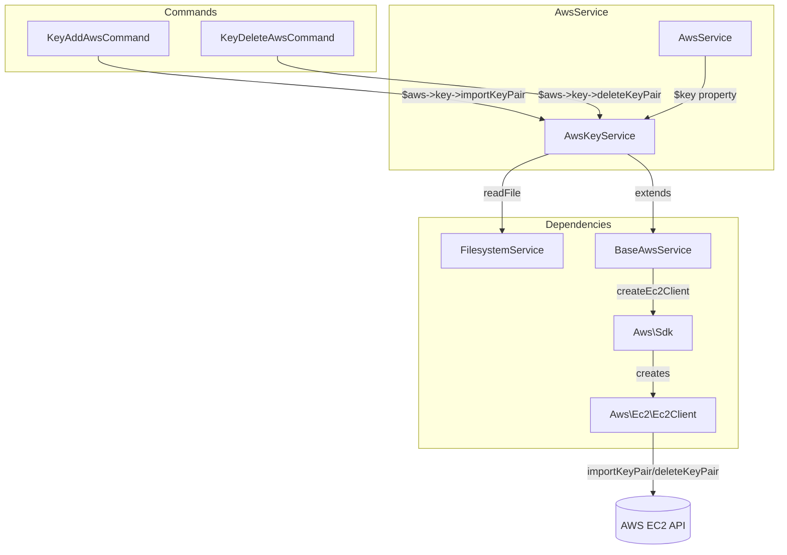

# Schematic: AwsKeyService.php

> Auto-generated schematic. Last updated: 2025-12-21

## Overview

AWS EC2 key pair management service. Imports local SSH public keys to AWS and deletes existing key pairs. Extends `BaseAwsService` for SDK and region management.

## Logic Flow

### Entry Points

| Method | Purpose |
|--------|---------|
| `importKeyPair(string $publicKeyPath, string $keyName): string` | Import SSH public key to AWS |
| `deleteKeyPair(string $keyName): void` | Delete key pair from AWS |

### Execution Flow

**importKeyPair:**
1. Read public key file via `FilesystemService->readFile()`
2. Trim whitespace from key content
3. Create EC2 client via parent `createEc2Client()`
4. Call AWS `importKeyPair` API with key name and material
5. Extract and return fingerprint from response
6. On error: check for "already exists" and throw cleaner message

**deleteKeyPair:**
1. Create EC2 client via parent `createEc2Client()`
2. Call AWS `deleteKeyPair` API with key name
3. On error: check for "not found"/"does not exist" and return silently
4. Re-throw other errors wrapped in RuntimeException

### Decision Points

| Method | Condition | Branch |
|--------|-----------|--------|
| `importKeyPair` | Error contains "already exists" | Throw cleaner duplicate message |
| `importKeyPair` | Other error | Throw generic failure message |
| `deleteKeyPair` | Error contains "not found" | Return silently (idempotent) |
| `deleteKeyPair` | Other error | Throw wrapped RuntimeException |

### Exit Conditions

- `importKeyPair`: Returns fingerprint string on success, throws `RuntimeException` on failure
- `deleteKeyPair`: Returns void on success (including missing key), throws `RuntimeException` on failure

## Interaction Diagram

## Dependencies

### Direct Imports

| File/Class | Usage |
|------------|-------|
| `Deployer\Services\FilesystemService` | Read SSH public key file contents |
| `Deployer\Services\Aws\BaseAwsService` | Parent class for SDK/region management |

### Coupled Files

| File | Coupling Type | Description |
|------|---------------|-------------|
| `AwsService` | State | Receives SDK and region via `setSdk()`/`setRegion()` |
| `BaseAwsService` | Inheritance | Provides `createEc2Client()`, SDK/region getters |
| `Aws\Sdk` | API | AWS SDK for PHP, creates EC2 clients |

## Data Flow

### Inputs

| Source | Data | Method |
|--------|------|--------|
| `FilesystemService` | Public key file contents | `importKeyPair` |
| Command | Key name string | Both methods |
| `AwsService.initialize()` | AWS SDK and region | `setSdk()`/`setRegion()` |

### Outputs

| Destination | Data | Method |
|-------------|------|--------|
| AWS EC2 API | Key material + name | `importKeyPair` |
| Caller | Key fingerprint | `importKeyPair` return |
| AWS EC2 API | Key name | `deleteKeyPair` |

### Side Effects

| Effect | Method |
|--------|--------|
| Creates EC2 key pair in AWS region | `importKeyPair` |
| Deletes EC2 key pair from AWS region | `deleteKeyPair` |

## Dependents

| File | Usage |
|------|-------|
| `AwsService` | Exposes via `$aws->key` property |
| `KeyAddAwsCommand` | Calls `importKeyPair()` |
| `KeyDeleteAwsCommand` | Calls `deleteKeyPair()` |

## Error Messages

| Condition | Message |
|-----------|---------|
| Duplicate key | `Key pair '{name}' already exists in this region` |
| Import failure | `Failed to import key pair: {aws_message}` |
| Delete failure | `Failed to delete key pair: {aws_message}` |
| SDK not set | `AWS SDK not configured. Call setSdk() first.` (from parent) |
| Region not set | `AWS region not configured. Call setRegion() first.` (from parent) |

## Notes

- **Initialization Required:** `AwsService.initialize()` must be called before use to set SDK and region
- **Idempotent Delete:** AWS `deleteKeyPair` is idempotent; defensive error handling catches "not found" for robustness
- **Exception Chain:** All AWS exceptions wrapped in `RuntimeException` with original as `previous` for debugging
- **Region Scope:** Key pairs are region-specific; same key name can exist in different regions
