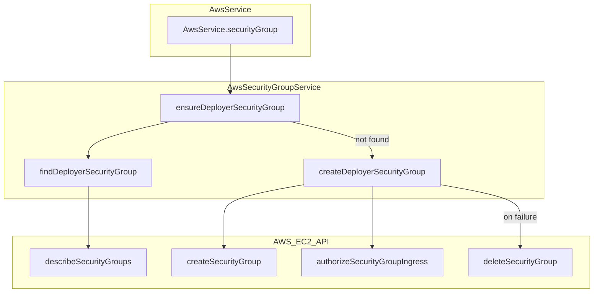

# Schematic: AwsSecurityGroupService.php

> Auto-generated schematic. Last updated: 2025-12-21

## Overview

AWS EC2 security group management service. Manages the shared "deployer" security group for all deployer-provisioned instances, providing allow-all traffic rules (firewall management delegated to `server:firewall`).

## Logic Flow

### Entry Points

| Method | Purpose |
|--------|---------|
| `ensureDeployerSecurityGroup(string $vpcId)` | Create or find existing deployer security group |
| `findDeployerSecurityGroup(string $vpcId)` | Search for existing security group by name |

### Execution Flow

**ensureDeployerSecurityGroup:**
1. Call `findDeployerSecurityGroup()` to check for existing group
2. If found, return existing security group ID
3. If not found, call `createDeployerSecurityGroup()` to create new group
4. Return new security group ID

**findDeployerSecurityGroup:**
1. Create EC2 client via parent `createEc2Client()`
2. Call AWS `describeSecurityGroups` with VPC and name filters
3. Return first match's GroupId or null if empty

**createDeployerSecurityGroup (private):**
1. Create EC2 client via parent `createEc2Client()`
2. Initialize `$groupId = null` for rollback tracking
3. Create security group with:
   - Name: "deployer"
   - Tags: Name=deployer, ManagedBy=deployer
4. Capture `$groupId` from response
5. Add ingress rules (allow all IPv4/IPv6)
6. Return group ID on success
7. On failure: attempt rollback deletion if `$groupId` was assigned

### Decision Points

| Condition | Branch |
|-----------|--------|
| Security group exists | Return existing ID, skip creation |
| Creation succeeds, ingress fails | Rollback: delete orphaned group |
| Rollback succeeds | Throw error without orphan warning |
| Rollback fails | Throw error with orphan warning and group ID |

### Exit Conditions

- **Success:** Returns security group ID string
- **Failure:** Throws `\RuntimeException` with descriptive message

## Interaction Diagram



## Dependencies

### Direct Imports

| File/Class | Usage |
|------------|-------|
| `BaseAwsService` | Parent class providing `createEc2Client()`, `setSdk()`, `setRegion()` |

### Coupled Files

| File | Coupling Type | Description |
|------|---------------|-------------|
| `AwsService` | Facade | Exposes via `$aws->securityGroup` property |
| `BaseAwsService` | Inheritance | SDK and region configuration |
| `ServerProvisionAwsCommand` | Consumer | Calls `ensureDeployerSecurityGroup()` during provisioning |

## Data Flow

### Inputs

| Input | Type | Source |
|-------|------|--------|
| VPC ID | `string` | From `AwsAccountService.getDefaultVpc()` via command |
| AWS SDK | `Aws\Sdk` | Injected via `setSdk()` from `AwsService.initialize()` |
| Region | `string` | Injected via `setRegion()` from `AwsService.initialize()` |

### Outputs

| Output | Type | Destination |
|--------|------|-------------|
| Security Group ID | `string` | Used by `AwsInstanceService` for instance launch |

### Side Effects

- Creates "deployer" security group in AWS VPC (if not exists)
- Adds allow-all ingress rules to created security group
- May delete orphaned security group on ingress rule failure (rollback)

## Constants

| Constant | Value | Purpose |
|----------|-------|---------|
| `SECURITY_GROUP_NAME` | `'deployer'` | Fixed name for deployer-managed security group |
| `SECURITY_GROUP_DESCRIPTION` | Managed by Deployer... | Description shown in AWS console |

## Error Messages

| Condition | Message Pattern |
|-----------|-----------------|
| Search failure | `Failed to search for security group: {aws_message}` |
| Creation failure (clean rollback) | `Failed to create security group: {aws_message}` |
| Ingress failure (rollback succeeded) | `Failed to create security group: {aws_message}` |
| Ingress failure (rollback failed) | `Failed to configure security group ingress rules: {msg}. An orphaned security group (ID: {id}) may exist and should be manually deleted.` |

## Rollback Logic

The `createDeployerSecurityGroup` method implements atomic-like behavior:

```
try:
    1. Create security group -> capture $groupId
    2. Add ingress rules
    3. Return $groupId
catch:
    if $groupId was assigned (group created before failure):
        try: delete the orphaned group
        catch: warn user about orphan in error message
    throw wrapped exception
```

This prevents orphaned security groups when ingress rule creation fails after the group itself was successfully created.

## Notes

- Security group allows ALL traffic (0.0.0.0/0 and ::/0) - actual firewall rules managed by `server:firewall`
- Outbound rules use AWS default (allow-all) - not explicitly configured
- SDK and region must be configured via parent methods before use
- Idempotent: safe to call multiple times, returns existing group if present
