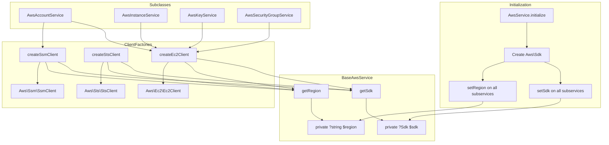

# Schematic: BaseAwsService.php

> Auto-generated schematic. Last updated: 2025-12-21

## Overview

Abstract base class for AWS API services providing SDK instance management and region configuration. Serves as the foundation for all specialized AWS service classes (account, instance, key, security group), enabling them to create AWS SDK clients with consistent configuration.

## Logic Flow

### Entry Points

| Method | Visibility | Purpose |
|--------|------------|---------|
| `setSdk(Sdk $sdk)` | public | Configure SDK instance |
| `setRegion(string $region)` | public | Configure AWS region |

### Execution Flow

**SDK/Region Configuration (called by AwsService.initialize):**

1. `AwsService` creates SDK instance with credentials
2. `AwsService` calls `setSdk()` on each sub-service
3. `AwsService` calls `setRegion()` on each sub-service
4. Sub-services are ready to make API calls

**Client Creation (called by subclasses):**

1. Subclass calls protected factory method (e.g., `createEc2Client()`)
2. Factory validates SDK is configured via `getSdk()`
3. Factory creates client with region (or provided override)
4. Client returned to subclass for API operations

### Decision Points

| Location | Condition | True Branch | False Branch |
|----------|-----------|-------------|--------------|
| `getSdk()` | `null === $this->sdk` | Throw RuntimeException | Return SDK |
| `getRegion()` | `null === $this->region` | Throw RuntimeException | Return region |
| `createEc2Client()` | `null !== $region` param | Use param region | Use default region |
| `createSsmClient()` | `null !== $region` param | Use param region | Use default region |

### Exit Conditions

- All public setters return void
- Protected getters throw on misconfiguration or return values
- Factory methods return client instances or throw on SDK not configured

## Interaction Diagram

## Dependencies

### Direct Imports

| File/Class | Usage |
|------------|-------|
| `Aws\Sdk` | AWS SDK instance for creating service clients |
| `Aws\Ec2\Ec2Client` | Return type of createEc2Client() |
| `Aws\Sts\StsClient` | Return type of createStsClient() |
| `Aws\Ssm\SsmClient` | Return type of createSsmClient() |

### Coupled Files

| File | Coupling Type | Description |
|------|---------------|-------------|
| `app/Services/AwsService.php` | State | Orchestrates initialization; calls setSdk/setRegion |
| `app/Services/Aws/AwsAccountService.php` | Inheritance | Extends this class; uses createEc2Client, createSsmClient |
| `app/Services/Aws/AwsInstanceService.php` | Inheritance | Extends this class; uses createEc2Client |
| `app/Services/Aws/AwsKeyService.php` | Inheritance | Extends this class; uses createEc2Client |
| `app/Services/Aws/AwsSecurityGroupService.php` | Inheritance | Extends this class; uses createEc2Client |

## Data Flow

### Inputs

| Source | Data | Method |
|--------|------|--------|
| AwsService | SDK instance | `setSdk()` |
| AwsService | Region string | `setRegion()` |
| Subclass | Optional region override | `createEc2Client()`, `createSsmClient()` |

### Outputs

| Destination | Data | Method |
|-------------|------|--------|
| Subclasses | SDK instance | `getSdk()` |
| Subclasses | Region string | `getRegion()` |
| Subclasses | EC2 client | `createEc2Client()` |
| Subclasses | STS client | `createStsClient()` |
| Subclasses | SSM client | `createSsmClient()` |

### Side Effects

None. This class is a pure configuration holder and factory.

## Notes

1. **Lazy initialization:** SDK and region are nullable with runtime guards; must call setters before use
2. **Region override:** `createEc2Client()` and `createSsmClient()` accept optional region parameter for cross-region operations
3. **Single SDK instance:** All subclasses share the same SDK instance set by AwsService
4. **Error messages:** Explicitly guide caller to use correct setter method
5. **STS client:** Used by AwsService for credential verification via GetCallerIdentity
