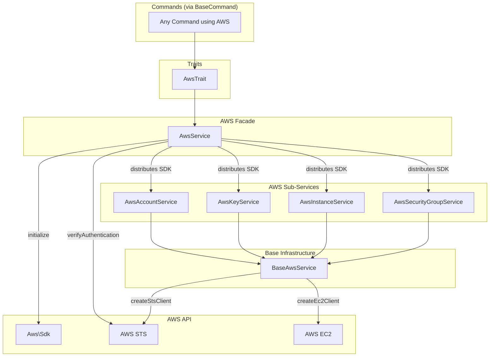
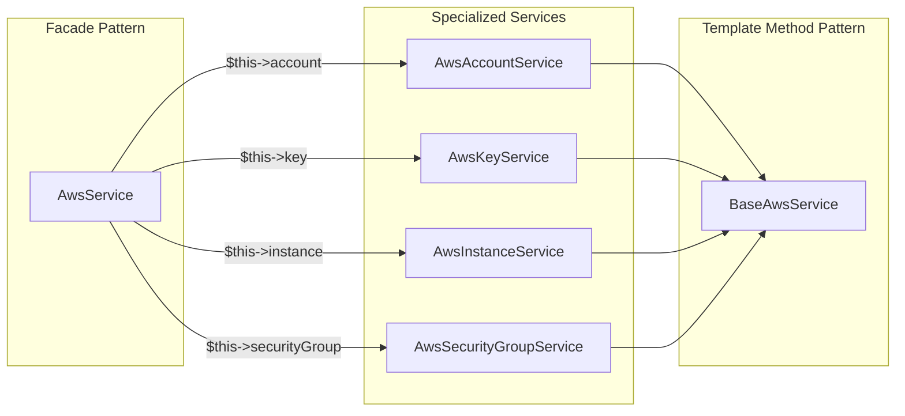

# Schematic: AwsService.php

> Auto-generated schematic. Last updated: 2025-12-21

## Overview

AWS API facade service that provides unified access to specialized AWS sub-services. Acts as the central entry point for all AWS operations, handling SDK initialization, credential verification, and cache management while delegating domain-specific operations to dedicated services.

## Logic Flow

### Entry Points

| Method | Purpose |
|--------|---------|
| `initialize(accessKeyId, secretAccessKey, region)` | Initialize SDK and verify authentication |
| `getRegion()` | Get configured AWS region |
| `hasCache(key)` | Check cache key existence |
| `getCache(key)` | Retrieve cached value |
| `setCache(key, value)` | Store value in cache |
| `clearCache(key)` | Remove cached value |

### Execution Flow

**Primary Flow: SDK Initialization**

1. `initialize()` called with credentials and region
2. Region stored in `$this->region`
3. `initializeSdk()` validates credentials are non-empty
4. AWS SDK instance created with credentials
5. SDK and region distributed to all 4 sub-services via `setSdk()` and `setRegion()`
6. `verifyAuthentication()` calls STS GetCallerIdentity to validate credentials
7. On success, all sub-services are ready for use

### Decision Points

| Location | Condition | Branch |
|----------|-----------|--------|
| `initializeSdk()` L74 | Empty credentials | Throws RuntimeException with setup instructions |
| `verifyAuthentication()` L108 | SDK is null | Throws RuntimeException (SDK not initialized) |
| `verifyAuthentication()` L119 | STS call fails | Throws RuntimeException with auth failure message |
| `getRegion()` L62 | Region is null | Throws RuntimeException (not initialized) |

### Exit Conditions

- `initialize()`: Void on success, throws on credential/auth failure
- `getRegion()`: Returns region string or throws if not initialized
- Cache methods: Return immediately after cache operation

## Interaction Diagram

## Dependencies

### Direct Imports

| File/Class | Usage |
|------------|-------|
| `Aws\Sdk` | AWS SDK factory for creating service clients |
| `AwsAccountService` | Account data retrieval (regions, instance types, AMIs, VPCs, subnets, keys) |
| `AwsKeyService` | EC2 key pair management (import, delete) |
| `AwsInstanceService` | EC2 instance lifecycle (create, terminate, status, wait) |
| `AwsSecurityGroupService` | Security group management (ensure deployer group exists) |

### Coupled Files

| File | Coupling Type | Description |
|------|---------------|-------------|
| `app/Traits/AwsTrait.php` | State | Calls `initializeAwsAPI()` which invokes `$this->aws->initialize()` |
| `app/Contracts/BaseCommand.php` | State | Injects AwsService via constructor for all commands |
| `app/Services/Aws/BaseAwsService.php` | State | Parent class of all sub-services, receives SDK via `setSdk()` |
| `.env` | Config | Reads `AWS_ACCESS_KEY_ID`, `AWS_SECRET_ACCESS_KEY`, `AWS_DEFAULT_REGION` |

## Data Flow

### Inputs

| Source | Data | Method |
|--------|------|--------|
| Environment | AWS credentials (key ID, secret, region) | `initialize()` |
| Commands | Cache keys and values | `setCache()`, `getCache()` |

### Outputs

| Destination | Data | Method |
|-------------|------|--------|
| Sub-services | SDK instance and region | `initializeSdk()` |
| Commands | Cached data | `getCache()` |
| Commands | Region string | `getRegion()` |

### Side Effects

| Effect | Location | Description |
|--------|----------|-------------|
| SDK State | `initializeSdk()` | Sets `$this->sdk` and distributes to all 4 sub-services |
| Region State | `initializeSdk()` | Sets `$this->region` and distributes to all 4 sub-services |
| AWS API Call | `verifyAuthentication()` | Makes STS GetCallerIdentity call to validate credentials |
| Memory Cache | `setCache()`/`clearCache()` | Stores/removes values in `$this->cache` array |

## Sub-Service Responsibilities

| Service | Domain | Key Methods |
|---------|--------|-------------|
| `AwsAccountService` | Account resources | `getAvailableRegions()`, `getAvailableInstanceTypes()`, `getAvailableImages()`, `getUserVpcs()`, `getUserSubnets()`, `getPublicKeys()` |
| `AwsKeyService` | Key pair CRUD | `importKeyPair()`, `deleteKeyPair()` |
| `AwsInstanceService` | Instance lifecycle | `createInstance()`, `terminateInstance()`, `getInstanceStatus()`, `waitForInstanceReady()`, `getInstanceIp()`, `getDefaultUsername()` |
| `AwsSecurityGroupService` | Security groups | `ensureDeployerSecurityGroup()`, `findDeployerSecurityGroup()` |

## Architecture Pattern

## Notes

- **Facade Pattern**: AwsService follows the Facade pattern, providing a single entry point that delegates to specialized sub-services
- **Lazy Initialization**: SDK is only created when `initialize()` is explicitly called, not during construction
- **SDK Distribution**: The facade distributes the SDK to all sub-services after initialization, ensuring consistent credentials
- **STS Verification**: Uses the lightweight `GetCallerIdentity` STS call to verify credentials without requiring specific permissions
- **Cache Scope**: The cache is in-memory only, scoped to the service instance lifetime (per-command execution)
- **Version Lock**: SDK version is hardcoded to `2016-11-15` (EC2 API version)
- **Readonly Properties**: Sub-services are exposed as `public readonly` properties for direct access by commands/traits
