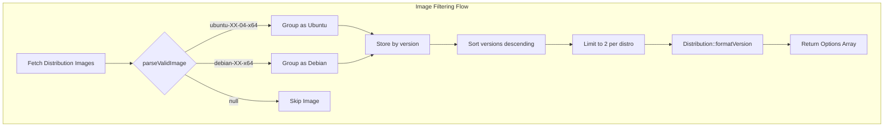

# Schematic: DoAccountService.php

> Auto-generated schematic. Last updated: 2025-12-26

## Overview

DigitalOcean account data service that fetches account-level resources from the DO API. Provides methods to retrieve regions, droplet sizes, OS images (Ubuntu/Debian only), VPCs, and SSH keys for use in server provisioning workflows.

## Logic Flow

### Entry Points

| Method | Purpose |
|--------|---------|
| `getAvailableRegions()` | Fetch available DO regions |
| `getAvailableSizes()` | Fetch available droplet sizes |
| `getAvailableImages()` | Fetch latest 2 Ubuntu LTS and 2 Debian images |
| `getUserVpcs(string $region)` | Fetch VPCs for a specific region |
| `getPublicKeys()` | Fetch SSH keys on the account |

### Execution Flow

**getAvailableRegions()**
1. Get API client via `getAPI()`
2. Call `region()->getAll()`
3. Filter to available regions only
4. Format as `slug => "Name (slug)"`
5. Sort alphabetically and return

**getAvailableSizes()**
1. Get API client
2. Call `size()->getAll()`
3. Filter to available sizes only
4. Extract vCPUs, memory (convert MB to GB), disk, price
5. Sort by price ascending
6. Format as `slug => "slug - X vCPU, YGB RAM, ZGB SSD ($price/mo)"`

**getAvailableImages()**
1. Get API client
2. Call `image()->getAll(['type' => 'distribution'])`
3. Filter and parse each image via `parseValidImage()`:
   - Must be available and public
   - Must have valid slug
   - Must match Ubuntu LTS (xx.04) or Debian pattern
4. Group by version, keeping latest per version
5. Sort versions descending, limit to latest 2 per distro
6. Format descriptions via `Distribution::formatVersion()`

**getUserVpcs()**
1. Get API client
2. Call `vpc()->getAll()`
3. Filter to specified region
4. Include "default" option
5. Return as `uuid => "name (uuid)"`

**getPublicKeys()**
1. Get API client
2. Call `key()->getAll()`
3. Extract key ID, name, and truncated fingerprint
4. Return as `id => "name (fingerprint...)"`

### Decision Points

| Location | Condition | Branches |
|----------|-----------|----------|
| `parseValidImage()` | Image unavailable or private | Return null (skip) |
| `parseValidImage()` | Slug is null or empty | Return null (skip) |
| `parseValidImage()` | Ubuntu LTS pattern (ubuntu-XX-04) | Return [UBUNTU, slug, version] |
| `parseValidImage()` | Debian pattern (debian-XX) | Return [DEBIAN, slug, version] |
| `parseValidImage()` | No match | Return null (skip) |
| `getAvailableImages()` | Version sorting | Keep latest 2 per distro |

### Exit Conditions

All public methods either:
- Return `array<string|int, string>` on success
- Throw `\RuntimeException` on API failure

## Interaction Diagram

```mermaid
flowchart TD
    subgraph DoAccountService
        GAR[getAvailableRegions]
        GAS[getAvailableSizes]
        GAI[getAvailableImages]
        GUV[getUserVpcs]
        GPK[getPublicKeys]
        PVI[parseValidImage]
    end

    subgraph BaseDoService
        GAPI[getAPI]
    end

    subgraph "Distribution Enum"
        DFV[Distribution::formatVersion]
        DU[Distribution::UBUNTU]
        DD[Distribution::DEBIAN]
    end

    subgraph "DigitalOcean API"
        RA[region()->getAll]
        SA[size()->getAll]
        IA[image()->getAll]
        VA[vpc()->getAll]
        KA[key()->getAll]
    end

    GAR --> GAPI
    GAR --> RA
    GAS --> GAPI
    GAS --> SA
    GAI --> GAPI
    GAI --> IA
    GAI --> PVI
    PVI --> DU
    PVI --> DD
    GAI --> DFV
    GUV --> GAPI
    GUV --> VA
    GPK --> GAPI
    GPK --> KA
```



## Dependencies

### Direct Imports

| File/Class | Usage |
|------------|-------|
| `BaseDoService` | Parent class providing API client |
| `Distribution` | Enum for distribution constants and version formatting |
| `DigitalOceanV2\Entity\Image` | Image entity type hint |
| `DigitalOceanV2\Entity\Region` | Region entity type hint |
| `DigitalOceanV2\Entity\Size` | Size entity type hint |

### Coupled Files

| File | Coupling Type | Description |
|------|---------------|-------------|
| `app/Services/DoService.php` | Facade | Aggregates this service, calls `setAPI()` |
| `app/Services/Do/BaseDoService.php` | Inheritance | Provides `getAPI()` method |

## Data Flow

### Inputs

| Input | Source | Description |
|-------|--------|-------------|
| DO API Client | `DoService.initialize()` | Injected via `setAPI()` |
| Region | Caller | Required for `getUserVpcs()` |

### Outputs

All methods return arrays where:
- Key = DO resource identifier (slug, UUID, or integer ID)
- Value = Human-readable display string

| Method | Key Type | Value Format |
|--------|----------|--------------|
| `getAvailableRegions()` | string (slug) | "Name (slug)" |
| `getAvailableSizes()` | string (slug) | "slug - X vCPU, YGB RAM, ZGB SSD ($price/mo)" |
| `getAvailableImages()` | string (slug) | Distribution::formatVersion() output |
| `getUserVpcs()` | string (uuid) | "name (uuid)" or "Use default VPC" |
| `getPublicKeys()` | int (id) | "name (fingerprint...)" |

### Side Effects

None. This service is read-only and makes no modifications to DigitalOcean resources.

## Notes

**Dynamic Version Filtering:**
The service dynamically filters to the latest 2 versions per distribution rather than hardcoding supported versions. This means new Ubuntu LTS or Debian releases are automatically included when available in DigitalOcean.

**Image Filtering:**
Only Ubuntu LTS and Debian stable images are returned. The service:
- Filters by availability and public status
- Uses regex to extract versions: Ubuntu xx.04 (LTS only), Debian major version
- Slug patterns: `ubuntu-XX-04-x64`, `debian-XX-x64`
- Limits to latest 2 versions per distribution

**Size Sorting:**
Sizes are sorted by monthly price ascending, making budget-friendly options appear first.

**VPC Handling:**
The `getUserVpcs()` method includes a "default" option for users who want to use DigitalOcean's default VPC rather than a custom one.

**No Pagination:**
The current implementation does not handle pagination for API responses. This is typically acceptable for the number of regions, sizes, and images, but could be an issue for accounts with many SSH keys.
