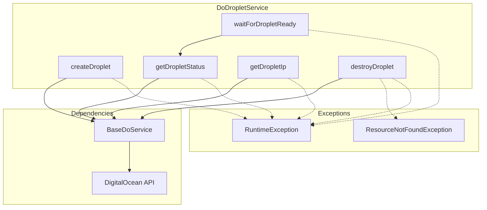

# Schematic: DoDropletService.php

> Auto-generated schematic. Last updated: 2025-12-25

## Overview

DigitalOcean droplet management service. Handles creating, monitoring, and destroying droplets via the API. Provides polling-based wait functionality for droplet provisioning.

## Logic Flow

### Entry Points

| Method                   | Visibility | Purpose                                  |
| ------------------------ | ---------- | ---------------------------------------- |
| `createDroplet()`        | public     | Create new droplet with configuration    |
| `getDropletStatus()`     | public     | Get current status of a droplet          |
| `waitForDropletReady()`  | public     | Poll until droplet becomes active        |
| `getDropletIp()`         | public     | Get public IPv4 address of a droplet     |
| `destroyDroplet()`       | public     | Destroy droplet by ID                    |

### Execution Flow

**createDroplet(...): array**

1. Get API client via inherited `getAPI()`
2. Prepare VPC parameter (`$vpcUuid ?? false`)
3. Call `$client->droplet()->create()` with all parameters
4. Return array with `id`, `name`, `status` from response

**getDropletStatus(int $dropletId): string**

1. Get API client via inherited `getAPI()`
2. Call `$client->droplet()->getById($dropletId)`
3. Return `$droplet->status`

**waitForDropletReady(int $dropletId, int $timeoutSeconds = 300, int $pollIntervalSeconds = 2): void**

1. Record start time
2. Loop: call `getDropletStatus()`
3. If status is `'active'`, return
4. If elapsed time >= timeout, throw `RuntimeException`
5. Sleep for poll interval, continue loop

**getDropletIp(int $dropletId): string**

1. Get API client via inherited `getAPI()`
2. Call `$client->droplet()->getById($dropletId)`
3. Iterate `$droplet->networks` to find public IPv4
4. Return `$network->ipAddress` or throw if not found

**destroyDroplet(int $dropletId): void**

1. Get API client via inherited `getAPI()`
2. Call `$client->droplet()->remove($dropletId)`
3. Catch `ResourceNotFoundException` - silently succeed (idempotent delete)
4. Re-throw other exceptions wrapped in `RuntimeException`

### Decision Points

| Method                  | Condition                   | Branch                          |
| ----------------------- | --------------------------- | ------------------------------- |
| `createDroplet()`       | `$vpcUuid` is null          | Use `false` for default VPC     |
| `waitForDropletReady()` | Status is `'active'`        | Return success                  |
| `waitForDropletReady()` | Timeout reached             | Throw `RuntimeException`        |
| `getDropletIp()`        | Network is public IPv4      | Return IP address               |
| `getDropletIp()`        | No public IPv4 found        | Throw `RuntimeException`        |
| `destroyDroplet()`      | `ResourceNotFoundException` | Silent return (already deleted) |
| `destroyDroplet()`      | Other `\Throwable`          | Wrap and re-throw               |

### Exit Conditions

| Method                  | Success                        | Failure                            |
| ----------------------- | ------------------------------ | ---------------------------------- |
| `createDroplet()`       | Returns array (droplet info)   | Throws `RuntimeException`          |
| `getDropletStatus()`    | Returns string (status)        | Throws `RuntimeException`          |
| `waitForDropletReady()` | Returns void                   | Throws `RuntimeException` (timeout)|
| `getDropletIp()`        | Returns string (IP)            | Throws `RuntimeException`          |
| `destroyDroplet()`      | Returns void                   | Throws `RuntimeException` (non-404)|

## Interaction Diagram

## Dependencies

### Direct Imports

| File/Class                                          | Usage                                      |
| --------------------------------------------------- | ------------------------------------------ |
| `DigitalOceanV2\Entity\Droplet`                     | Type hint for droplet entity from API      |
| `DigitalOceanV2\Exception\ResourceNotFoundException`| Detect 404 responses for idempotent delete |

### Coupled Files

| File                                  | Coupling Type | Description                                 |
| ------------------------------------- | ------------- | ------------------------------------------- |
| `app/Services/Do/BaseDoService.php`   | Inheritance   | Provides `setAPI()` and `getAPI()`          |
| `app/Services/DoService.php`          | Composition   | Facade that exposes this service as `->droplet` |
| `app/Traits/DoTrait.php`              | Consumer      | Uses via `$this->do->droplet->*` calls      |

## Data Flow

### Inputs

| Method                  | Input                           | Source                    |
| ----------------------- | ------------------------------- | ------------------------- |
| `createDroplet()`       | name, region, size, image, etc. | Command/Trait caller      |
| `getDropletStatus()`    | `$dropletId`                    | Command/Trait caller      |
| `waitForDropletReady()` | `$dropletId`, timeout, interval | Command/Trait caller      |
| `getDropletIp()`        | `$dropletId`                    | Command/Trait caller      |
| `destroyDroplet()`      | `$dropletId`                    | Command/Trait caller      |
| All                     | API Client                      | `setAPI()` from DoService |

### Outputs

| Method                  | Output                                      | Destination                |
| ----------------------- | ------------------------------------------- | -------------------------- |
| `createDroplet()`       | `array{id: int, name: string, status: string}` | Command for provisioning   |
| `getDropletStatus()`    | string (e.g., `'new'`, `'active'`)          | `waitForDropletReady()`    |
| `waitForDropletReady()` | void                                        | N/A                        |
| `getDropletIp()`        | string (IPv4 address)                       | Command for SSH connection |
| `destroyDroplet()`      | void                                        | N/A                        |

### Side Effects

| Method                  | Side Effect                                    |
| ----------------------- | ---------------------------------------------- |
| `createDroplet()`       | Creates droplet in DigitalOcean infrastructure |
| `waitForDropletReady()` | Blocks execution with `sleep()` calls          |
| `destroyDroplet()`      | Destroys droplet in DigitalOcean               |

## Notes

- Uses typed exception `ResourceNotFoundException` for 404 detection instead of string matching
- Destroy operation is idempotent - silently succeeds if droplet already deleted
- `waitForDropletReady()` uses internal `getDropletStatus()` call for polling
- VPC parameter uses `false` to indicate default VPC (API design constraint)
- Network iteration finds first public IPv4 network from droplet's network list
- Requires `setAPI()` call before use (enforced by `BaseDoService::getAPI()`)
- Default timeout of 300 seconds (5 minutes) for droplet provisioning
