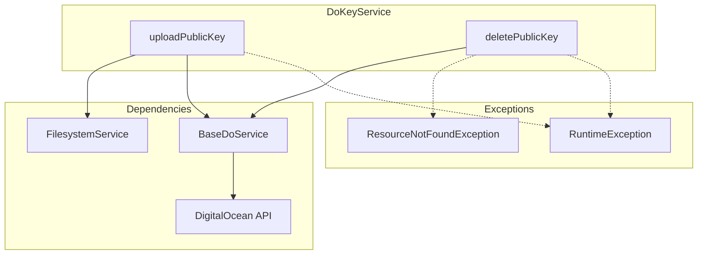

# Schematic: DoKeyService.php

> Auto-generated schematic. Last updated: 2025-12-25

## Overview

DigitalOcean SSH key management service. Handles uploading public keys to and deleting them from a DigitalOcean account via the API.

## Logic Flow

### Entry Points

| Method              | Visibility | Purpose                              |
| ------------------- | ---------- | ------------------------------------ |
| `uploadPublicKey()` | public     | Upload local SSH public key to DO    |
| `deletePublicKey()` | public     | Delete SSH key from DO account by ID |

### Execution Flow

**uploadPublicKey(string $publicKeyPath, string $keyName): int**

1. Read public key file contents via `FilesystemService::readFile()`
2. Trim whitespace from key content
3. Get API client via inherited `getAPI()`
4. Call `$client->key()->create($keyName, $publicKey)`
5. Return the new key ID from response

**deletePublicKey(int $keyId): void**

1. Get API client via inherited `getAPI()`
2. Call `$client->key()->remove((string) $keyId)`
3. Catch `ResourceNotFoundException` - silently succeed (idempotent delete)
4. Re-throw other exceptions wrapped in `RuntimeException`

### Decision Points

| Method              | Condition                     | Branch                         |
| ------------------- | ----------------------------- | ------------------------------ |
| `deletePublicKey()` | `ResourceNotFoundException`   | Silent return (already deleted)|
| `deletePublicKey()` | Other `\Throwable`            | Wrap and re-throw              |

### Exit Conditions

| Method              | Success                | Failure                                    |
| ------------------- | ---------------------- | ------------------------------------------ |
| `uploadPublicKey()` | Returns int (key ID)   | Throws `RuntimeException`                  |
| `deletePublicKey()` | Returns void           | Throws `RuntimeException` (non-404 errors) |

## Interaction Diagram

## Dependencies

### Direct Imports

| File/Class                                   | Usage                                     |
| -------------------------------------------- | ----------------------------------------- |
| `Deployer\Services\FilesystemService`        | Read public key file from disk            |
| `DigitalOceanV2\Exception\ResourceNotFoundException` | Detect 404 responses for idempotent delete |

### Coupled Files

| File                                  | Coupling Type | Description                              |
| ------------------------------------- | ------------- | ---------------------------------------- |
| `app/Services/Do/BaseDoService.php`   | Inheritance   | Provides `setAPI()` and `getAPI()`       |
| `app/Services/DoService.php`          | Composition   | Facade that exposes this service as `->key` |
| `app/Traits/DoTrait.php`              | Consumer      | Uses via `$this->do->key->*` calls       |

## Data Flow

### Inputs

| Method              | Input                  | Source                    |
| ------------------- | ---------------------- | ------------------------- |
| `uploadPublicKey()` | `$publicKeyPath`       | Command/Trait caller      |
| `uploadPublicKey()` | `$keyName`             | Command/Trait caller      |
| `deletePublicKey()` | `$keyId`               | Command/Trait caller      |
| Both                | API Client             | `setAPI()` from DoService |

### Outputs

| Method              | Output       | Destination           |
| ------------------- | ------------ | --------------------- |
| `uploadPublicKey()` | int (key ID) | Command for inventory |
| `deletePublicKey()` | void         | N/A                   |

### Side Effects

| Method              | Side Effect                               |
| ------------------- | ----------------------------------------- |
| `uploadPublicKey()` | Creates SSH key in DigitalOcean account   |
| `deletePublicKey()` | Removes SSH key from DigitalOcean account |

## Notes

- Uses typed exception `ResourceNotFoundException` for 404 detection instead of string matching
- Delete operation is idempotent - silently succeeds if key already deleted
- Requires `setAPI()` call before use (enforced by `BaseDoService::getAPI()`)
- Key ID is cast to string for API call as the SDK expects string parameter
