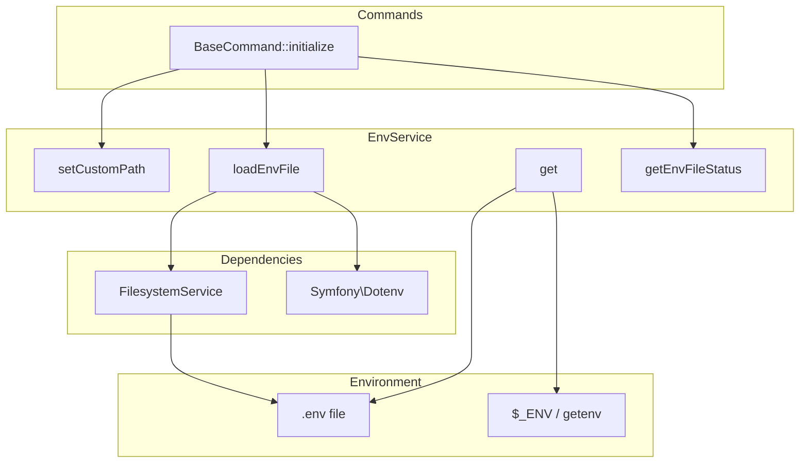

# Schematic: EnvService.php

> Auto-generated schematic. Last updated: 2025-12-19

## Overview

EnvService provides environment variable access with a dual-source lookup strategy: first checking a `.env` file, then falling back to system environment variables. It supports custom `.env` paths and tracks file status for debugging purposes.

## Logic Flow

### Entry Points

| Method | Purpose |
|--------|---------|
| `get()` | Retrieve environment variable value by key(s) |
| `setCustomPath()` | Set custom `.env` file path |
| `loadEnvFile()` | Load and parse `.env` file |
| `getEnvFileStatus()` | Get status message for loaded file |

### Execution Flow

**Initialization Flow:**

1. `setCustomPath()` optionally sets custom `.env` location
2. `loadEnvFile()` called during `BaseCommand::initialize()`
   - Resets internal `$dotenv` array
   - Resolves path (custom or `{cwd}/.env`)
   - If file exists: parses via Symfony Dotenv parser
   - Sets status message based on outcome

**Value Retrieval Flow (`get()`):**

1. Normalize input to array of keys
2. For each key:
   - Check `$this->dotenv` (parsed `.env` values)
   - Check `$_ENV` superglobal
   - Check `getenv()` result
3. Return first non-empty value found
4. If no value and `$required=true`: throw `InvalidArgumentException`
5. If no value and `$required=false`: return `null`

### Decision Points

| Location | Condition | Branch |
|----------|-----------|--------|
| `get()` L42-44 | Key exists in `$this->dotenv` with non-empty value | Return value |
| `get()` L47-50 | Key exists in `$_ENV` or `getenv()` with non-empty value | Return value |
| `get()` L53-57 | No value found and `$required=true` | Throw exception |
| `loadEnvFile()` L79 | File doesn't exist | Set status, return early |

### Exit Conditions

- `get()`: Returns `?string` or throws `InvalidArgumentException` for missing required variables
- `loadEnvFile()`: Returns void after setting internal state
- `readDotenv()`: Throws `RuntimeException` on parse failure

## Interaction Diagram

## Dependencies

### Direct Imports

| File/Class | Usage |
|------------|-------|
| `Symfony\Component\Dotenv\Dotenv` | Parse `.env` file content into key-value pairs |

### Coupled Files

| File | Coupling Type | Description |
|------|---------------|-------------|
| `FilesystemService` | Service | File existence checks and content reading |
| `BaseCommand` | Consumer | Initializes service and retrieves env values |
| `DigitalOceanTrait` | Consumer | Retrieves API tokens via `get()` |
| `.env` | Config | Default source file at `{cwd}/.env` |

## Data Flow

### Inputs

| Source | Data | Method |
|--------|------|--------|
| Constructor | `FilesystemService`, `Dotenv` | DI injection |
| `setCustomPath()` | Custom file path | Called from `BaseCommand` |
| `.env` file | Key-value pairs | Parsed on `loadEnvFile()` |
| System environment | `$_ENV`, `getenv()` | Fallback source in `get()` |

### Outputs

| Destination | Data | Method |
|-------------|------|--------|
| Callers | Environment variable values | `get()` returns `?string` |
| BaseCommand | Status message | `getEnvFileStatus()` |

### Side Effects

- Modifies internal `$dotenv` array on `loadEnvFile()`
- Sets `$envPath` on `setCustomPath()`
- Sets `$envFileStatus` on `loadEnvFile()`

## Notes

- The service is stateful: must call `loadEnvFile()` before `get()` will include `.env` values
- Multiple keys can be passed to `get()` for fallback variable names (e.g., `['DO_TOKEN', 'DIGITALOCEAN_TOKEN']`)
- Empty string values are treated as non-existent (won't match)
- The `.env` file takes precedence over system environment variables
- File status message includes path on success, or descriptive error message on failure
