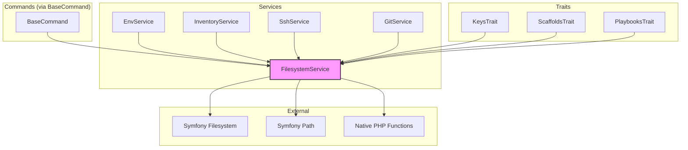

# Schematic: FilesystemService.php

> Auto-generated schematic. Last updated: 2025-12-26

## Overview

FilesystemService is a thin, mockable wrapper around Symfony Filesystem with additional gap-filling methods for native PHP filesystem operations. It serves as the single point of access for all filesystem operations throughout the application, enabling testability via dependency injection.

## Logic Flow

### Entry Points

All public methods are entry points - this is a stateless utility service:

| Method | Purpose |
|--------|---------|
| `exists()` | Check if file/directory exists |
| `readFile()` | Read file contents |
| `dumpFile()` | Write contents to file |
| `appendFile()` | Append to file (creates if missing) |
| `chmod()` | Change file permissions |
| `remove()` | Delete files or directories |
| `joinPaths()` | Join path segments into canonical path |
| `getCwd()` | Get current working directory |
| `isDirectory()` | Check if path is a directory |
| `getParentDirectory()` | Get parent directory path |
| `isLink()` | Check if path is a symbolic link |
| `mkdir()` | Create directory recursively |
| `scanDirectory()` | List directory contents (excludes . and ..) |
| `expandPath()` | Expand tilde (~) to home directory |
| `getFirstExisting()` | Find first existing path from candidates |

### Execution Flow

**Symfony Filesystem Wrappers** (lines 38-102)

Direct delegation to Symfony Filesystem with no additional logic:

1. `exists()` -> `$fs->exists()`
2. `readFile()` -> `$fs->readFile()`
3. `dumpFile()` -> `$fs->dumpFile()`
4. `appendFile()` -> `$fs->appendToFile()`
5. `chmod()` -> `$fs->chmod()`
6. `remove()` -> `$fs->remove()`
7. `joinPaths()` -> `Path::join()`

**Gap-Filling Methods** (lines 104-239)

Native PHP functions wrapped for mockability:

1. **getCwd()** (lines 113-121)
   - Calls `getcwd()`
   - Throws RuntimeException if false returned
   - Returns current working directory string

2. **isDirectory()** (lines 126-129)
   - Combines `exists()` check with `is_dir()`
   - Returns true only if path exists AND is a directory

3. **getParentDirectory()** (lines 136-143)
   - Validates levels >= 1
   - Delegates to `dirname()` with levels parameter

4. **isLink()** (lines 148-151)
   - Wraps native `is_link()` for mockability
   - Returns true if path is a symbolic link

5. **mkdir()** (lines 158-161)
   - Delegates to Symfony Filesystem `mkdir()`
   - Creates directory recursively with specified mode (default 0755)
   - Throws RuntimeException if creation fails

6. **scanDirectory()** (lines 170-178)
   - Wraps native `scandir()` with error suppression
   - Filters out `.` and `..` entries
   - Returns array of filenames (re-indexed via array_values)
   - Throws RuntimeException if directory cannot be read

7. **expandPath()** (lines 185-215)
   - Returns unchanged if empty or not starting with ~
   - Resolves home via: HOME -> USERPROFILE -> HOMEDRIVE+HOMEPATH
   - Handles "~" alone and "~/" or "~\" prefixes
   - Does NOT expand "~user" syntax (left unchanged)
   - Uses Symfony Path::canonicalize() for normalization

8. **getFirstExisting()** (lines 224-239)
   - Iterates candidate paths
   - Expands each with `expandPath()` (catches exceptions)
   - Returns first path that `exists()` returns true
   - Returns null if none exist

### Decision Points

| Location | Condition | True Branch | False Branch |
|----------|-----------|-------------|--------------|
| getCwd (line 116) | `$cwd === false` | Throw RuntimeException | Return cwd |
| getParentDirectory (line 138) | `$levels < 1` | Throw InvalidArgumentException | Return dirname |
| scanDirectory (line 173) | `$entries === false` | Throw RuntimeException | Filter and return |
| expandPath (line 187) | Empty or not ~ prefix | Return unchanged | Continue expansion |
| expandPath (line 203) | `$home === ''` | Throw RuntimeException | Continue |
| expandPath (line 208) | `$path === '~'` | Return canonicalized home | Check ~/prefix |
| expandPath (line 211) | Starts with ~/ or ~\ | Return home + suffix | Return unchanged |

### Exit Conditions

- All methods return immediately after single operation
- No iteration except `getFirstExisting()` (iterates until match or exhausted)
- RuntimeException thrown on: getCwd failure, home directory not found, directory cannot be read (scanDirectory), mkdir failure
- InvalidArgumentException thrown on: invalid levels parameter

## Interaction Diagram

## Dependencies

### Direct Imports

| File/Class | Usage |
|------------|-------|
| `Symfony\Component\Filesystem\Filesystem` | Core filesystem operations (exists, read, write, chmod, remove) |
| `Symfony\Component\Filesystem\Path` | Path canonicalization and joining |

### Coupled Files

| File | Coupling Type | Description |
|------|---------------|-------------|
| `app/Contracts/BaseCommand.php` | Injection | Injected as `$fs` property for all commands |
| `app/Services/EnvService.php` | Service | Uses getCwd(), exists(), readFile() for .env handling |
| `app/Services/InventoryService.php` | Service | Uses getCwd(), exists(), readFile(), dumpFile() for deployer.yml |
| `app/Services/SshService.php` | Service | Uses exists(), readFile() for SSH key validation |
| `app/Services/GitService.php` | Service | Uses exists(), isDirectory(), remove() for file existence checks and cleanup |
| `app/Traits/KeysTrait.php` | Trait | Uses getFirstExisting() for SSH key resolution |
| `app/Traits/ScaffoldsTrait.php` | Trait | Uses getCwd() for path resolution |
| `app/Traits/PlaybooksTrait.php` | Trait | Uses filesystem operations |
| `.env` | Config | Read via EnvService using this service |
| `deployer.yml` | Data | Read/written via InventoryService using this service |
| `~/.ssh/*` | Data | Key files accessed via SSH operations |

## Data Flow

### Inputs

| Source | Data Type | Description |
|--------|-----------|-------------|
| Method parameters | `string` | File/directory paths |
| Method parameters | `string` | File content to write |
| Method parameters | `int` | Permission modes, directory levels |
| Environment | `string` | HOME, USERPROFILE, HOMEDRIVE, HOMEPATH variables |

### Outputs

| Destination | Data Type | Description |
|-------------|-----------|-------------|
| Caller | `bool` | Existence/directory checks |
| Caller | `string` | File contents, resolved paths, cwd |
| Caller | `?string` | First existing path or null |
| Caller | `array<int, string>` | Directory contents from scanDirectory |
| Filesystem | Files | Written file content, removed files |

### Side Effects

| Operation | Side Effect |
|-----------|-------------|
| `dumpFile()` | Creates/overwrites file on disk |
| `appendFile()` | Creates/appends to file on disk |
| `chmod()` | Changes file permissions |
| `remove()` | Deletes files/directories from disk |
| `mkdir()` | Creates directories on disk |

## Notes

**Design Pattern:** This service implements the Adapter pattern, wrapping Symfony Filesystem to provide a consistent, mockable interface while adding gap-filling methods for operations Symfony doesn't cover.

**Immutability:** Declared as `final readonly class` - cannot be extended and has no mutable state.

**Home Directory Resolution:** The `expandPath()` method supports cross-platform home directory detection (POSIX and Windows), but does NOT support the `~username` syntax for other users' home directories.

**Error Handling:** Most methods delegate exceptions from Symfony Filesystem. The service adds explicit RuntimeException for:

- Unable to determine current working directory
- Home directory environment variables not set
- Directory cannot be read (scanDirectory)

**Testing:** This service is the primary abstraction point for filesystem mocking in tests. All filesystem operations in the codebase should go through this service rather than calling Symfony Filesystem or native PHP functions directly.
