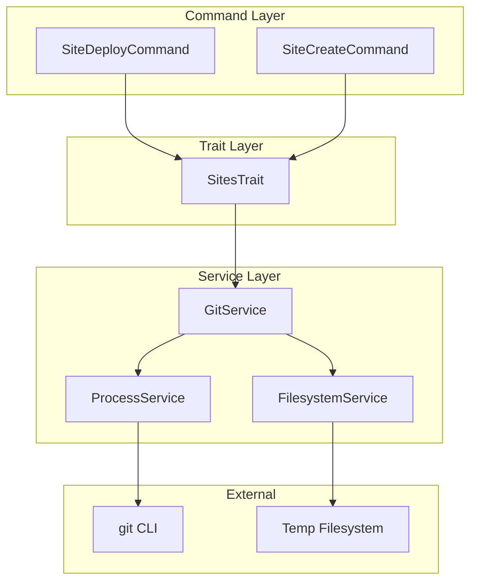
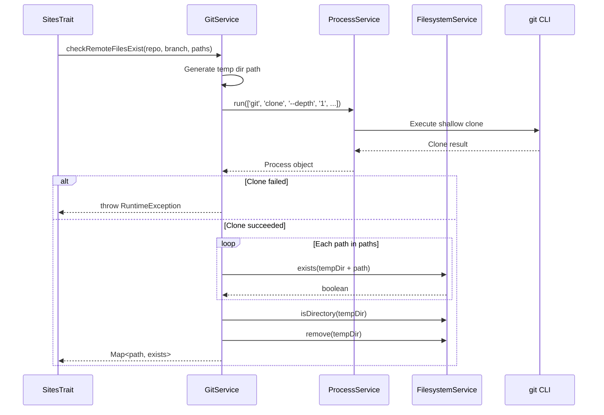

# Schematic: GitService.php

> Auto-generated schematic. Last updated: 2025-12-26

## Overview

GitService provides git repository utilities for detecting local repository information (remote URL, current branch) and inspecting remote repositories without full clones. It wraps git CLI commands through ProcessService and uses FilesystemService for file operations, enabling commands to gather git context and check remote repository contents.

## Logic Flow

### Entry Points

| Method | Purpose | Returns |
|--------|---------|---------|
| `detectRemoteUrl(?string $workingDir)` | Get git remote origin URL from working directory | `?string` |
| `detectCurrentBranch(?string $workingDir)` | Get current branch name from working directory | `?string` |
| `checkRemoteFilesExist(string $repo, string $branch, array $paths)` | Check if files exist in remote repo | `array<string, bool>` |
| `listRemoteDirectoryFiles(string $repo, string $branch, string $directory)` | List files in remote repo directory | `array<int, string>` |

### Execution Flow

#### Detection Methods (`detectRemoteUrl`, `detectCurrentBranch`)

```
1. Call runGitCommand() with appropriate git command
2. runGitCommand() resolves working directory (param or getcwd())
3. If getcwd() fails, return null
4. Execute git command via ProcessService with 2-second timeout
5. If successful, return trimmed output
6. If failed or exception, return null (silent failure)
```

#### Remote Repository Methods (`checkRemoteFilesExist`, `listRemoteDirectoryFiles`)

```
1. Generate unique temp directory path with random suffix
2. Shallow clone repository (depth=1, single-branch) via ProcessService
   - 60-second timeout for network operations
3. If clone fails, throw RuntimeException with error details
4. Perform file operations:
   - checkRemoteFilesExist: Check each path via FilesystemService->exists()
   - listRemoteDirectoryFiles: Scan directory with RecursiveIteratorIterator
5. Clean up temp directory in finally block (always executes)
6. Return results (map or sorted list)
```

### Decision Points

| Location | Condition | True Branch | False Branch |
|----------|-----------|-------------|--------------|
| `runGitCommand` L177-179 | `$cwd === false` | Return `null` | Continue |
| `runGitCommand` L184-186 | `$process->isSuccessful()` | Return trimmed output | Return `null` |
| `checkRemoteFilesExist` L79 | `!$process->isSuccessful()` | Throw RuntimeException | Continue |
| `listRemoteDirectoryFiles` L124 | `!$process->isSuccessful()` | Throw RuntimeException | Continue |
| `listRemoteDirectoryFiles` L132 | Directory doesn't exist | Return empty array | Scan files |

### Exit Conditions

| Method | Success | Failure |
|--------|---------|---------|
| `detectRemoteUrl` | Returns URL string | Returns `null` |
| `detectCurrentBranch` | Returns branch name | Returns `null` |
| `checkRemoteFilesExist` | Returns path=>bool map | Throws `RuntimeException` |
| `listRemoteDirectoryFiles` | Returns sorted file list | Throws `RuntimeException` |

## Interaction Diagram



## Sequence Diagram: Remote File Check



## Dependencies

### Direct Imports

| File/Class | Usage |
|------------|-------|
| `DeployerPHP\Services\ProcessService` | Execute git CLI commands |
| `DeployerPHP\Services\FilesystemService` | File existence checks, temp directory cleanup |

### Coupled Files

| File | Coupling Type | Description |
|------|---------------|-------------|
| `app/Traits/SitesTrait.php` | Service | Uses `checkRemoteFilesExist()` and `listRemoteDirectoryFiles()` for repo inspection |
| `app/Contracts/BaseCommand.php` | DI | Injected as constructor dependency to all commands |
| `app/Console/Site/SiteDeployCommand.php` | Consumer | Uses detection methods for git context |

## Data Flow

### Inputs

| Method | Input | Source |
|--------|-------|--------|
| `detectRemoteUrl` | Working directory path (optional) | Caller or `getcwd()` |
| `detectCurrentBranch` | Working directory path (optional) | Caller or `getcwd()` |
| `checkRemoteFilesExist` | Repo URL, branch, file paths | SiteDTO via SitesTrait |
| `listRemoteDirectoryFiles` | Repo URL, branch, directory path | SiteDTO via SitesTrait |

### Outputs

| Method | Output | Consumer |
|--------|--------|----------|
| `detectRemoteUrl` | Remote origin URL or null | SiteDeployCommand (pre-fill repo) |
| `detectCurrentBranch` | Branch name or null | SiteDeployCommand (pre-fill branch) |
| `checkRemoteFilesExist` | Map of path => boolean | SitesTrait for deployment script detection |
| `listRemoteDirectoryFiles` | List of relative file paths | SitesTrait for scaffold discovery |

### Side Effects

| Effect | Location | Description |
|--------|----------|-------------|
| Temp directory creation | `checkRemoteFilesExist`, `listRemoteDirectoryFiles` | Creates `/tmp/deployer-git-check-*` |
| Temp directory cleanup | `finally` blocks | Always removes temp directory |
| Network I/O | Shallow clone operations | Fetches from remote git server |

## Notes

### Design Decisions

- **Shallow clones**: Uses `--depth 1 --single-branch` to minimize data transfer when checking remote repos
- **Silent failures for detection**: `detectRemoteUrl` and `detectCurrentBranch` return `null` instead of throwing, making them safe for optional context gathering
- **Throwing for remote ops**: `checkRemoteFilesExist` and `listRemoteDirectoryFiles` throw on failure since they are explicit operations that should report errors
- **Temp directory cleanup**: Uses `finally` block to ensure cleanup even on exceptions

### Method Categories

1. **Git Detection** (Lines 20-50): Local repository info gathering, returns null on failure
2. **Remote Repository** (Lines 52-161): Remote repo inspection via shallow clone, throws on failure
3. **Helpers** (Lines 163-192): Private utility for running git commands

### Timeout Configuration

| Operation | Timeout | Reason |
|-----------|---------|--------|
| Local git commands | 2 seconds | Simple, fast operations |
| Remote clone | 60 seconds | Network latency, larger repos |

### Error Handling Pattern

```php
// Detection methods: Silent failure (optional context)
return null;

// Remote methods: Explicit failure (required operations)
throw new \RuntimeException("Failed to access git repository '{$repo}'...");
```
