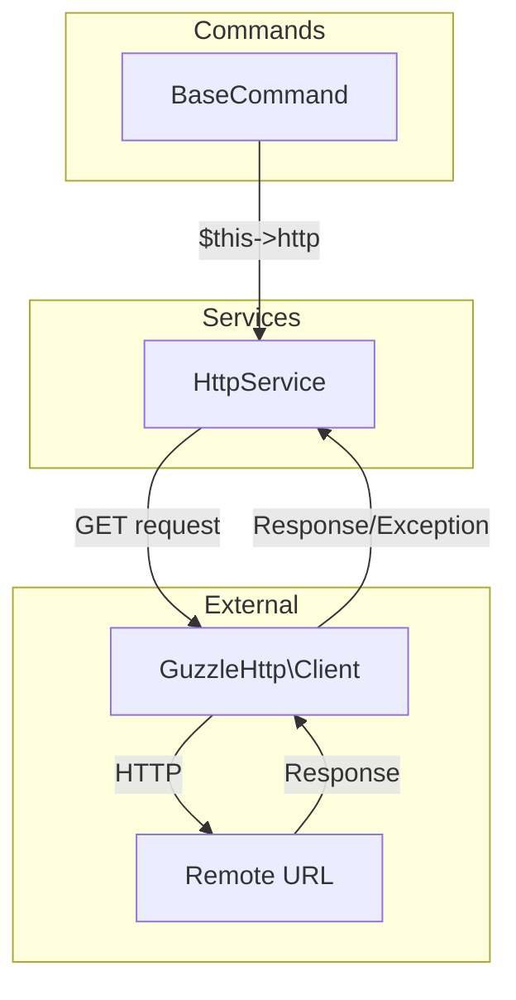

# Schematic: HttpService.php

> Auto-generated schematic. Last updated: 2025-12-19

## Overview

A lightweight HTTP client service that wraps GuzzleHttp to provide URL verification capabilities. The service is injected into all commands via `BaseCommand` and handles HTTP requests with consistent timeout and error handling configuration.

## Logic Flow

### Entry Points

| Method | Visibility | Purpose |
|--------|------------|---------|
| `verifyUrl(string $url)` | public | Verify a URL responds with expected status |

### Execution Flow

**`verifyUrl()`**

1. Execute GET request to provided URL via Guzzle client
2. On success: Return structured array with status code 200 check, actual status code, and response body
3. On exception: Return failure array with status code 0 and exception message as body

### Decision Points

| Location | Condition | True Branch | False Branch |
|----------|-----------|-------------|--------------|
| Line 37 | `$response->getStatusCode() === 200` | `success: true` | `success: false` |

### Exit Conditions

- Returns structured array on successful HTTP response (any status code)
- Returns structured array with `status_code: 0` on GuzzleException (network error, timeout, etc.)

## Interaction Diagram

## Dependencies

### Direct Imports

| Package/Class | Usage |
|---------------|-------|
| `GuzzleHttp\Client` | HTTP client for making requests |
| `GuzzleHttp\Exception\GuzzleException` | Exception handling for failed requests |

### Coupled Files

| File | Coupling Type | Description |
|------|---------------|-------------|
| `app/Contracts/BaseCommand.php` | DI | Injects HttpService into all commands |
| `composer.json` | Config | Requires `guzzlehttp/guzzle: ^7.10` |

## Data Flow

### Inputs

| Method | Parameter | Type | Source |
|--------|-----------|------|--------|
| `verifyUrl` | `$url` | `string` | Calling command |

### Outputs

| Method | Return Type | Description |
|--------|-------------|-------------|
| `verifyUrl` | `array{success: bool, status_code: int, body: string}` | Verification result with status and content |

### Side Effects

- Makes outbound HTTP GET requests to external URLs
- Network I/O with configurable 10-second timeout

## Configuration

| Setting | Value | Purpose |
|---------|-------|---------|
| `timeout` | 10 seconds | Maximum time for request completion |
| `http_errors` | false | Return response instead of throwing on 4xx/5xx |

## Notes

- **Stateless Service**: Creates Guzzle client in constructor, no mutable state
- **Error Suppression**: `http_errors: false` means 4xx/5xx responses return normally rather than throwing exceptions
- **Currently Unused**: No commands currently call `verifyUrl()` - available for future URL verification features (e.g., verifying deployed sites)
- **Potential Use Cases**: Site health checks, deployment verification, webhook testing
