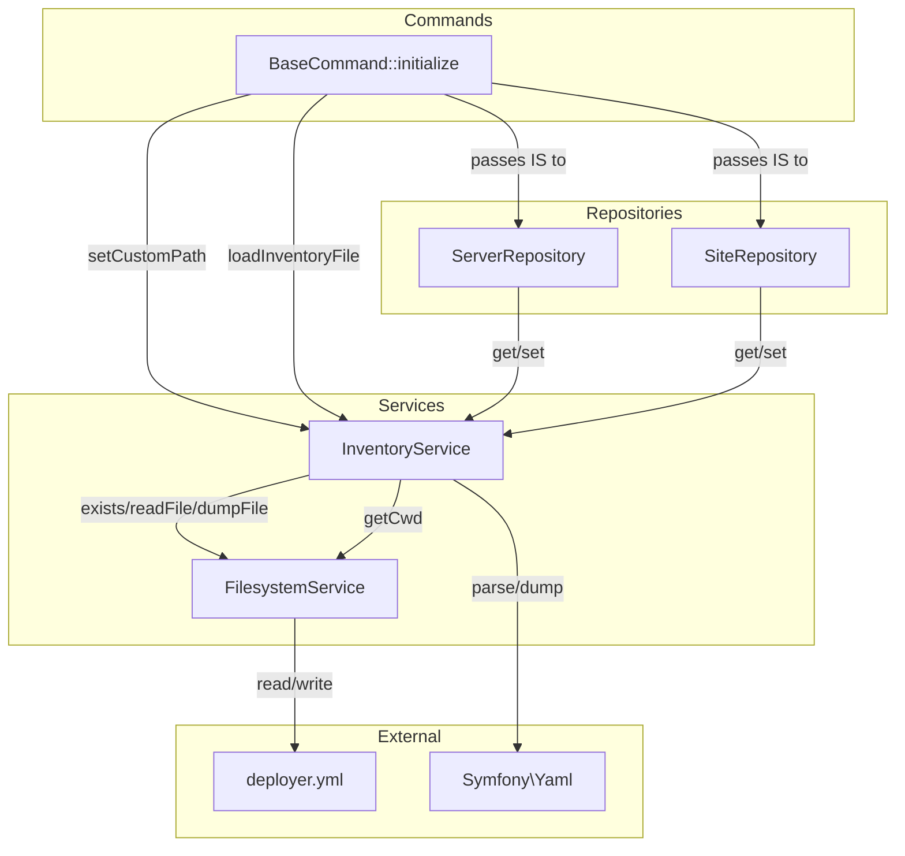
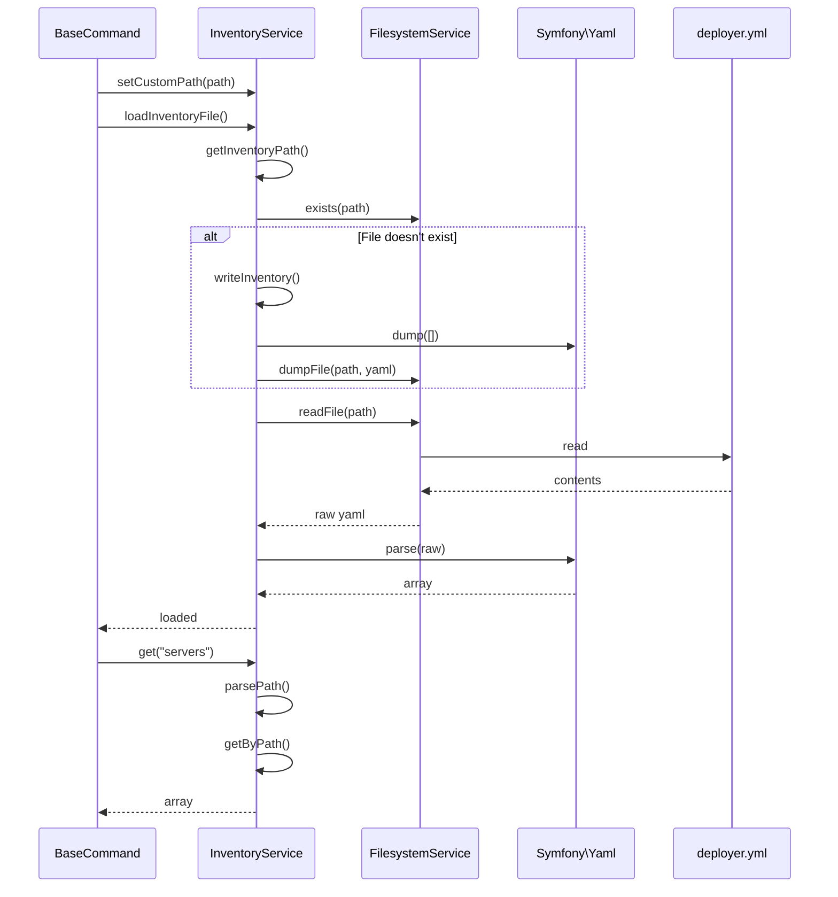

# Schematic: InventoryService.php

> Auto-generated schematic. Last updated: 2025-12-26

## Overview

`InventoryService` provides YAML-based persistent storage with dot-notation access for the deployer inventory file (`deployer.yml`). It serves as the data layer for server and site configuration, enabling CRUD operations through repositories while abstracting file I/O and path resolution.

## Logic Flow

### Entry Points

| Method | Purpose |
|--------|---------|
| `loadInventoryFile()` | Initialize service, load/create YAML file |
| `setCustomPath()` | Override default inventory path |
| `get()` | Read value at dot-notation path |
| `set()` | Write value at dot-notation path |
| `delete()` | Remove value at dot-notation path |
| `getInventoryFileStatus()` | Get load status for display |

### Execution Flow

**Initialization Flow (loadInventoryFile)**

1. Reset internal inventory array to empty
2. Resolve inventory path (custom or default `{cwd}/deployer.yml`)
3. If file doesn't exist:
   - Set status message indicating creation
   - Call `writeInventory()` to create empty file
4. Call `readInventory()` to parse YAML into internal array
5. Update status to resolved path

**Read Flow (get)**

1. Parse dot-notation path into segments array
2. Traverse internal inventory array using segments
3. Return value at path, or default if not found

**Write Flow (set)**

1. Parse dot-notation path into segments array
2. Navigate/create nested structure in internal array
3. Set value at terminal segment
4. Persist to YAML file via `writeInventory()`

**Delete Flow (delete)**

1. Parse dot-notation path into segments array
2. Navigate to parent of target segment
3. Unset terminal segment if exists
4. Persist to YAML file via `writeInventory()`

### Decision Points

| Location | Condition | Branch |
|----------|-----------|--------|
| `loadInventoryFile()` L104 | File doesn't exist | Create empty file, set creation status |
| `get()` L72 | Value is null | Return provided default |
| `getByPath()` L149 | Segment not in array | Return null (path doesn't exist) |
| `setByPath()` L169 | Current not array | Reset to empty array |
| `unsetByPath()` L191-208 | Path/target doesn't exist | Return false (no-op) |
| `writeInventory()` L251 | Status is null | Throw (inventory not loaded) |

### Exit Conditions

| Method | Success | Failure |
|--------|---------|---------|
| `get()` | Returns value or default | Never throws |
| `set()` | Returns void | Throws if not loaded or write fails |
| `delete()` | Returns void | Throws if not loaded or write fails |
| `loadInventoryFile()` | Sets status, loads data | Throws on read/parse failure |

## Interaction Diagram

## Dependencies

### Direct Imports

| File/Class | Usage |
|------------|-------|
| `Symfony\Component\Yaml\Yaml` | Parse YAML to array, dump array to YAML |
| `DeployerPHP\Services\FilesystemService` | File existence, read, write, cwd resolution |

### Coupled Files

| File | Coupling Type | Description |
|------|---------------|-------------|
| `deployer.yml` | Data | Inventory file read/written by this service |
| `ServerRepository` | Consumer | Reads/writes `servers` prefix via get/set |
| `SiteRepository` | Consumer | Reads/writes `sites` prefix via get/set |
| `BaseCommand` | Orchestrator | Initializes service, passes to repositories |
| `EnvService` | Pattern | Similar initialization pattern (setCustomPath, load, getStatus) |

## Data Flow

### Inputs

| Source | Data | Method |
|--------|------|--------|
| BaseCommand | Custom path from `--inventory` option | `setCustomPath()` |
| Repositories | Dot-notation paths and values | `get()`, `set()`, `delete()` |
| FilesystemService | Current working directory | `getCwd()` |
| Filesystem | YAML file contents | `readFile()` |

### Outputs

| Destination | Data | Method |
|-------------|------|--------|
| Repositories | Parsed inventory data (arrays) | `get()` return value |
| BaseCommand | File status string for display | `getInventoryFileStatus()` |
| Filesystem | YAML-formatted inventory | `dumpFile()` |

### Side Effects

| Effect | Trigger | Description |
|--------|---------|-------------|
| File creation | `loadInventoryFile()` when file missing | Creates `deployer.yml` with empty content |
| File write | `set()`, `delete()` | Persists full inventory to YAML file |
| Internal state | `loadInventoryFile()` | Populates `$inventory` array and `$inventoryFileStatus` |

## Notes

**State Management:**

- Service is stateful - must call `loadInventoryFile()` before any operations
- Write operations check `$inventoryFileStatus` to verify initialization
- `$inventory` array is the in-memory cache; all reads come from here after load

**Dot Notation:**

- Paths like `servers.0.name` access nested structures
- Setting a path auto-creates intermediate arrays
- Deleting a path navigates to parent before unsetting

**YAML Format:**

- Uses `Yaml::DUMP_EMPTY_ARRAY_AS_SEQUENCE` for consistent array formatting
- Dump depth of 12 levels, 2-space indentation

**Error Handling:**

- Read/write failures wrapped with path context in exception message
- Silent failure when deleting non-existent paths (returns false, no exception)

**Thread Safety:**

- Not thread-safe; single in-memory cache without locking
- Concurrent modifications could cause data loss
