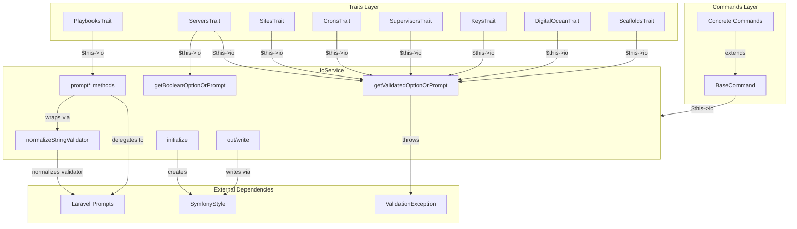
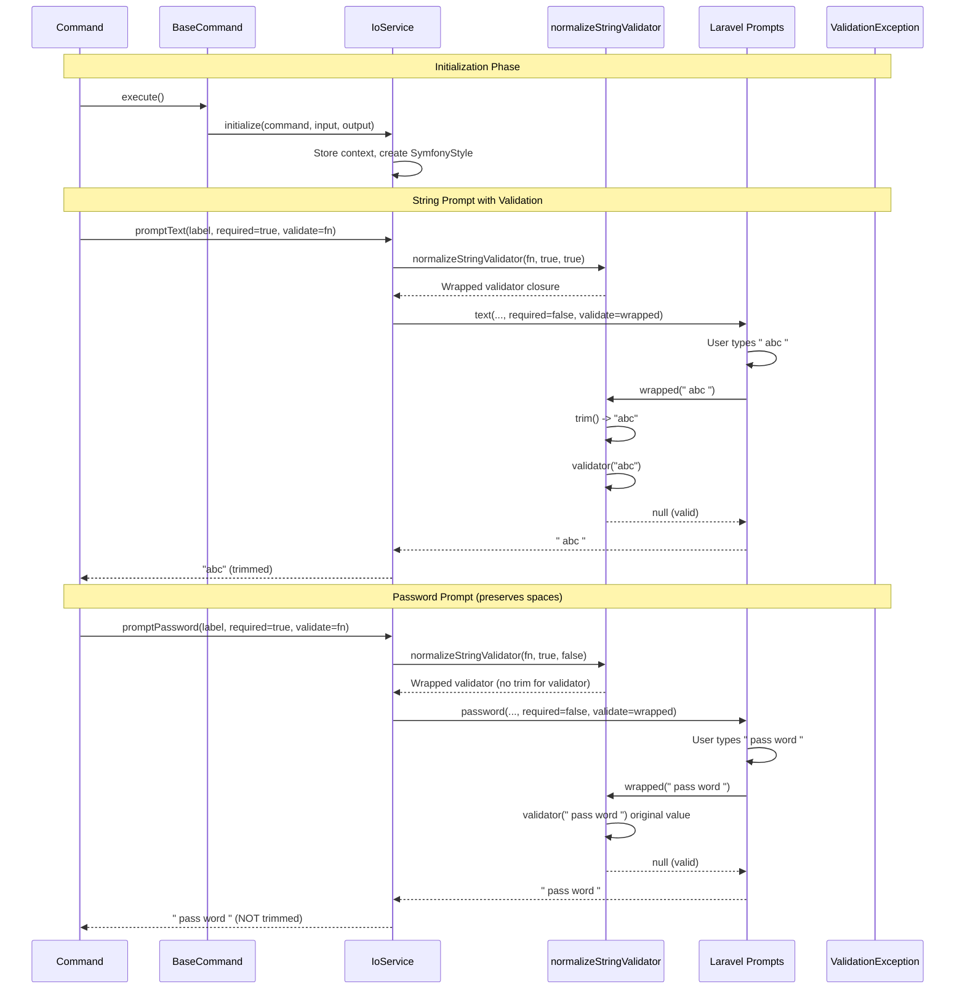

# Schematic: IoService.php

> Auto-generated schematic. Last updated: 2025-12-26

## Overview

IoService is the console I/O service that centralizes all user interaction in the Deployer CLI. It handles interactive prompts via Laravel Prompts, output formatting via SymfonyStyle, and provides a unified input validation pattern that works for both CLI options and interactive prompts. The service must be initialized with a command context before use.

## Logic Flow

### Entry Points

| Method | Purpose |
|--------|---------|
| `initialize()` | Bootstrap service with command context (required before any other method) |
| `getValidatedOptionOrPrompt()` | Get validated input from CLI option or interactive prompt |
| `getBooleanOptionOrPrompt()` | Get boolean flag from CLI or confirmation prompt |
| `out()` | Write formatted output lines |
| `write()` | Raw output passthrough |
| `prompt*()` | Interactive prompt methods (text, password, confirm, select, etc.) |

### Execution Flow

#### Initialization Flow

```
initialize(command, input, output)
    |
    +-> Store command reference (for input definitions)
    +-> Store input interface
    +-> Create SymfonyStyle from input/output
```

#### Validated Input Flow (getValidatedOptionOrPrompt)

```
getValidatedOptionOrPrompt(optionName, promptCallback, validator)
    |
    +-> getOptionOrPrompt(optionName, wrappedCallback)
    |       |
    |       +-> Check if option value exists
    |       |       |
    |       |       +-> [boolean] Check if flag was explicitly provided
    |       |       |       +-> [provided] Return flag value
    |       |       |       +-> [not provided] Prompt or return false
    |       |       |
    |       |       +-> [non-null] Return option value
    |       |       |
    |       |       +-> [null] Execute promptCallback with validator
    |       |
    |       +-> Return value
    |
    +-> If value came from CLI option:
    |       +-> Run validator on value
    |       +-> [error] Throw ValidationException
    |
    +-> Return validated value
```

#### Boolean Input Flow (getBooleanOptionOrPrompt)

```
getBooleanOptionOrPrompt(optionName, promptCallback)
    |
    +-> Get option value from input
    +-> Build option flags list (--name, -shortcut, --no-name)
    +-> Check if flag was explicitly provided via hasParameterOption()
    |       |
    |       +-> [provided] Return boolean value
    |       |
    |       +-> [not provided & interactive] Run promptCallback
    |       |
    |       +-> [not provided & non-interactive] Return false
```

#### String Prompt Flow (promptText, promptSuggest)

```
promptText/promptSuggest(label, ..., required, validate)
    |
    +-> normalizeStringValidator(validate, required, trimValue=true)
    |       |
    |       +-> [!required && null validator] Return null
    |       |
    |       +-> Return wrapper closure:
    |               +-> [non-string] Delegate to original validator
    |               +-> Trim value
    |               +-> [required && empty] Return "This field is required."
    |               +-> [validator] Pass trimmed value to validator
    |               +-> Return validation result
    |
    +-> Call Laravel Prompts with required=false, normalizedValidate
    +-> Return trim(result)
```

#### Password Prompt Flow (promptPassword)

```
promptPassword(label, ..., required, validate)
    |
    +-> normalizeStringValidator(validate, required, trimValue=false)
    |       |
    |       +-> Return wrapper closure:
    |               +-> [non-string] Delegate to original validator
    |               +-> Trim value (for whitespace check only)
    |               +-> [required && whitespace-only] Return error
    |               +-> [validator] Pass ORIGINAL value (not trimmed)
    |               +-> Return validation result
    |
    +-> Call Laravel Prompts with required=false, normalizedValidate
    +-> Return result (NOT trimmed - preserves spaces in password)
```

#### Output Flow (out)

```
out(lines)
    |
    +-> Normalize to array if string
    +-> For each line:
    |       +-> Replace <| with <fg= (shorthand)
    |       +-> Prepend visual marker with color preservation
    +-> Write via SymfonyStyle
```

### Decision Points

| Location | Condition | Branches |
|----------|-----------|----------|
| `normalizeStringValidator()` L482 | `!$required && null === $validate` | Return null (no validation needed) |
| `normalizeStringValidator()` L487 | `!is_string($value)` | Delegate to original validator |
| `normalizeStringValidator()` L495 | `$required && '' === $trimmed` | Reject whitespace-only input |
| `normalizeStringValidator()` L502 | `$trimValue` | Pass trimmed or original to validator |
| `getOptionOrPrompt()` L528 | `is_bool($value)` | Boolean flags vs string options |
| `getOptionOrPrompt()` L553 | `$wasProvided` | Use provided value vs prompt/default |
| `getOptionOrPrompt()` L559 | `$input->isInteractive()` | Show prompt vs return false |
| `getOptionOrPrompt()` L568 | `$value !== null` | Use CLI value vs prompt |
| `getValidatedOptionOrPrompt()` L133 | CLI option provided | Validate CLI input (prompts self-validate) |
| `promptSpin()` L453 | Test environment detected | Bypass spinner in tests |

### Exit Conditions

| Method | Returns | Condition |
|--------|---------|-----------|
| `getValidatedOptionOrPrompt()` | `mixed` | Valid input from CLI or prompt |
| `getValidatedOptionOrPrompt()` | throws `ValidationException` | CLI validation failed |
| `getBooleanOptionOrPrompt()` | `bool` | Flag provided, prompted, or default false |
| `promptText()` | `string` | Trimmed user input |
| `promptPassword()` | `string` | Original user input (spaces preserved) |
| `promptSuggest()` | `string` | Trimmed user input |
| Other prompt methods | Various | User input or default values |

## Interaction Diagram





## Dependencies

### Direct Imports

| File/Class | Usage |
|------------|-------|
| `DeployerPHP\Exceptions\ValidationException` | Thrown when CLI option validation fails |
| `Laravel\Prompts\*` | Interactive prompt functions (text, password, confirm, select, etc.) |
| `Symfony\Component\Console\Command\Command` | Stored reference for input definition introspection |
| `Symfony\Component\Console\Input\InputInterface` | CLI option retrieval and interactivity check |
| `Symfony\Component\Console\Output\OutputInterface` | Passed to SymfonyStyle for output |
| `Symfony\Component\Console\Style\SymfonyStyle` | Output formatting and writing |

### Coupled Files

| File | Coupling Type | Description |
|------|---------------|-------------|
| `app/Contracts/BaseCommand.php` | State | Calls `initialize()` in its `initialize()` lifecycle hook; uses `$this->io` throughout |
| `app/Traits/ServersTrait.php` | State | Uses `$this->io` for prompts and validation |
| `app/Traits/SitesTrait.php` | State | Uses `$this->io` for prompts and validation |
| `app/Traits/CronsTrait.php` | State | Uses `$this->io` for prompts and validation |
| `app/Traits/SupervisorsTrait.php` | State | Uses `$this->io` for prompts and validation |
| `app/Traits/KeysTrait.php` | State | Uses `$this->io` for prompts and validation |
| `app/Traits/DigitalOceanTrait.php` | State | Uses `$this->io` for prompts and validation |
| `app/Traits/ScaffoldsTrait.php` | State | Uses `$this->io` for prompts and validation |
| `app/Traits/PlaybooksTrait.php` | State | Uses `$this->io` for spin/progress display |

## Data Flow

### Inputs

| Source | Data | Method |
|--------|------|--------|
| `BaseCommand::initialize()` | Command, Input, Output interfaces | `initialize()` |
| CLI options | String/bool values via `--option` | `getOptionOrPrompt()`, `getBooleanOptionOrPrompt()` |
| User interaction | Typed responses to prompts | `prompt*()` methods |
| Validation closures | Error messages or null | `getValidatedOptionOrPrompt()` validator param |

### Outputs

| Destination | Data | Method |
|-------------|------|--------|
| Console (stdout) | Formatted text with visual markers | `out()`, `write()` |
| Calling code | Validated user input | `getValidatedOptionOrPrompt()`, `getBooleanOptionOrPrompt()` |
| Exception handler | Validation error message | `ValidationException` thrown |

### Side Effects

| Effect | Location | Description |
|--------|----------|-------------|
| Terminal I/O | `prompt*()` methods | Interactive prompts modify terminal state |
| Spinner display | `promptSpin()` | Animated loading indicator (bypassed in tests) |
| Output buffer | `out()`, `write()` | Writes to console output stream |

## Notes

### Stateful Service Pattern

IoService is a stateful service that requires initialization before use. The `initialize()` method must be called (done automatically by `BaseCommand::initialize()`) to set up the command context, input interface, and SymfonyStyle instance.

### Dual Validation Strategy

The service uses a clever dual validation approach:

1. **Interactive prompts**: Validator closure is passed to Laravel Prompts, which re-prompts on failure
2. **CLI options**: Validator is called after value retrieval; failure throws `ValidationException`

This means interactive users get retry capability while CLI users get immediate failure with error message.

### String Validator Normalization

The `normalizeStringValidator()` method (L467-507) wraps validators for string prompts to:

1. **Handle required fields**: Rejects whitespace-only input when `$required=true` (Laravel Prompts' `required` is set to `false` - we handle it ourselves)
2. **Normalize input**: Trims values before passing to validators (except passwords)
3. **Preserve password spaces**: For `promptPassword()`, `$trimValue=false` ensures spaces in passwords are preserved

**Important behaviors:**
- Non-Closure validators are ignored (by design - only Closures are normalized)
- Whitespace-only rejection applies to all required string prompts
- Validators receive trimmed input for text/suggest, original input for passwords
- Return values are trimmed for text/suggest, original for passwords

### Boolean Flag Detection

For VALUE_NONE and VALUE_NEGATABLE options, the service must distinguish between "flag not provided" (should prompt) vs "flag provided with false value" (should use false). It uses `hasParameterOption()` to detect explicit provision.

### Output Formatting

The `out()` method prepends a visual marker character to all output lines and supports a color shorthand (`<|color>` becomes `<fg=color>`). This provides consistent branding across all command output.

### Test Environment Detection

The `promptSpin()` method detects PHPUnit/Pest test environments and bypasses the spinner animation to prevent terminal conflicts during parallel test execution.

### Architecture Position

IoService sits between the command layer and external I/O libraries, providing:

- Unified API for all console interaction
- Consistent validation pattern across CLI and interactive modes
- Abstraction over Laravel Prompts and Symfony Console

### Recent Changes

Updated 2025-12-20: Added `normalizeStringValidator()` method for whitespace handling in string prompts. Updated `promptText()`, `promptPassword()`, and `promptSuggest()` to use normalized validation. Key changes:

- Laravel Prompts' `required` parameter is now always `false` (we handle required ourselves)
- Whitespace-only input rejected when required
- Text/suggest prompts return trimmed values
- Password prompts preserve spaces in return value while still rejecting whitespace-only
