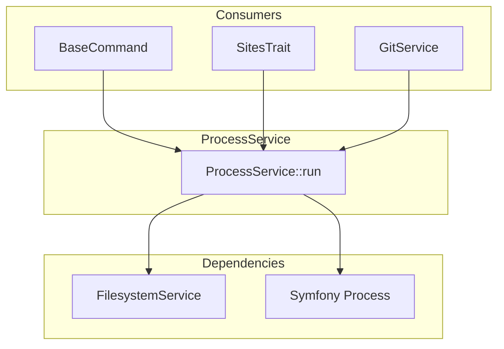

# Schematic: ProcessService.php

> Auto-generated schematic. Last updated: 2025-12-19

## Overview

ProcessService is a thin wrapper around Symfony's Process component that provides consistent local shell command execution. It validates inputs before execution and returns the executed Process instance for status/output inspection. The service is stateless and relies on FilesystemService for directory validation.

## Logic Flow

### Entry Points

| Method | Signature | Purpose |
|--------|-----------|---------|
| `run()` | `(array $command, string $cwd, float $timeout = 3.0): Process` | Execute a shell command in a specified directory |

### Execution Flow

**`run()` Method:**

1. Validate command array is not empty (throws `InvalidArgumentException` if empty)
2. Validate working directory exists via `FilesystemService::isDirectory()` (throws `InvalidArgumentException` if invalid)
3. Create new `Symfony\Component\Process\Process` instance with command and cwd
4. Set timeout on process
5. Execute process synchronously via `$process->run()`
6. Return the executed Process instance

### Decision Points

| Line | Condition | True Branch | False Branch |
|------|-----------|-------------|--------------|
| 35-37 | `$command === []` | Throw `InvalidArgumentException` | Continue |
| 39-41 | `!$this->fs->isDirectory($cwd)` | Throw `InvalidArgumentException` | Continue |

### Exit Conditions

- **Normal:** Returns `Process` instance after synchronous execution completes
- **Error:** Throws `InvalidArgumentException` for empty command or invalid directory

## Interaction Diagram

## Dependencies

### Direct Imports

| File/Class | Usage |
|------------|-------|
| `Symfony\Component\Process\Process` | Creates and executes shell commands |

### Constructor Dependencies

| Service | Type | Purpose |
|---------|------|---------|
| `FilesystemService` | Injected | Validates working directory via `isDirectory()` |

### Coupled Files

| File | Coupling Type | Description |
|------|---------------|-------------|
| `app/Services/FilesystemService.php` | Service | Required for directory validation |
| `app/Services/GitService.php` | Consumer | Uses ProcessService for git commands |
| `app/Contracts/BaseCommand.php` | Consumer | Injects ProcessService into all commands |
| `app/Traits/SitesTrait.php` | Consumer | Uses ProcessService for site-related operations |

## Data Flow

### Inputs

| Parameter | Type | Source | Validation |
|-----------|------|--------|------------|
| `$command` | `list<string>` | Caller | Must be non-empty array |
| `$cwd` | `string` | Caller | Must be existing directory |
| `$timeout` | `float` | Caller (default: 3.0) | None (passed to Symfony Process) |

### Outputs

| Type | Description |
|------|-------------|
| `Process` | Executed Symfony Process instance with available methods: `isSuccessful()`, `getOutput()`, `getErrorOutput()`, `getExitCode()` |

### Side Effects

| Effect | Description |
|--------|-------------|
| Shell execution | Executes arbitrary shell commands on local system |
| Timeout handling | Process is killed if it exceeds timeout duration |

## Notes

- **Synchronous execution:** The service blocks until the command completes or times out
- **No output capture:** Caller must inspect the returned Process for output/errors
- **Security consideration:** Commands are passed as arrays, avoiding shell injection via proper escaping by Symfony Process
- **Default timeout:** 3 seconds may be too short for some operations; callers can override
- **Stateless:** Service maintains no state between calls; safe for concurrent use
- **Error handling pattern:** Returns Process even on command failure; caller checks `isSuccessful()`
