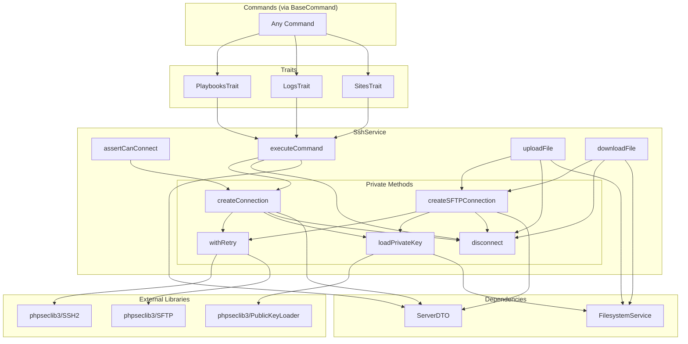

# Schematic: SshService.php

> Auto-generated schematic. Last updated: 2025-12-26

## Overview

SshService provides SSH and SFTP operations for remote server management using the phpseclib3 library. All operations are stateless - connections are created and destroyed per operation. The service handles connectivity testing, command execution with streaming output support, and bidirectional file transfers.

## Logic Flow

### Entry Points

| Method | Purpose |
|--------|---------|
| `assertCanConnect(ServerDTO)` | Validate SSH connectivity and authentication |
| `executeCommand(ServerDTO, string, ?callable, int)` | Execute remote command with optional output streaming |
| `uploadFile(ServerDTO, string, string)` | Upload local file to remote server via SFTP |
| `downloadFile(ServerDTO, string, string)` | Download remote file to local system via SFTP |

### Execution Flow

#### assertCanConnect()

1. Call `createConnection()` to establish SSH connection
2. Immediately call `disconnect()` to clean up
3. If connection fails, exception propagates to caller

#### executeCommand()

1. Call `createConnection()` to establish SSH connection
2. Set timeout on connection (default: 300 seconds)
3. Execute command via `SSH2::exec()` with optional output callback
4. Capture exit status via `SSH2::getExitStatus()`
5. Check for timeout (returns `false` from exec)
6. Return `['output' => string, 'exit_code' => int]`
7. Always disconnect in `finally` block

#### uploadFile()

1. Validate local file exists via `FilesystemService::exists()`
2. Call `createSFTPConnection()` to establish SFTP connection
3. Read local file contents via `FilesystemService::readFile()`
4. Upload via `SFTP::put()`
5. Validate upload success
6. Always disconnect in `finally` block

#### downloadFile()

1. Call `createSFTPConnection()` to establish SFTP connection
2. Download via `SFTP::get()`
3. Validate download success (not `false`)
4. Write to local file via `FilesystemService::dumpFile()`
5. Always disconnect in `finally` block

### Decision Points

| Location | Condition | True Branch | False Branch |
|----------|-----------|-------------|--------------|
| `createConnection()` | `privateKeyPath === null` | Throw RuntimeException | Continue |
| `executeCommand()` | `$output === false` | Throw SshTimeoutException | Return result array |
| `uploadFile()` | `!$fs->exists($localPath)` | Throw RuntimeException | Continue |
| `downloadFile()` | `$contents === false` | Throw RuntimeException | Write to local file |
| `withRetry()` | `$attempt < $retryAttempts` | Sleep with exponential backoff, retry | Throw with last exception |

### Exit Conditions

- **Success**: Method completes and returns result (void, array, or data)
- **RuntimeException**: Connection failed, authentication failed, file not found, operation failed
- **SshTimeoutException**: Command execution exceeded timeout limit

## Interaction Diagram

## Dependencies

### Direct Imports

| File/Class | Usage |
|------------|-------|
| `DeployerPHP\DTOs\ServerDTO` | Connection parameters (host, port, username, privateKeyPath) |
| `DeployerPHP\Exceptions\SshTimeoutException` | Thrown when command execution times out |
| `DeployerPHP\Services\FilesystemService` | Local file operations (read, write, exists) |
| `phpseclib3\Crypt\Common\PrivateKey` | Type for loaded SSH private keys |
| `phpseclib3\Crypt\PublicKeyLoader` | Parse SSH private key files |
| `phpseclib3\Net\SSH2` | SSH command execution |
| `phpseclib3\Net\SFTP` | File transfer operations |

### Coupled Files

| File | Coupling Type | Description |
|------|---------------|-------------|
| `app/Contracts/BaseCommand.php` | Dependency | Injects SshService into all commands via constructor |
| `app/Traits/PlaybooksTrait.php` | Consumer | Uses `executeCommand()` for playbook execution with streaming output |
| `app/Traits/LogsTrait.php` | Consumer | Uses `executeCommand()` for `journalctl` and `tail` log retrieval |
| `app/Traits/SitesTrait.php` | Consumer | Uses `executeCommand()` for `ensureSiteExists()` validation |
| `app/Traits/ServersTrait.php` | Transitive | Uses PlaybooksTrait which depends on SshService |
| `playbooks/*.sh` | Data | Shell scripts executed remotely via `executeCommand()` |

## Data Flow

### Inputs

| Input | Source | Description |
|-------|--------|-------------|
| `ServerDTO` | Commands/Traits | Connection parameters with host, port, username, privateKeyPath |
| Command string | Callers | Shell command to execute remotely |
| Output callback | Callers | Optional `callable(string): void` for streaming output |
| Timeout | Callers | Command timeout in seconds (default: 300) |
| Local file path | Callers | Source path for upload, destination for download |
| Remote file path | Callers | Destination for upload, source for download |

### Outputs

| Output | Destination | Description |
|--------|-------------|-------------|
| `['output' => string, 'exit_code' => int]` | Callers | Command execution result |
| Streamed output chunks | Output callback | Real-time command output via callback |
| Downloaded file contents | Local filesystem | Written via FilesystemService |

### Side Effects

| Effect | Description |
|--------|-------------|
| Remote command execution | Commands run on remote server may modify state |
| Remote file creation | `uploadFile()` creates/overwrites files on remote server |
| Local file creation | `downloadFile()` creates/overwrites files on local system |
| Network connections | Creates ephemeral SSH/SFTP connections |

## Notes

### Retry Logic

The `withRetry()` method implements exponential backoff:

- Default: 5 attempts with 2-second initial delay
- Delay doubles after each failed attempt (2s, 4s, 8s, 16s)
- Only catches `RuntimeException` for retry
- Final attempt throws with "after N attempts" message

### Stateless Design

All operations create and destroy connections per-call. This ensures:

- No stale connections from dropped SSH sessions
- Thread-safe operation (no shared connection state)
- Clean exception handling without connection cleanup concerns

### Timeout Handling

- Default timeout: 300 seconds (5 minutes)
- `phpseclib3` returns `false` from `exec()` on timeout
- Caller receives `SshTimeoutException` with descriptive message
- `PlaybooksTrait` provides user-friendly recovery suggestions for timeouts

### Key File Resolution

- Expects absolute path in `ServerDTO::privateKeyPath`
- Path resolution (tilde expansion, defaults) handled by callers
- Validates key file exists before attempting to load
- Validates loaded key is actually a private key (not public)

### Error Message Pattern

All exceptions include context for user-friendly display:

- Host/port in connection errors
- File paths in file operation errors
- Preserves exception chain via `previous:` parameter
