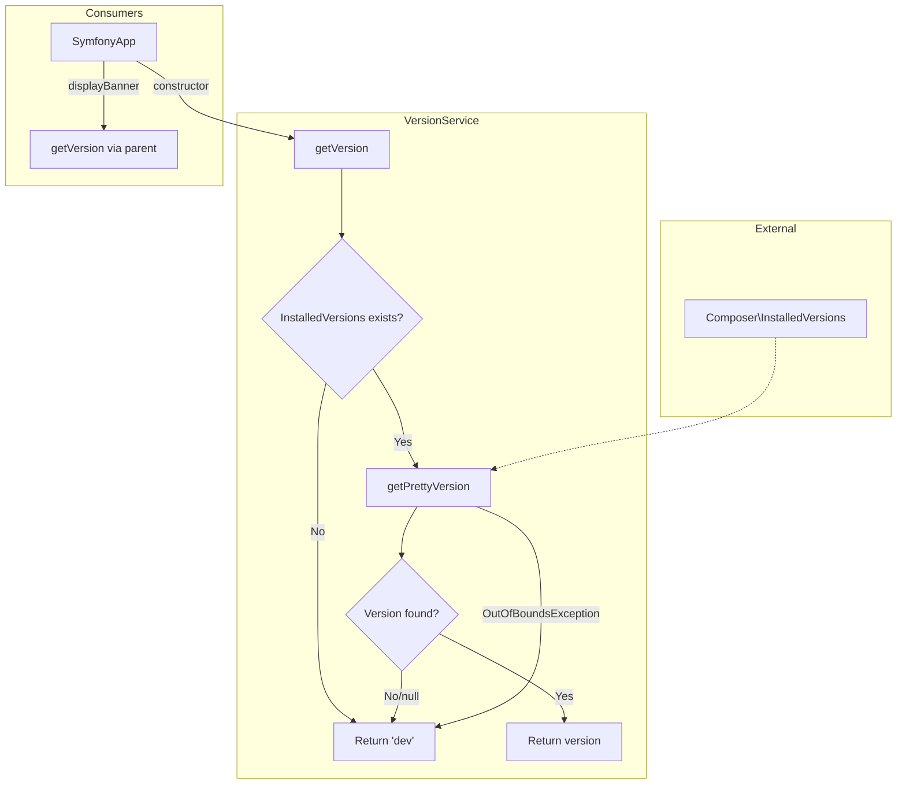

# Schematic: VersionService.php

> Auto-generated schematic. Last updated: 2025-12-26

## Overview

VersionService provides application version detection using Composer's InstalledVersions API. It serves as the single source of truth for the application's version string, falling back to 'dev' when version information is unavailable.

## Logic Flow

### Entry Points

| Method | Visibility | Purpose |
|--------|------------|---------|
| `__construct()` | public | Initialize with package name (default: `loadinglucian/deployer-php`) |
| `getVersion()` | public | Return version string or 'dev' fallback |

### Execution Flow

**`getVersion()` method:**

1. Check if `Composer\InstalledVersions` class exists
2. If class missing, return `'dev'` (non-Composer environment)
3. Query `InstalledVersions::getPrettyVersion()` with configured package name
4. Return pretty version if available, otherwise `'dev'`
5. Catch `OutOfBoundsException` (package not found), return `'dev'`

### Decision Points

| Line | Condition | True Branch | False Branch |
|------|-----------|-------------|--------------|
| 29 | `!class_exists(InstalledVersions::class)` | Return `'dev'` | Continue to API call |
| 34 | `getPrettyVersion() ?? 'dev'` | Return version | Return `'dev'` |
| 35 | `OutOfBoundsException` caught | Return `'dev'` | N/A |

### Exit Conditions

All paths return a string:

- Valid version string from Composer (e.g., `'1.2.3'`, `'v2.0.0'`)
- Fallback `'dev'` when version unavailable

## Interaction Diagram

## Dependencies

### Direct Imports

| File/Class | Usage |
|------------|-------|
| `Composer\InstalledVersions` | Query installed package version via Composer runtime API |

### Coupled Files

| File | Coupling Type | Description |
|------|---------------|-------------|
| `composer.json` | Config | Package name `loadinglucian/deployer-php` must match |
| `vendor/composer/installed.php` | Data | Runtime version data generated by Composer |
| `app/SymfonyApp.php` | Consumer | Injects service to set application version |
| `bin/deployer` | Entry | Container builds SymfonyApp which depends on VersionService |

## Data Flow

### Inputs

| Source | Type | Description |
|--------|------|-------------|
| Constructor | `string` | Package name to query (default: `loadinglucian/deployer-php`) |
| Composer runtime | internal | `vendor/composer/installed.php` data |

### Outputs

| Destination | Type | Description |
|-------------|------|-------------|
| Return value | `string` | Semantic version (e.g., `'1.0.0'`) or `'dev'` |

### Side Effects

None. This service is stateless and performs read-only operations.

## Notes

- **Namespace**: `DeployerPHP\Services`
- **Defensive design**: Three fallback paths to `'dev'` ensure the application never fails due to missing version info
- **Composer dependency**: Version detection only works in Composer-installed environments; standalone PHAR or non-Composer installs will always show `'dev'`
- **Package name**: The default package name is `loadinglucian/deployer-php` (configurable via constructor)
- **No caching**: Version is queried on each call, though in practice `getVersion()` is only called once during application bootstrap
