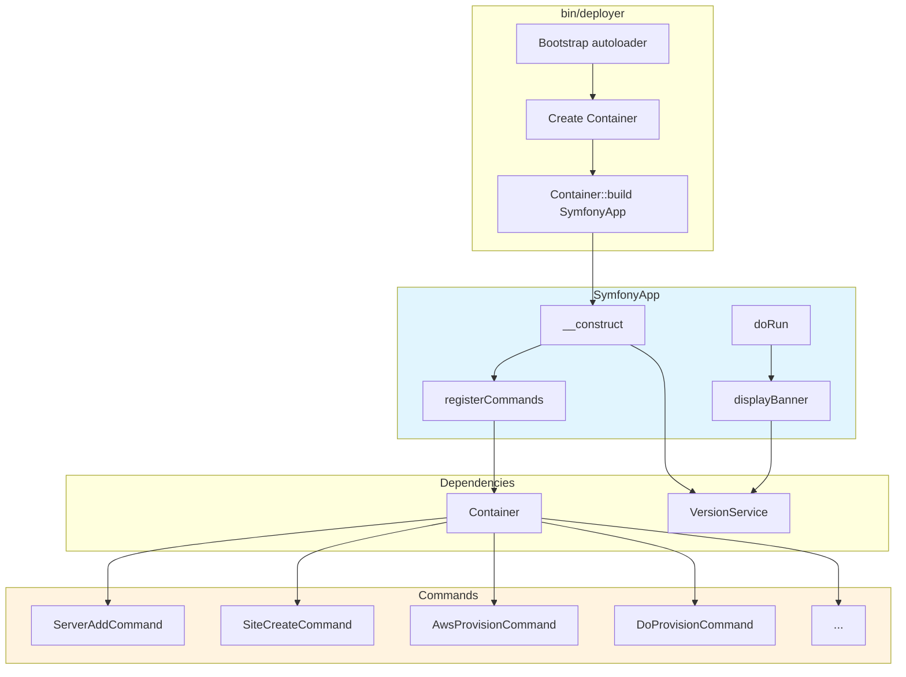

# Schematic: SymfonyApp.php

> Auto-generated schematic. Last updated: 2025-12-26

## Overview

`SymfonyApp` is the main CLI application entry point that extends Symfony's Console Application. It bootstraps the DeployerPHP CLI by registering all commands with auto-wired dependencies via the Container, customizes the default input/output behavior, and displays a branded ASCII banner on every invocation.

## Logic Flow

### Entry Points

| Method | Visibility | Description |
|--------|------------|-------------|
| `__construct()` | public | Initializes app with Container and VersionService, registers commands |
| `doRun()` | public | Main execution method, displays banner, handles --version flag |
| `getDefaultInputDefinition()` | protected | Returns customized input definition |
| `getHelp()` | public | Returns empty string to hide default Symfony help |

### Execution Flow

1. **Construction** (`__construct`)
   - Receives `Container` and `VersionService` via dependency injection
   - Retrieves version string from `VersionService::getVersion()`
   - Calls parent constructor with app name "DeployerPHP" and version
   - Invokes `registerCommands()` to load all CLI commands
   - Sets default command to `list`

2. **Command Registration** (`registerCommands`)
   - Defines array of command class names organized by domain:
     - Scaffolding (3): `ScaffoldCronsCommand`, `ScaffoldHooksCommand`, `ScaffoldSupervisorsCommand`
     - Server management (8): Add, Delete, Firewall, Info, Install, Logs, Run, Ssh
     - Provider integrations (8): AWS key commands (3), AWS provision, DO key commands (3), DO provision
     - Site management (7): Create, Delete, Deploy, Https, SharedPull, SharedPush, Ssh
     - Cron management (3): Create, Delete, Sync
     - Supervisor management (7): Create, Delete, Logs, Restart, Start, Stop, Sync
     - MySQL management (5): Install, Logs, Restart, Start, Stop
     - MariaDB management (5): Install, Logs, Restart, Start, Stop
     - PostgreSQL management (5): Install, Logs, Restart, Start, Stop
   - Iterates over command classes, uses `Container::build()` for auto-wiring
   - Adds each command instance to the Symfony Application

3. **Runtime Execution** (`doRun`)
   - Creates `SymfonyStyle` instance for styled I/O
   - Calls `displayBanner()` to show ASCII art header with version
   - Checks for `--version` / `-V` flag:
     - If present: returns `Command::SUCCESS` immediately (banner already displayed version)
     - If absent: delegates to `parent::doRun()` for normal command dispatch

4. **Banner Display** (`displayBanner`)
   - Retrieves version via `$this->getVersion()`
   - Writes multi-colored ASCII art header using ANSI escape codes
   - Displays version number in gray

### Decision Points

| Location | Condition | True Branch | False Branch |
|----------|-----------|-------------|--------------|
| `doRun()` L123 | `--version` or `-V` flag present | Return SUCCESS immediately | Continue to parent::doRun() |

### Exit Conditions

- **--version flag**: Returns `Command::SUCCESS` (0) after displaying banner
- **Normal execution**: Returns exit code from `parent::doRun()` which delegates to the matched command
- **No command match**: Symfony's default behavior (shows command list)

## Interaction Diagram

## Dependencies

### Direct Imports

| File/Class | Usage |
|------------|-------|
| `DeployerPHP\Container` | DI container for auto-wiring command dependencies |
| `DeployerPHP\Services\VersionService` | Retrieves application version from Composer |
| `Symfony\Component\Console\Application` | Base class extended by SymfonyApp |
| `Symfony\Component\Console\Command\Command` | Return code constants (SUCCESS) |
| `Symfony\Component\Console\Input\InputArgument` | Define command argument |
| `Symfony\Component\Console\Input\InputDefinition` | Custom input definition |
| `Symfony\Component\Console\Input\InputInterface` | Console input abstraction |
| `Symfony\Component\Console\Input\InputOption` | Define CLI options |
| `Symfony\Component\Console\Output\OutputInterface` | Console output abstraction |
| `Symfony\Component\Console\Style\SymfonyStyle` | Styled I/O for banner |

### Command Imports (by domain)

| Domain | Commands |
|--------|----------|
| Scaffolding | `ScaffoldCronsCommand`, `ScaffoldHooksCommand`, `ScaffoldSupervisorsCommand` |
| Server | `ServerAddCommand`, `ServerDeleteCommand`, `ServerFirewallCommand`, `ServerInfoCommand`, `ServerInstallCommand`, `ServerLogsCommand`, `ServerRunCommand`, `ServerSshCommand` |
| Provider (AWS) | `AwsKeyAddCommand`, `AwsKeyDeleteCommand`, `AwsKeyListCommand`, `AwsProvisionCommand` |
| Provider (DO) | `DoKeyAddCommand`, `DoKeyDeleteCommand`, `DoKeyListCommand`, `DoProvisionCommand` |
| Site | `SiteCreateCommand`, `SiteDeleteCommand`, `SiteDeployCommand`, `SiteHttpsCommand`, `SiteSharedPullCommand`, `SiteSharedPushCommand`, `SiteSshCommand` |
| Cron | `CronCreateCommand`, `CronDeleteCommand`, `CronSyncCommand` |
| Supervisor | `SupervisorCreateCommand`, `SupervisorDeleteCommand`, `SupervisorLogsCommand`, `SupervisorRestartCommand`, `SupervisorStartCommand`, `SupervisorStopCommand`, `SupervisorSyncCommand` |
| MySQL | `MysqlInstallCommand`, `MysqlLogsCommand`, `MysqlRestartCommand`, `MysqlStartCommand`, `MysqlStopCommand` |
| MariaDB | `MariadbInstallCommand`, `MariadbLogsCommand`, `MariadbRestartCommand`, `MariadbStartCommand`, `MariadbStopCommand` |
| PostgreSQL | `PostgresqlInstallCommand`, `PostgresqlLogsCommand`, `PostgresqlRestartCommand`, `PostgresqlStartCommand`, `PostgresqlStopCommand` |

### Coupled Files

| File | Coupling Type | Description |
|------|---------------|-------------|
| `bin/deployer` | Entry | Entry point that creates Container and builds SymfonyApp |
| `app/Container.php` | DI | Auto-wires all command dependencies via reflection |
| `app/Contracts/BaseCommand.php` | State | All commands extend BaseCommand, share injected services |
| `app/Services/VersionService.php` | Config | Provides version string from Composer metadata |
| `composer.json` | Config | Source of version via Composer's InstalledVersions API |

## Data Flow

### Inputs

| Source | Data | Description |
|--------|------|-------------|
| Constructor | `Container` | DI container for building commands |
| Constructor | `VersionService` | Service to retrieve version string |
| `doRun()` | `InputInterface` | CLI arguments and options |
| `doRun()` | `OutputInterface` | Console output stream |

### Outputs

| Target | Data | Description |
|--------|------|-------------|
| Console | Banner text | ASCII art header with version (always displayed) |
| Console | Command output | Delegated to individual command's output |
| Return | Exit code | Integer status (0 = success, non-zero = failure) |

### Side Effects

| Effect | Description |
|--------|-------------|
| Command registration | Populates parent Application's command collection |
| SymfonyStyle creation | Creates new SymfonyStyle instance stored in `$this->io` |
| Console output | Writes banner to stdout on every invocation |

## Notes

### Architectural Role

SymfonyApp serves as the central orchestrator connecting the DI Container to Symfony Console. It follows the "composition root" pattern where all dependency resolution happens at the application boundary.

### Customizations from Base Symfony Application

1. **Stripped input definition**: Removes `--quiet`, `--verbose`, `--no-interaction` from global options
2. **Hidden help text**: Returns empty string from `getHelp()` to suppress default Symfony branding
3. **Custom banner**: Replaces Symfony's default application header with retro BBS-style ASCII art
4. **Version flag short-circuit**: Handles `--version` early to avoid redundant output

### Namespace

All imports use the `DeployerPHP` namespace (e.g., `DeployerPHP\Console\Server\ServerAddCommand`).

### Extension Points

- Add new commands by adding class to the `$commands` array in `registerCommands()`
- Commands must extend `BaseCommand` to receive injected services
- Container auto-wires all constructor dependencies via reflection
