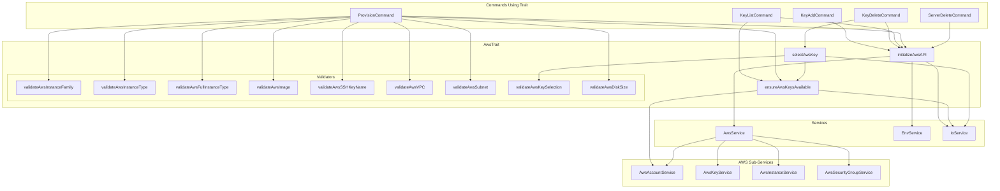

# Schematic: AwsTrait.php

> Auto-generated schematic. Last updated: 2025-12-26
>
> Recent update: Removed `validateAwsDiskType()` and `getAwsDiskTypeOptions()` methods - disk type now always uses gp3 SSD.

## Overview

AwsTrait provides shared AWS API functionality for commands that interact with AWS services. It handles API initialization/authentication, EC2 key pair selection UI, and input validation for AWS-specific parameters (instance families, instance types, AMIs, key pairs, VPCs, subnets, disk size).

## Logic Flow

### Entry Points

| Method | Purpose | Return Type |
|--------|---------|-------------|
| `initializeAwsAPI()` | Initialize and authenticate AWS API | `int` (Command status) |
| `ensureAwsKeysAvailable()` | Verify EC2 key pairs exist in account | `array\|int` |
| `selectAwsKey()` | Interactive EC2 key pair selection | `array\|int` |
| `validateAwsInstanceFamily()` | Validate instance family | `?string` |
| `validateAwsInstanceType()` | Validate instance type against available types | `?string` |
| `validateAwsFullInstanceType()` | Validate full instance type format and family | `?string` |
| `validateAwsImage()` | Validate AMI | `?string` |
| `validateAwsSSHKeyName()` | Validate key pair name | `?string` |
| `validateAwsVPC()` | Validate VPC ID | `?string` |
| `validateAwsSubnet()` | Validate subnet ID | `?string` |
| `validateAwsKeySelection()` | Validate key exists in options | `?string` |
| `validateAwsDiskSize()` | Validate disk size (8-16384 GB) | `?string` |

### Execution Flow

#### `initializeAwsAPI()`

1. **Get Credentials** - Retrieves from `EnvService`:
   - `AWS_ACCESS_KEY_ID`
   - `AWS_SECRET_ACCESS_KEY`
   - `AWS_DEFAULT_REGION` or `AWS_REGION`
2. **Initialize API** - Calls `AwsService::initialize()` with spinner
3. **Handle Errors**:
   - `InvalidArgumentException` - Credentials not found in environment
   - `RuntimeException` - API authentication failed

```
initializeAwsAPI()
    |
    v
env.get(['AWS_ACCESS_KEY_ID'])
env.get(['AWS_SECRET_ACCESS_KEY'])
env.get(['AWS_DEFAULT_REGION', 'AWS_REGION'])
    |
    +--[InvalidArgumentException]--> nay("Credentials not found") --> FAILURE
    |
    v
io.promptSpin(aws.initialize(accessKeyId, secretAccessKey, region))
    |
    +--[RuntimeException]--> nay(message) + nay("Check credentials") --> FAILURE
    |
    v
SUCCESS
```

#### `ensureAwsKeysAvailable()`

1. **Fetch Keys** - If `$keys` param is null, fetches from `aws.account.getPublicKeys()`
2. **Validate Count** - Checks if keys array is empty
3. **Return** - Keys array on success, `Command::FAILURE` on error or empty

#### `selectAwsKey()`

1. **Get Available Keys** - Calls `ensureAwsKeysAvailable()`
2. **Prompt Selection** - Uses `getValidatedOptionOrPrompt()` with `--key` option
3. **Return** - `['name' => $keyName, 'description' => $desc]` or `Command::FAILURE`

### Decision Points

| Location | Condition | True Path | False Path |
|----------|-----------|-----------|------------|
| `initializeAwsAPI()` | Credential exception | Return FAILURE | Continue |
| `ensureAwsKeysAvailable()` | `$keys === null` | Fetch from API | Use provided keys |
| `ensureAwsKeysAvailable()` | `count($keys) === 0` | Show info, return FAILURE | Return keys |
| `selectAwsKey()` | `is_int($availableKeys)` | Return FAILURE | Continue to prompt |
| Validators | Input invalid | Return error string | Return null |
| `validateAwsDiskSize()` | `size < 8` or `size > 16384` | Return error | Return null |
| `validateAwsFullInstanceType()` | Format invalid | Return error | Continue |
| `validateAwsFullInstanceType()` | Family not in valid list | Return error | Return null |

### Exit Conditions

| Method | Success | Failure |
|--------|---------|---------|
| `initializeAwsAPI()` | `Command::SUCCESS` | `Command::FAILURE` |
| `ensureAwsKeysAvailable()` | `array<string, string>` | `Command::FAILURE` |
| `selectAwsKey()` | `array{name, description}` | `Command::FAILURE` |
| Validators | `null` | Error message string |
| `getAwsDiskTypeOptions()` | `array<string, string>` | N/A (always succeeds) |

## Interaction Diagram



## Dependencies

### Direct Imports

| File/Class | Usage |
|------------|-------|
| `Deployer\Exceptions\ValidationException` | Thrown by IoService on validation failure, caught in selectAwsKey() |
| `Deployer\Services\AwsService` | Main API facade for AWS operations |
| `Deployer\Services\EnvService` | Retrieves AWS credentials from environment |
| `Deployer\Services\IoService` | UI prompts and spinner |
| `Symfony\Component\Console\Command\Command` | Return status constants (SUCCESS/FAILURE) |

### Coupled Files

| File | Coupling Type | Description |
|------|---------------|-------------|
| `.env` | Environment | Reads `AWS_ACCESS_KEY_ID`, `AWS_SECRET_ACCESS_KEY`, `AWS_DEFAULT_REGION`/`AWS_REGION` |
| `app/Services/Aws/AwsAccountService.php` | API | Uses `getPublicKeys()` for key listing |
| `app/Services/Aws/AwsKeyService.php` | API | Key import/delete operations via commands |
| `app/Services/Aws/AwsInstanceService.php` | API | EC2 instance operations via commands |
| `app/Services/Aws/AwsSecurityGroupService.php` | API | Security group operations via commands |
| `app/Contracts/BaseCommand.php` | Inheritance | Trait assumes `$this->nay()`, `$this->info()`, `$this->ul()` methods |

## Data Flow

### Inputs

| Source | Data | Used By |
|--------|------|---------|
| Environment (.env) | `AWS_ACCESS_KEY_ID`, `AWS_SECRET_ACCESS_KEY`, `AWS_DEFAULT_REGION` | `initializeAwsAPI()` |
| CLI `--key` option | EC2 key pair name | `selectAwsKey()` |
| CLI various options | instance-family, instance-size, instance-type, ami, key-pair, vpc, subnet, disk-size | Validators |
| AWS API | EC2 key pairs list | `ensureAwsKeysAvailable()`, `selectAwsKey()` |

### Outputs

| Method | Output | Consumer |
|--------|--------|----------|
| `initializeAwsAPI()` | Command status | Commands for flow control |
| `ensureAwsKeysAvailable()` | Keys array or failure | Commands, `selectAwsKey()` |
| `selectAwsKey()` | `{name, description}` or failure | Commands for key operations |
| Validators | `null` (valid) or error string | IoService validation |

### Side Effects

| Method | Side Effect |
|--------|-------------|
| `initializeAwsAPI()` | Authenticates `AwsService` with credentials and distributes SDK to sub-services |
| `initializeAwsAPI()` | Displays spinner during API call |
| `ensureAwsKeysAvailable()` | May display error/info messages |
| `selectAwsKey()` | May display error messages |

## Validation Methods Reference

### `validateAwsInstanceFamily(mixed $family, array $validFamilies)`

Validates EC2 instance family exists in available families.

- **Type check**: Must be string
- **Empty check**: Cannot be empty/whitespace
- **Existence check**: Must exist as key in `$validFamilies`
- **Error format**: Lists valid family names on failure

### `validateAwsInstanceType(mixed $type, array $validTypes)`

Validates EC2 instance type exists in available types for a specific family.

- **Type check**: Must be string
- **Empty check**: Cannot be empty/whitespace
- **Existence check**: Must exist as key in `$validTypes`

### `validateAwsFullInstanceType(mixed $type, array $validFamilies)`

Validates full instance type format and family (for backwards-compatible `--instance-type` option).

- **Type check**: Must be string
- **Empty check**: Cannot be empty/whitespace
- **Format check**: Must match `family.size` pattern (e.g., t3.large)
- **Family check**: Extracted family must exist in `$validFamilies` array

### `validateAwsImage(mixed $ami, array $validImages)`

Validates AMI ID exists in available images for the region.

- **Type check**: Must be string
- **Empty check**: Cannot be empty/whitespace
- **Existence check**: Must exist as key in `$validImages`

### `validateAwsSSHKeyName(mixed $keyName, array $validKeys)`

Validates EC2 key pair name exists in available keys.

- **Type check**: Must be string
- **Empty check**: Cannot be empty/whitespace
- **Existence check**: Must exist as key in `$validKeys`

### `validateAwsVPC(mixed $vpcId, array $availableVpcs)`

Validates VPC ID format and existence.

- **Type check**: Must be string
- **Empty check**: Cannot be empty/whitespace
- **Format check**: Must match `vpc-[a-f0-9]+` pattern
- **Existence check**: Must exist as key in `$availableVpcs`

### `validateAwsSubnet(mixed $subnetId, array $availableSubnets)`

Validates subnet ID format and existence in selected VPC.

- **Type check**: Must be string
- **Empty check**: Cannot be empty/whitespace
- **Format check**: Must match `subnet-[a-f0-9]+` pattern
- **Existence check**: Must exist as key in `$availableSubnets`

### `validateAwsKeySelection(mixed $keyName, array $validKeys)`

Validates key pair selection exists in available keys (used by `selectAwsKey()`).

- **Type check**: Must be string
- **Empty check**: Cannot be empty/whitespace
- **Existence check**: Must exist as key in `$validKeys`

### `validateAwsDiskSize(mixed $size)`

Validates disk size is within AWS limits.

- **Type check**: Must be string or int
- **Range check**: Must be between 8 GB and 16384 GB (16 TB)

## Notes

- **Property Annotations**: Trait uses `@property` annotations to document expected properties from using class:
  - `$this->aws` (AwsService)
  - `$this->env` (EnvService)
  - `$this->io` (IoService)

- **Error Display Pattern**: The trait handles its own error display via `$this->nay()`, `$this->info()`, etc. Commands check return value for `Command::FAILURE` and exit early.

- **Validation Pattern**: All validators follow the `?string` return pattern (null = valid, string = error message) for use with `IoService::getValidatedOptionOrPrompt()`.

- **Two-Step Instance Selection**: The trait now includes `validateAwsInstanceFamily()` for the first step (family selection) and `validateAwsInstanceType()` for the second step (size selection within a family).

- **Backwards Compatibility**: `validateAwsFullInstanceType()` supports the legacy `--instance-type t3.large` CLI option by validating format and family, then allowing ProvisionCommand to verify the type exists via AWS API.

- **Difference from DigitalOceanTrait**: AWS uses key pair names (strings) while DigitalOcean uses numeric key IDs. The `selectAwsKey()` returns `{name, description}` vs DigitalOcean's `{id, description}`.

- **VPC/Subnet Validation**: Includes regex format validation (`vpc-xxx`, `subnet-xxx`) in addition to existence checks, unlike DigitalOcean's simpler UUID validation.

- **Disk Validation**: Validates disk size (8-16384 GB); disk type always uses gp3 SSD (no validation needed).
