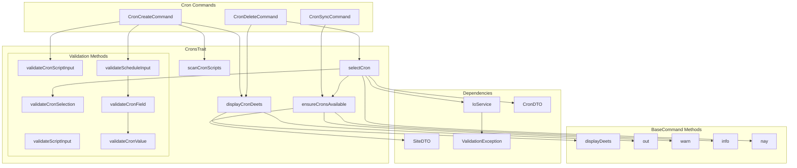

# Schematic: CronsTrait.php

> Auto-generated schematic. Last updated: 2025-12-26

## Overview

`CronsTrait` provides reusable cron job helpers for commands in the Cron domain. It offers methods for scanning cron scripts from the filesystem, displaying cron details, selecting crons interactively, and validating cron schedule expressions. This trait follows the standard pattern where traits let `ValidationException` propagate to calling commands.

## Logic Flow

### Entry Points

| Method | Visibility | Purpose |
|--------|------------|---------|
| `scanCronScripts()` | protected | Scan `.deployer/crons/` directory recursively |
| `displayCronDeets()` | protected | Display formatted cron details |
| `ensureCronsAvailable()` | protected | Guard method ensuring site has crons |
| `selectCron()` | protected | Interactive cron selection with CLI support |
| `validateCronScriptInput()` | protected | Validate script exists in available scripts |
| `validateCronSelection()` | protected | Validate script exists in site's crons |
| `validateScheduleInput()` | protected | Validate 5-field cron schedule expression |
| `validateScriptInput()` | protected | Validate script name is non-empty |

### Execution Flow

**scanCronScripts(string $cronsDir)**

1. Create `RecursiveIteratorIterator` over `RecursiveDirectoryIterator`
2. Iterate all files (LEAVES_ONLY, SKIP_DOTS)
3. Extract relative path from absolute path
4. Collect into array and sort alphabetically
5. Return sorted array of script paths

**selectCron(SiteDTO $site)**

1. Call `ensureCronsAvailable()` to validate site has crons
2. If no crons, return `Command::SUCCESS` (early exit with warning)
3. Extract script names from `CronDTO` array
4. Call `getValidatedOptionOrPrompt()` with:
   - Option: `--script`
   - Prompt: `promptSelect()` with cron scripts
   - Validator: `validateCronSelection()`
5. Find and return matching `CronDTO` by script name

**validateScheduleInput(mixed $schedule)**

1. Type check: must be string
2. Empty check: reject empty/whitespace
3. Split by whitespace into fields
4. Validate exactly 5 fields (minute, hour, day, month, weekday)
5. For each field, call `validateCronField()` with appropriate range:
   - minute: 0-59, no names
   - hour: 0-23, no names
   - day: 1-31, no names
   - month: 1-12, names: jan-dec
   - weekday: 0-7, names: sun-sat
6. Return error message or null

**validateCronField(string $field, int $min, int $max, array $names)** (private)

1. Wildcard `*` -> valid
2. List (contains `,`) -> validate each part recursively
3. Step value (contains `/`) -> extract step, validate base and step
4. Range (contains `-`) -> validate start and end values
5. Single value -> call `validateCronValue()`

**validateCronValue(string $value, int $min, int $max, array $names)** (private)

1. Check name aliases (case-insensitive)
2. Must be numeric (ctype_digit)
3. Must be within min-max range
4. Return error or null

### Decision Points

| Location | Condition | True Branch | False Branch |
|----------|-----------|-------------|--------------|
| `ensureCronsAvailable()` | `[] === $site->crons` | Display warning, return SUCCESS | Return crons array |
| `selectCron()` | `is_int($allCrons)` | Return early (no crons) | Continue to selection |
| `validateCronField()` | `str_contains($field, ',')` | Handle as list (recursive) | Continue checks |
| `validateCronField()` | `str_contains($field, '/')` | Handle as step value | Continue checks |
| `validateCronField()` | `str_contains($field, '-')` | Handle as range | Handle as single value |
| `validateCronValue()` | `in_array(strtolower($value), $names)` | Valid (name alias) | Check numeric |

### Exit Conditions

- `selectCron()`: Returns `Command::SUCCESS` if no crons available
- `selectCron()`: Returns `Command::FAILURE` if `ValidationException` caught
- `selectCron()`: Returns `CronDTO` on successful selection
- All validators: Return `null` for valid, error string for invalid

## Interaction Diagram

## Dependencies

### Direct Imports

| File/Class | Usage |
|------------|-------|
| `DeployerPHP\DTOs\CronDTO` | Data structure for cron job (script, schedule) |
| `DeployerPHP\DTOs\SiteDTO` | Contains `crons` array for site |
| `DeployerPHP\Exceptions\ValidationException` | Caught in `selectCron()` on CLI validation failure |
| `DeployerPHP\Services\IoService` | Input prompts via `getValidatedOptionOrPrompt()`, `promptSelect()` |
| `Symfony\Component\Console\Command\Command` | Return codes (SUCCESS, FAILURE) |

### Coupled Files

| File | Coupling Type | Description |
|------|---------------|-------------|
| `app/Contracts/BaseCommand.php` | State | Trait expects `$this->io`, `displayDeets()`, `out()`, `warn()`, `info()`, `nay()` |
| `app/Console/Cron/CronCreateCommand.php` | Consumer | Uses `scanCronScripts()`, `displayCronDeets()`, validation methods |
| `app/Console/Cron/CronDeleteCommand.php` | Consumer | Uses `selectCron()`, `displayCronDeets()` |
| `app/Console/Cron/CronSyncCommand.php` | Consumer | Uses `ensureCronsAvailable()` indirectly via trait chain |
| `.deployer/crons/` | Data | Filesystem directory scanned by `scanCronScripts()` |
| `deployer.yml` | Config | Source of cron data loaded into `SiteDTO.crons` |

## Data Flow

### Inputs

| Source | Data | Method |
|--------|------|--------|
| Filesystem | Cron script files | `scanCronScripts()` - reads `.deployer/crons/` |
| CLI Option | `--script` | `selectCron()` - via `getValidatedOptionOrPrompt()` |
| Interactive | User selection | `selectCron()` - via `promptSelect()` |
| `SiteDTO` | `crons` array | `ensureCronsAvailable()`, `selectCron()` |

### Outputs

| Destination | Data | Method |
|-------------|------|--------|
| Console | Formatted cron details | `displayCronDeets()` |
| Console | Warning message | `ensureCronsAvailable()` when no crons |
| Console | Error message | `selectCron()` on ValidationException |
| Return | `array<string>` | `scanCronScripts()` |
| Return | `CronDTO\|int` | `selectCron()` |
| Return | `?string` | All validation methods |

### Side Effects

- None. This trait is purely functional - no state mutations, file writes, or external calls.

## Notes

### Validation Strategy

The trait uses the standard `?string` return pattern for validators, making them compatible with both:

- Interactive prompts (re-prompt on error)
- CLI options (throw `ValidationException` via IoService)

### Cron Schedule Validation

The `validateScheduleInput()` method implements comprehensive cron expression validation:

- Supports wildcards (`*`), ranges (`1-5`), lists (`1,3,5`), steps (`*/5`, `0-30/5`)
- Supports name aliases for month (jan-dec) and weekday (sun-sat)
- Weekday accepts both 0 and 7 for Sunday (standard cron behavior)

### Error Propagation

Following the project convention, `selectCron()` catches `ValidationException` and displays the error with `$this->nay()`, returning `Command::FAILURE`. This is the standard pattern for trait methods that use `getValidatedOptionOrPrompt()`.

### Trait Requirements

Classes using this trait must:

1. Extend `BaseCommand` (provides `displayDeets()`, `out()`, `warn()`, `info()`, `nay()`)
2. Have access to `$this->io` (IoService instance)
3. Define `--script` option when using `selectCron()`
