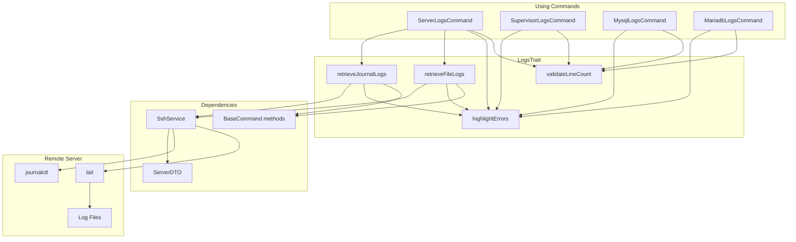
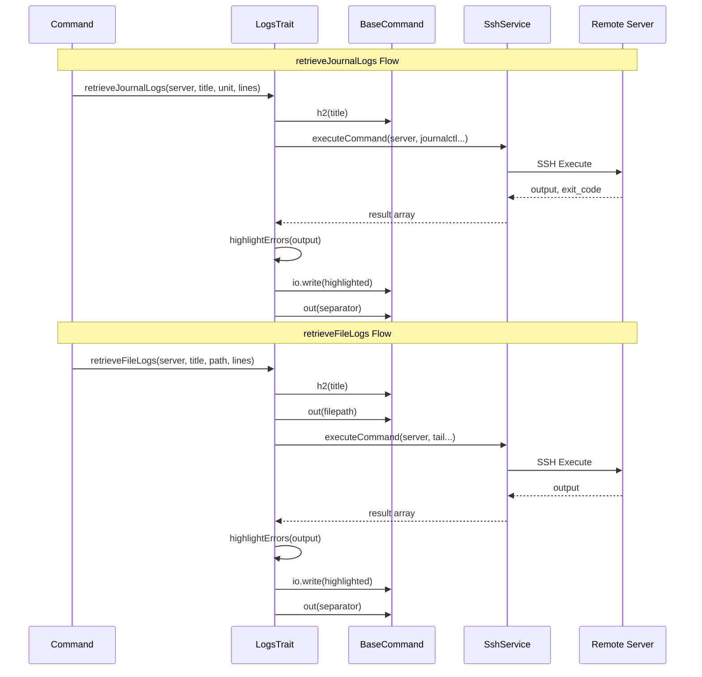

# Schematic: LogsTrait.php

> Auto-generated schematic. Last updated: 2025-12-18

## Overview

LogsTrait provides shared utilities for log-viewing commands, enabling retrieval and display of logs from remote servers via SSH. It supports two log retrieval methods: journalctl for systemd units and tail for log files. The trait also provides error keyword highlighting and input validation for line count parameters.

## Logic Flow

### Entry Points

| Method | Visibility | Purpose |
|--------|------------|---------|
| `retrieveJournalLogs()` | protected | Retrieve logs from systemd journal via journalctl |
| `retrieveFileLogs()` | protected | Retrieve logs from a file via tail |
| `highlightErrors()` | protected | Highlight error keywords in log output |
| `validateLineCount()` | protected | Validate line count input for log retrieval |

### Execution Flow

#### retrieveJournalLogs()

1. Display section heading via `$this->h2()`
2. Build journalctl command:
   - If `$unit` is null: `journalctl -n {lines} --no-pager 2>&1`
   - If `$unit` is provided: `journalctl -u {unit} -n {lines} --no-pager 2>&1`
3. Execute command via `$this->ssh->executeCommand()`
4. Trim output and detect "no data" conditions:
   - Empty string
   - `-- No entries --`
   - Contains `No data available`
5. Handle failure (non-zero exit code AND has data): display error with highlighting
6. Handle success:
   - No data: display warning
   - Has data: display with error highlighting
7. Output separator line

#### retrieveFileLogs()

1. Display section heading via `$this->h2()`
2. Display file path in gray
3. Build tail command: `tail -n {lines} {filepath} 2>&1`
4. Execute command via `$this->ssh->executeCommand()`
5. Trim output and detect "not found" conditions:
   - Contains `No such file`
   - Contains `cannot open`
6. Handle empty/not found: display warning
7. Handle success: display with error highlighting
8. Output separator line

#### highlightErrors()

1. Define error keywords: `error`, `exception`, `fail`, `failed`, `fatal`, `panic`
2. Define HTTP error status pattern: `\b(500|502|503|504)\b`
3. For each line:
   - Convert to lowercase for keyword matching
   - Check for error keywords (case-insensitive)
   - Check for HTTP error status codes
   - Wrap in `<fg=red>` tags if error detected
4. Return processed content with line breaks

#### validateLineCount()

1. Validate value is numeric and positive integer
2. Validate value does not exceed 1000
3. Return null (valid) or error message string

### Decision Points

| Location | Condition | True Branch | False Branch |
|----------|-----------|-------------|--------------|
| `retrieveJournalLogs()` L35 | `null === $unit` | All system logs | Unit-specific logs |
| `retrieveJournalLogs()` L46 | Non-zero exit AND has data | Display error | Continue |
| `retrieveJournalLogs()` L54 | No data | Display warning | Display logs |
| `retrieveFileLogs()` L86 | Not found OR empty | Display warning | Display logs |
| `highlightErrors()` L124 | Has error keyword OR status | Add red styling | Keep plain |
| `validateLineCount()` L143 | Not numeric OR <= 0 | Return error | Continue |
| `validateLineCount()` L147 | Value > 1000 | Return error | Return null |

### Exit Conditions

- `retrieveJournalLogs()`: Returns void after displaying output (success or error)
- `retrieveFileLogs()`: Returns void after displaying output (success or error)
- `highlightErrors()`: Returns processed string
- `validateLineCount()`: Returns `?string` (null = valid, string = error message)

## Interaction Diagram

## Dependencies

### Direct Imports

| File/Class | Usage |
|------------|-------|
| `Deployer\DTOs\ServerDTO` | Server connection details for SSH commands |
| `Deployer\Services\SshService` | Execute remote commands (declared via `@property` annotation) |

### Coupled Files

| File | Coupling Type | Description |
|------|---------------|-------------|
| `app/Contracts/BaseCommand.php` | State | Provides `$this->ssh`, `$this->io`, and output methods (`h2()`, `out()`, `warn()`, `nay()`) |
| `app/Services/SshService.php` | API | Uses `executeCommand()` to run remote commands |
| `app/Services/IoService.php` | State | Uses `$this->io->write()` for raw console output |
| `app/DTOs/ServerDTO.php` | Data | Server DTO passed to SSH operations |
| `app/Console/Server/ServerLogsCommand.php` | Consumer | Primary consumer using all trait methods |
| `app/Console/Supervisor/SupervisorLogsCommand.php` | Consumer | Uses `highlightErrors()` and `validateLineCount()` |
| `app/Console/Mysql/MysqlLogsCommand.php` | Consumer | Uses `highlightErrors()` and `validateLineCount()` |
| `app/Console/Mariadb/MariadbLogsCommand.php` | Consumer | Uses `highlightErrors()` and `validateLineCount()` |

### Remote Server Paths

| Path Pattern | Source | Description |
|--------------|--------|-------------|
| `/var/log/mysql/error.log` | PORT_SOURCES | MySQL/MariaDB error log |
| `/var/log/{unit}.log` | PHP-FPM | PHP-FPM version logs |
| `/var/log/cron/{domain}-{script}.log` | ServerLogsCommand | Per-site cron script logs |
| `/var/log/supervisor/{domain}-{program}.log` | ServerLogsCommand | Per-site supervisor program logs |
| `/var/log/caddy/{domain}-access.log` | ServerLogsCommand | Per-site Caddy access logs |

## Data Flow

### Inputs

| Method | Parameter | Type | Source |
|--------|-----------|------|--------|
| `retrieveJournalLogs` | `$server` | `ServerDTO` | Selected from inventory |
| `retrieveJournalLogs` | `$title` | `string` | Command configuration |
| `retrieveJournalLogs` | `$unit` | `?string` | Systemd unit name or null for all |
| `retrieveJournalLogs` | `$lines` | `int` | User input (validated) |
| `retrieveFileLogs` | `$server` | `ServerDTO` | Selected from inventory |
| `retrieveFileLogs` | `$title` | `string` | Command configuration |
| `retrieveFileLogs` | `$filepath` | `string` | Log file path on remote server |
| `retrieveFileLogs` | `$lines` | `int` | User input (validated) |
| `highlightErrors` | `$content` | `string` | Raw log content from SSH |
| `validateLineCount` | `$value` | `mixed` | CLI option or prompt input |

### Outputs

| Method | Returns | Destination |
|--------|---------|-------------|
| `retrieveJournalLogs` | `void` | Console output via IoService |
| `retrieveFileLogs` | `void` | Console output via IoService |
| `highlightErrors` | `string` | Formatted content with ANSI color tags |
| `validateLineCount` | `?string` | Error message or null for valid |

### Side Effects

| Method | Side Effect | Description |
|--------|-------------|-------------|
| `retrieveJournalLogs` | Console I/O | Writes heading, log content, and separator to console |
| `retrieveFileLogs` | Console I/O | Writes heading, filepath, log content, and separator to console |
| `retrieveJournalLogs` | SSH Connection | Creates/destroys SSH connection per command |
| `retrieveFileLogs` | SSH Connection | Creates/destroys SSH connection per command |

## Notes

### Error Highlighting

The `highlightErrors()` method applies red ANSI styling to entire lines containing error indicators:

- Keywords (case-insensitive): `error`, `exception`, `fail`, `failed`, `fatal`, `panic`
- HTTP status codes: 500, 502, 503, 504

This provides visual distinction for problematic log entries without requiring log format parsing.

### Line Count Validation

The `validateLineCount()` method enforces:

- Positive integer (> 0)
- Maximum 1000 lines

This prevents excessive SSH data transfer and protects against potential abuse.

### Usage Patterns

Two distinct usage patterns exist among consuming commands:

1. **Full trait usage** (ServerLogsCommand): Uses `retrieveJournalLogs()` and `retrieveFileLogs()` for unified log viewing across multiple sources

2. **Partial trait usage** (MysqlLogsCommand, MariadbLogsCommand, SupervisorLogsCommand): Only uses `highlightErrors()` and `validateLineCount()`, implementing their own journalctl logic inline. This creates some code duplication that could potentially be consolidated.

### Trait Property Requirements

The trait requires these properties from the using class (provided by BaseCommand):

- `$this->ssh` - SshService instance for remote command execution
- `$this->io` - IoService instance for console output
- Output methods: `h2()`, `out()`, `warn()`, `nay()`

This is documented via the `@property` PHPDoc annotation at the class level.
