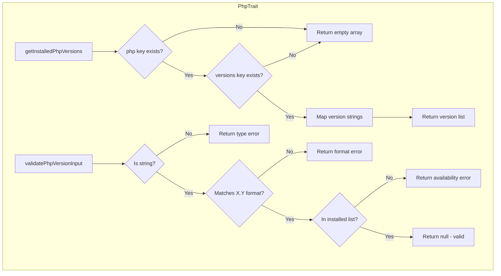

# Schematic: PhpTrait.php

> Auto-generated schematic. Last updated: 2025-12-19

## Overview

PhpTrait provides shared PHP version helpers for PHP-FPM service commands. It extracts installed PHP versions from server info and validates PHP version input against installed versions.

## Logic Flow

### Entry Points

| Method | Purpose |
|--------|---------|
| `getInstalledPhpVersions()` | Extract PHP version list from server info array |
| `validatePhpVersionInput()` | Validate a PHP version exists on server |

### Execution Flow

**getInstalledPhpVersions()**

1. Extract `php` key from server info array
2. Return empty array if `php` or `php.versions` is null
3. Map version arrays to extract version strings (e.g., `['8.3', '8.4']`)

**validatePhpVersionInput()**

1. Check value is a string (return error if not)
2. Validate format matches `X.Y` pattern via regex `/^\d+\.\d+$/`
3. Check version exists in installed versions list
4. Return null if valid, error message string if invalid

### Decision Points

| Condition | Branch |
|-----------|--------|
| `$php === null` or no `versions` key | Return empty array |
| Value not a string | Return type error |
| Format doesn't match `X.Y` | Return format error |
| Version not in installed list | Return availability error |

### Exit Conditions

- `getInstalledPhpVersions()`: Returns `list<string>` of versions or empty array
- `validatePhpVersionInput()`: Returns `null` (valid) or `string` (error message)

## Interaction Diagram

## Dependencies

### Direct Imports

None - trait contains pure utility methods.

### Coupled Files

| File | Coupling Type | Description |
|------|---------------|-------------|
| `app/Console/Php/PhpStartCommand.php` | Trait | Uses both methods |
| `app/Console/Php/PhpStopCommand.php` | Trait | Uses both methods |
| `app/Console/Php/PhpRestartCommand.php` | Trait | Uses both methods |
| `app/Console/Php/PhpLogsCommand.php` | Trait | Uses both methods |
| Server info structure | Data | Expects `php.versions[].version` structure |

## Data Flow

### Inputs

| Method | Input | Source |
|--------|-------|--------|
| `getInstalledPhpVersions()` | `array<string, mixed> $info` | Server info from `server-info.sh` playbook |
| `validatePhpVersionInput()` | `mixed $version` | CLI option or prompt value |
| `validatePhpVersionInput()` | `list<string> $installedVersions` | Output from `getInstalledPhpVersions()` |

### Outputs

| Method | Output | Format |
|--------|--------|--------|
| `getInstalledPhpVersions()` | Version list | `list<string>` e.g., `['8.3', '8.4']` |
| `validatePhpVersionInput()` | Validation result | `?string` - null if valid, error message if invalid |

### Side Effects

None - pure utility methods with no state changes.

## Notes

- Server info structure must contain `php.versions` array with objects having `version` key
- Version format validation uses regex to ensure `X.Y` pattern (e.g., `8.4`, not `8.4.1`)
- Validation error messages include available versions for user guidance
