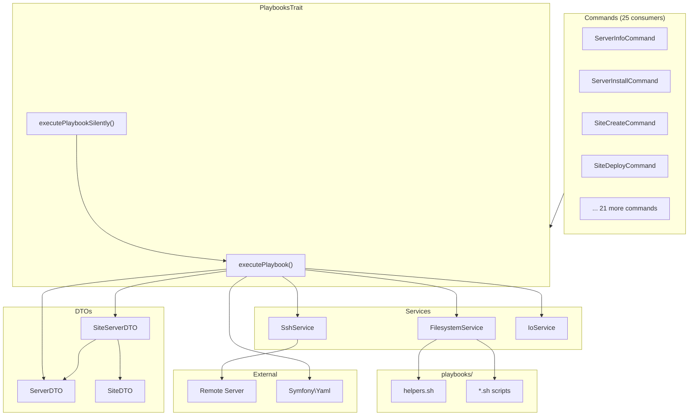
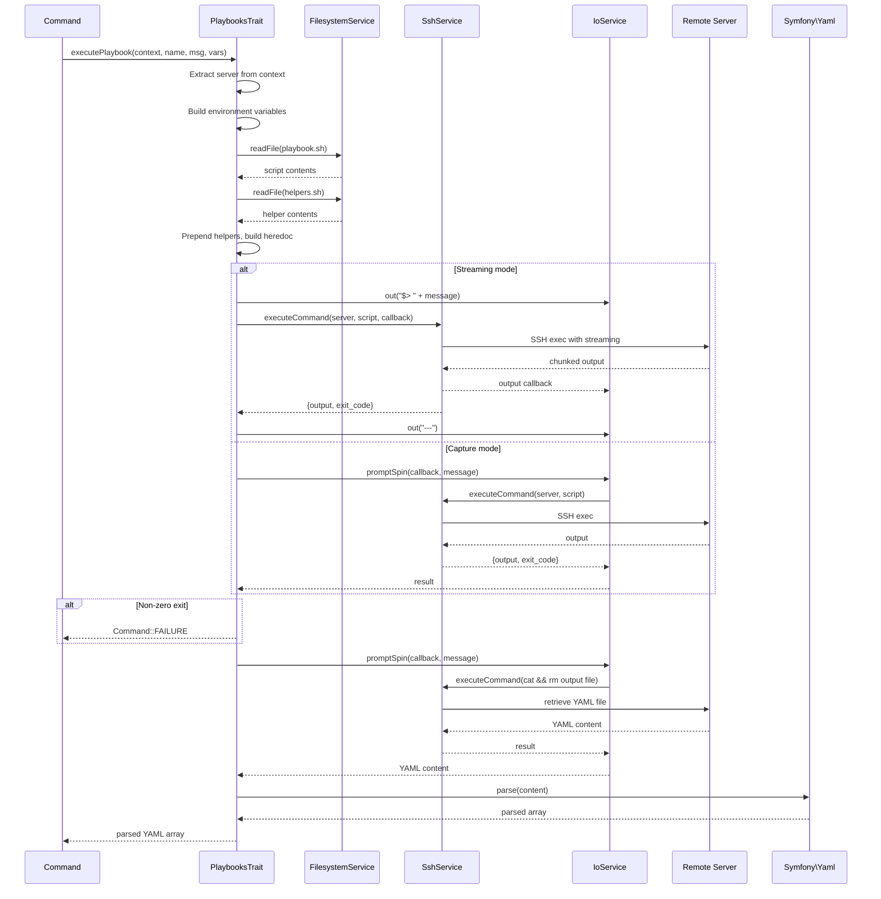

# Schematic: PlaybooksTrait.php

> Auto-generated schematic. Last updated: 2025-12-26

## Overview

PlaybooksTrait provides reusable methods for executing bash playbooks on remote servers via SSH. It handles script preparation, environment variable injection, SSH execution with streaming/spinner output modes, YAML response parsing, and comprehensive error handling for timeouts and connection failures.

## Logic Flow

### Entry Points

| Method | Purpose |
|--------|---------|
| `executePlaybook()` | Execute playbook with streaming or captured output |
| `executePlaybookSilently()` | Convenience wrapper that always captures output silently |

### Execution Flow

**`executePlaybook()`** (lines 62-270):

1. **Extract Context** (lines 69-126)
   - Determine if context is `ServerDTO` or `SiteServerDTO`
   - Extract server from context (SiteServerDTO wraps server)
   - Build base environment variables from server data
   - Optionally add server info vars (distro, permissions) if available
   - For SiteServerDTO contexts:
     - Inject domain and PHP version (always)
     - Inject repo and branch (when not null/empty)
     - Inject crons as JSON array (mapped from CronDTO objects)
     - Inject supervisors as JSON array (mapped from SupervisorDTO objects)
   - Merge explicit playbook vars (override auto-injected defaults)

2. **Prepare Playbook** (lines 128-163)
   - Resolve project root and playbook path
   - Read playbook script contents via FilesystemService
   - Prepend `helpers.sh` content for remote execution
   - Generate unique output file path: `/tmp/deployer-output-{timestamp}-{random}.yml`
   - Build environment variable prefix string (JSON-encode arrays)
   - Wrap script with heredoc for execution: `VAR=value bash <<'EOF'\n{script}\nEOF`

3. **Execution and Output** (lines 165-219)
   - **Streaming mode** (`$capture === null`):
     - Display status message with `$>` prefix
     - Execute via SSH with callback for real-time output
     - Display separator `---` after completion
   - **Capture mode** (`$capture !== null`):
     - Execute via spinner (`promptSpin`)
     - Only display output on error (non-zero exit code)
   - Catch `SshTimeoutException`: Display helpful recovery suggestions
   - Catch `RuntimeException`: Display error message
   - Both exceptions return `Command::FAILURE`

4. **Exit Code Check** (lines 221-226)
   - Non-zero exit code returns `Command::FAILURE`

5. **Read YAML Output** (lines 228-249)
   - Execute `cat` and `rm` commands to retrieve and cleanup output file
   - Short 30-second timeout for this quick operation
   - Validate content is not empty

6. **Parse YAML** (lines 251-269)
   - Parse YAML content using Symfony Yaml component
   - Validate result is array
   - Return parsed array on success
   - Display raw content on parse failure

**`executePlaybookSilently()`** (lines 281-296):

1. Initialize `$capture` variable
2. Delegate to `executePlaybook()` with capture reference
3. Return result (parsed YAML or `Command::FAILURE`)

### Decision Points

| Line | Condition | True Branch | False Branch |
|------|-----------|-------------|--------------|
| 73 | `$context instanceof SiteServerDTO` | Extract server from site context | Use context as server directly |
| 82 | `$server->info !== null` | Inject distro/permissions vars | Skip info vars |
| 93 | `$context instanceof SiteServerDTO` | Inject all site vars (domain, PHP, repo, branch, crons, supervisors) | Skip site vars |
| 99 | `$site->repo !== null && '' !== $site->repo` | Inject DEPLOYER_SITE_REPO | Skip repo var |
| 103 | `$site->branch !== null && '' !== $site->branch` | Inject DEPLOYER_SITE_BRANCH | Skip branch var |
| 137 | `file_exists($helpersPath)` | Prepend helpers.sh content | Use script alone |
| 154 | `is_array($value)` | JSON-encode array value | Cast to string |
| 169 | `$capture === null` | Stream output real-time | Use spinner, capture output |
| 192 | `$capture !== null && exit_code !== 0` | Display captured output | Skip (already streamed) |
| 222 | `$result['exit_code'] !== 0` | Return FAILURE | Continue to YAML retrieval |
| 242 | `empty($yamlContent)` | Throw RuntimeException | Continue to parsing |
| 255 | `!is_array($parsed)` | Throw RuntimeException | Return parsed array |

### Exit Conditions

| Condition | Return Value |
|-----------|--------------|
| SSH timeout (SshTimeoutException) | `Command::FAILURE` |
| SSH connection error (RuntimeException) | `Command::FAILURE` |
| Non-zero playbook exit code | `Command::FAILURE` |
| Failed to read output file | `Command::FAILURE` |
| Empty output file | `Command::FAILURE` |
| YAML parse error | `Command::FAILURE` |
| Successful execution | `array<string, mixed>` (parsed YAML) |

## Interaction Diagram



## Sequence Diagram



## Dependencies

### Direct Imports

| File/Class | Usage |
|------------|-------|
| `DeployerPHP\Container` | Property type declaration (required by trait contract) |
| `DeployerPHP\DTOs\CronDTO` | Map cron jobs to JSON array for DEPLOYER_CRONS |
| `DeployerPHP\DTOs\ServerDTO` | Server context parameter type |
| `DeployerPHP\DTOs\SiteServerDTO` | Site+server context parameter type |
| `DeployerPHP\DTOs\SupervisorDTO` | Map supervisor programs to JSON array for DEPLOYER_SUPERVISORS |
| `DeployerPHP\Exceptions\SshTimeoutException` | Catch SSH timeout errors |
| `DeployerPHP\Services\FilesystemService` | Read playbook files from disk |
| `DeployerPHP\Services\IoService` | Console output and spinner prompts |
| `DeployerPHP\Services\SshService` | Execute commands on remote servers |
| `Symfony\Component\Console\Command\Command` | Return FAILURE constant |
| `Symfony\Component\Yaml\Yaml` | Parse YAML output from playbooks |

### Coupled Files

| File | Coupling Type | Description |
|------|---------------|-------------|
| `playbooks/helpers.sh` | Data | Auto-prepended to all playbook scripts |
| `playbooks/*.sh` | Data | All 19 playbook scripts executed via this trait |
| `app/Contracts/BaseCommand.php` | State | Commands using trait must extend BaseCommand for `$io`, `$ssh`, `$fs` |
| `/tmp/deployer-output-*.yml` | Cache | Temporary output files on remote servers |

## Data Flow

### Inputs

| Source | Data | Description |
|--------|------|-------------|
| Command | `ServerDTO\|SiteServerDTO` | Server connection details and optional site context |
| Command | `string $playbookName` | Playbook script name without `.sh` extension |
| Command | `string $statusMessage` | Message shown during execution |
| Command | `array $playbookVars` | Custom environment variables for playbook |
| Command | `?string &$capture` | Reference for capturing output (null = stream) |
| Filesystem | `playbooks/{name}.sh` | Playbook script content |
| Filesystem | `playbooks/helpers.sh` | Shared helper functions |

### Outputs

| Destination | Data | Description |
|-------------|------|-------------|
| Return value | `array<string, mixed>` | Parsed YAML output from playbook |
| Return value | `int` | `Command::FAILURE` on any error |
| Console | Streaming output | Real-time playbook output (streaming mode) |
| Console | Error messages | Timeout suggestions, connection errors |
| `$capture` reference | Raw output | Full playbook stdout when capturing |

### Side Effects

| Effect | Description |
|--------|-------------|
| Remote file creation | Creates `/tmp/deployer-output-{ts}-{hex}.yml` on target server |
| Remote file deletion | Deletes output file after reading |
| Console output | Writes status messages, errors, and streaming output |
| SSH connection | Creates/closes SSH connections via SshService |

## Environment Variables

The trait auto-injects these environment variables into playbooks:

### Server Variables (Always Available)

| Variable | Source | Description |
|----------|--------|-------------|
| `DEPLOYER_OUTPUT_FILE` | Generated | Unique temp file path for YAML output |
| `DEPLOYER_SERVER_NAME` | `$server->name` | Server name from inventory |
| `DEPLOYER_SSH_PORT` | `$server->port` | SSH port number |

### Server Info Variables (When `$server->info` Loaded)

| Variable | Source | Description |
|----------|--------|-------------|
| `DEPLOYER_DISTRO` | `$server->info['distro']` | Distribution (ubuntu\|debian) |
| `DEPLOYER_PERMS` | `$server->info['permissions']` | User permissions (root\|sudo\|none) |

### Site Variables (SiteServerDTO Context Only)

| Variable | Source | Condition | Description |
|----------|--------|-----------|-------------|
| `DEPLOYER_SITE_DOMAIN` | `$site->domain` | Always | Site domain name |
| `DEPLOYER_PHP_VERSION` | `$site->phpVersion` | Always | PHP version (e.g., "8.3") |
| `DEPLOYER_SITE_REPO` | `$site->repo` | When not null/empty | Git repository URL |
| `DEPLOYER_SITE_BRANCH` | `$site->branch` | When not null/empty | Git branch name |
| `DEPLOYER_CRONS` | `$site->crons` | Always (may be empty array) | JSON array of cron jobs |
| `DEPLOYER_SUPERVISORS` | `$site->supervisors` | Always (may be empty array) | JSON array of supervisor programs |

### JSON Array Formats

**DEPLOYER_CRONS** structure:

```json
[{"script": "/path/to/script.sh", "schedule": "*/5 * * * *"}, ...]
```

**DEPLOYER_SUPERVISORS** structure:

```json
[{"program": "worker", "script": "php artisan queue:work", "autostart": true, "autorestart": true, "stopwaitsecs": 10, "numprocs": 1}, ...]
```

## Notes

### Design Patterns

- **Context Pattern**: `ServerDTO|SiteServerDTO` union allows flexible execution context
- **Reference Parameter**: `$capture` uses PHP reference to differentiate streaming vs capture mode
- **Variable Override**: Explicit vars override auto-injected base vars via array spread
- **Heredoc Execution**: Script wrapped in heredoc to preserve complex quoting in playbooks

### Error Handling Strategy

- SSH timeout receives special treatment with recovery suggestions
- All exceptions caught and converted to user-friendly messages
- Non-zero exit codes treated as failures without exception
- YAML parse failures display raw content for debugging

### Performance Considerations

- Helper functions prepended once per execution (not sourced remotely)
- Output file uses unique name to prevent conflicts
- 30-second timeout for YAML retrieval (quick operation)
- 300-second default timeout for main playbook execution

### Consumers

25 commands use this trait:

- Server: ServerAddCommand, ServerInfoCommand, ServerFirewallCommand, ServerInstallCommand
- Site: SiteCreateCommand, SiteDeleteCommand, SiteDeployCommand, SiteHttpsCommand
- Cron: CronCreateCommand, CronDeleteCommand, CronSyncCommand
- Supervisor: SupervisorCreateCommand, SupervisorDeleteCommand, SupervisorRestartCommand, SupervisorStartCommand, SupervisorStopCommand, SupervisorSyncCommand
- Database: MysqlInstallCommand, MysqlRestartCommand, MysqlStartCommand, MysqlStopCommand, MariadbInstallCommand, MariadbRestartCommand, MariadbStartCommand, MariadbStopCommand
