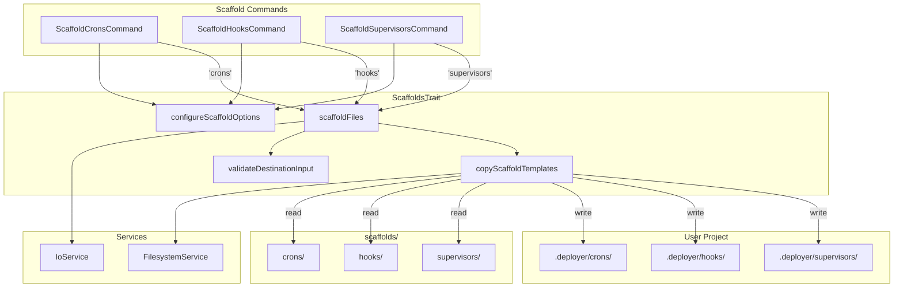

# Schematic: ScaffoldsTrait.php

> Auto-generated schematic. Last updated: 2025-12-19

## Overview

ScaffoldsTrait provides reusable scaffold file copying helpers for commands that need to copy template files from the `scaffolds/` directory to a user-specified destination. It handles destination path input/validation, directory creation, and file copying with skip-if-exists behavior.

## Logic Flow

### Entry Points

| Method | Visibility | Purpose |
|--------|------------|---------|
| `configureScaffoldOptions()` | protected | Adds `--destination` option to command configuration |
| `scaffoldFiles(string $type)` | protected | Main entry point for scaffolding operations |
| `validateDestinationInput(mixed $path)` | protected | Validates destination path input |

### Execution Flow

**`scaffoldFiles(string $type)` - Main Flow:**

```
1. Get destination directory via validated prompt/option
   └─> Uses IoService::getValidatedOptionOrPrompt()
       └─> Prompt default: current working directory
       └─> Validates via validateDestinationInput()
   └─> On ValidationException: display error, return FAILURE

2. Normalize path to absolute
   └─> If relative path, prepend current working directory

3. Calculate target directory
   └─> {destination}/.deployer/{type}

4. Copy template files
   └─> copyScaffoldTemplates(type, targetDir)
       └─> On RuntimeException: display error, return FAILURE

5. Success output
   └─> Display success message
   └─> Show command replay
   └─> Return SUCCESS
```

**`copyScaffoldTemplates(string $type, string $destination)` - Copy Flow:**

```
1. Ensure destination directory exists
   └─> Create with FilesystemService::mkdir() if missing

2. Locate source templates
   └─> {projectRoot}/scaffolds/{type}/
   └─> Throw RuntimeException if not found

3. Iterate template files
   └─> Via FilesystemService::scanDirectory()
   └─> Skip directories
   └─> For each file:
       ├─> If target exists or is symlink: skip (mark as "skipped")
       └─> If target missing: copy via FilesystemService (mark as "created")

4. Display status table
   └─> displayDeets() with filename => status
```

### Decision Points

| Location | Condition | True Branch | False Branch |
|----------|-----------|-------------|--------------|
| `scaffoldFiles()` L46-63 | ValidationException thrown | Display error, return FAILURE | Continue |
| `scaffoldFiles()` L66 | Path starts with `/` | Use as-is | Prepend cwd |
| `copyScaffoldTemplates()` L97 | Destination dir exists | Continue | Create dir |
| `copyScaffoldTemplates()` L102 | Templates dir exists | Continue | Throw exception |
| `copyScaffoldTemplates()` L118 | Target file exists or is link | Skip | Copy file |

### Exit Conditions

| Return Value | Condition |
|--------------|-----------|
| `Command::SUCCESS` | Files scaffolded successfully |
| `Command::FAILURE` | Validation fails, directory creation fails, or templates not found |

## Interaction Diagram



## Dependencies

### Direct Imports

| File/Class | Usage |
|------------|-------|
| `Deployer\Exceptions\ValidationException` | Caught when CLI option validation fails |
| `Deployer\Services\FilesystemService` | All file operations (getCwd, mkdir, isDirectory, exists, isLink, scanDirectory, readFile, dumpFile) |
| `Deployer\Services\IoService` | User input prompts and validation |
| `Symfony\Component\Console\Command\Command` | Return value constants (SUCCESS, FAILURE) |
| `Symfony\Component\Console\Input\InputOption` | Option configuration (VALUE_REQUIRED) |

### Coupled Files

| File | Coupling Type | Description |
|------|---------------|-------------|
| `app/Console/ScaffoldCronsCommand.php` | Consumer | Uses trait for `scaffold:crons` command |
| `app/Console/ScaffoldHooksCommand.php` | Consumer | Uses trait for `scaffold:hooks` command |
| `app/Console/ScaffoldSupervisorsCommand.php` | Consumer | Uses trait for `scaffold:supervisors` command |
| `scaffolds/crons/*.sh` | Data | Template source files for cron scripts |
| `scaffolds/hooks/*.sh` | Data | Template source files for deployment hooks |
| `scaffolds/supervisors/*.sh` | Data | Template source files for supervisor programs |
| `app/Contracts/BaseCommand.php` | State | Provides `$this->io`, `$this->fs`, output methods |

## Data Flow

### Inputs

| Source | Data | Method |
|--------|------|--------|
| CLI Option | `--destination` path | Via `IoService::getValidatedOptionOrPrompt()` |
| Interactive Prompt | Destination directory | Via `IoService::promptText()` |
| Command | Scaffold type string | Passed to `scaffoldFiles()` |
| Filesystem | Template file contents | Via `FilesystemService::readFile()` |

### Outputs

| Destination | Data | Method |
|-------------|------|--------|
| User Project | Copied template files | Via `FilesystemService::dumpFile()` |
| Console | Status table (filename => created/skipped) | Via `displayDeets()` |
| Console | Success message | Via `yay()` |
| Console | Command replay | Via `commandReplay()` |

### Side Effects

| Effect | Location | Description |
|--------|----------|-------------|
| Directory creation | `copyScaffoldTemplates()` L98 | Creates `{dest}/.deployer/{type}/` if missing |
| File creation | `copyScaffoldTemplates()` L120 | Creates template files that don't exist |

## Notes

**Skip-if-exists behavior:** The trait intentionally skips files that already exist at the destination (or are symlinks). This allows users to customize scaffolded files without losing changes on subsequent runs.

**Path resolution:** Relative paths are resolved against the current working directory from `FilesystemService::getCwd()`. The default prompt value is also the cwd.

**Template location:** Templates are located relative to the trait file using `dirname(__DIR__, 2)`, which resolves to the project root. This assumes the trait is in `app/Traits/`.

**FilesystemService consistency:** All file operations use FilesystemService methods (`isDirectory`, `mkdir`, `scanDirectory`, `exists`, `isLink`, `readFile`, `dumpFile`) for testability and consistency.

**ValidationException handling:** The trait catches `ValidationException` from `getValidatedOptionOrPrompt()` within `scaffoldFiles()` and returns `Command::FAILURE` after displaying the error. Commands using this trait do not need additional exception handling for validation errors.
