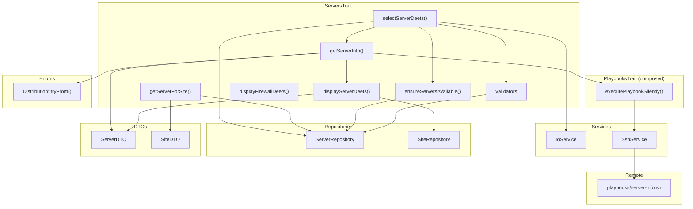

# Schematic: ServersTrait.php

> Auto-generated schematic. Last updated: 2025-12-26

## Overview

ServersTrait provides reusable server-related functionality for commands that manage servers. It includes server selection with validation, server information display, firewall status display, and input validation methods. The trait composes PlaybooksTrait to gain access to remote playbook execution capabilities.

## Logic Flow

### Entry Points

| Method | Purpose | Returns |
|--------|---------|---------|
| `selectServerDeets()` | Interactive server selection with info retrieval | `ServerDTO\|int` |
| `getServerInfo(ServerDTO)` | Retrieve and validate server information | `ServerDTO\|int` |
| `getServerForSite(SiteDTO)` | Resolve server from site association | `ServerDTO\|int` |
| `ensureServersAvailable(?array)` | Check if servers exist in inventory | `array<ServerDTO>\|int` |
| `displayServerDeets(ServerDTO)` | Display server details | `void` |
| `displayFirewallDeets(array)` | Display firewall status | `void` |

### Execution Flow

#### selectServerDeets() Flow

```
1. Call ensureServersAvailable() to get all servers
   - If no servers -> return FAILURE with helpful message

2. Extract server names for prompt options

3. Call io->getValidatedOptionOrPrompt() with:
   - CLI option: 'server'
   - Prompt: promptSelect() with server names
   - Validator: validateServerSelection()

4. Catch ValidationException
   - Display error -> return FAILURE

5. Lookup server by name from repository

6. Call getServerInfo() to retrieve remote info
   - Returns ServerDTO with populated info or FAILURE
```

#### getServerInfo(ServerDTO) Flow

```
1. Display server details via displayServerDeets()

2. Execute 'server-info' playbook silently
   - If SSH fails -> return FAILURE

3. Validate distribution via Distribution::tryFrom()
   - If null (unsupported) -> display message -> return FAILURE

4. Validate permissions (must be root or sudo)
   - If insufficient -> display setup instructions -> return FAILURE

5. Return server->withInfo(info) with populated info array
```

### Decision Points

| Location | Condition | True Path | False Path |
|----------|-----------|-----------|------------|
| L183 | `count($allServers) === 0` | Display guidance, return FAILURE | Return servers array |
| L203 | `null === $server` | Display error, return FAILURE | Return server |
| L232 | `is_int($info)` | Return FAILURE (playbook failed) | Continue validation |
| L243 | `null === $distribution` | Display message, return FAILURE | Continue |
| L254 | Permissions invalid | Display setup instructions, return FAILURE | Return enriched ServerDTO |

### Exit Conditions

- **Success**: Returns `ServerDTO` (optionally enriched with `info` array)
- **Failure**: Returns `Command::FAILURE` (integer 1) after displaying appropriate error/guidance

## Interaction Diagram



## Dependencies

### Direct Imports

| File/Class | Usage |
|------------|-------|
| `DeployerPHP\DTOs\ServerDTO` | Server data transfer object |
| `DeployerPHP\DTOs\SiteDTO` | Site data transfer object |
| `DeployerPHP\Enums\Distribution` | Distribution validation via tryFrom() |
| `DeployerPHP\Exceptions\ValidationException` | Input validation errors |
| `DeployerPHP\Repositories\ServerRepository` | Server CRUD operations |
| `DeployerPHP\Repositories\SiteRepository` | Site lookup for display |
| `DeployerPHP\Services\IoService` | User input/output |
| `DeployerPHP\Services\SshService` | Remote command execution (via PlaybooksTrait) |
| `Symfony\Component\Console\Command\Command` | Return codes (FAILURE) |

### Trait Composition

| Trait | Purpose |
|-------|---------|
| `PlaybooksTrait` | Provides `executePlaybookSilently()` for remote execution |

### Required Host Properties

Classes using this trait MUST have these properties:

```php
/** @property IoService $io */
/** @property ServerRepository $servers */
/** @property SshService $ssh */
/** @property SiteRepository $sites */
```

### Coupled Files

| File | Coupling Type | Description |
|------|---------------|-------------|
| `playbooks/server-info.sh` | Playbook | Called by `getServerInfo()` to gather server details |
| `playbooks/helpers.sh` | Playbook | Prepended to all playbooks by PlaybooksTrait |
| `~/.deployer/inventory.yml` | Data | ServerRepository reads/writes server entries |
| `app/Contracts/BaseCommand.php` | State | Provides output methods (`displayDeets`, `out`, `nay`, `info`, etc.) |

## Data Flow

### Inputs

| Source | Data | Used By |
|--------|------|---------|
| CLI option `--server` | Server name string | `selectServerDeets()` |
| Interactive prompt | Server name selection | `selectServerDeets()` |
| ServerRepository | `array<ServerDTO>` | `ensureServersAvailable()`, `selectServerDeets()` |
| SiteRepository | `array<SiteDTO>` | `displayServerDeets()` |
| Remote playbook | Server info array | `getServerInfo()` |

### Outputs

| Destination | Data | From |
|-------------|------|------|
| Console | Server details (name, host, port, user, key, sites) | `displayServerDeets()` |
| Console | Firewall status and open ports | `displayFirewallDeets()` |
| Console | Error messages | All methods on failure |
| Return value | `ServerDTO` with `info` populated | `getServerInfo()`, `selectServerDeets()` |

### Server Info Array Structure

The `info` array returned from `server-info.sh` playbook contains:

```php
[
    'distro' => string,          // 'ubuntu', 'debian', etc.
    'permissions' => string,     // 'root', 'sudo', or 'none'
    'ufw_installed' => bool,     // Firewall installed
    'ufw_active' => bool,        // Firewall active
    'ufw_rules' => array,        // ['22/tcp', '80/tcp', ...]
    'ports' => array,            // Port => process mapping
    'sites_config' => array,     // Domain => site config
]
```

### Side Effects

- **SSH connections**: `getServerInfo()` establishes SSH connection via playbook
- **Console output**: All display methods write to console
- **No persistent state changes**: Trait methods are read-only

## Validation Methods

| Method | Input | Rules | Returns |
|--------|-------|-------|---------|
| `validateServerSelection(mixed)` | Server name | Must be string, must exist in inventory | `?string` error |
| `validateServerName(mixed)` | New server name | Must be string, non-empty, alphanumeric/hyphen/underscore, max 64 chars, unique | `?string` error |
| `validateServerHost(mixed)` | Host/IP | Must be string, valid IP or domain, unique | `?string` error |
| `validateServerPort(mixed)` | Port string | Must be string, numeric, 1-65535 | `?string` error |
| `validateUsernameInput(mixed)` | Username | Must be string, non-empty, valid Unix format | `?string` error |

## Helper Methods

| Method | Purpose |
|--------|---------|
| `extractPortsFromRules(array)` | Parse port numbers from UFW rule strings like "22/tcp" |
| `getSiteConfig(array, string)` | Extract site configuration from server info by domain |

## Commands Using This Trait

This trait is used by 36 commands across multiple domains:

**Server Commands**: ServerAddCommand, ServerDeleteCommand, ServerFirewallCommand, ServerInfoCommand, ServerInstallCommand, ServerLogsCommand, ServerProvisionDigitalOceanCommand, ServerRunCommand, ServerSshCommand

**Site Commands**: SiteCreateCommand, SiteDeleteCommand, SiteDeployCommand, SiteHttpsCommand, SiteSharedPullCommand, SiteSharedPushCommand, SiteSshCommand

**Database Commands**: MariadbInstallCommand, MariadbRestartCommand, MariadbStartCommand, MariadbLogsCommand, MariadbStopCommand, MysqlInstallCommand, MysqlRestartCommand, MysqlStartCommand, MysqlLogsCommand, MysqlStopCommand

**Cron Commands**: CronCreateCommand, CronDeleteCommand, CronSyncCommand

**Supervisor Commands**: SupervisorCreateCommand, SupervisorDeleteCommand, SupervisorRestartCommand, SupervisorStartCommand, SupervisorLogsCommand, SupervisorStopCommand, SupervisorSyncCommand

## Notes

- **Yoda conditions**: The trait uses Yoda conditions (`null === $server`) per project standards
- **Return types**: Methods return union types `ServerDTO|int` where int is always `Command::FAILURE`
- **ValidationException pattern**: `selectServerDeets()` catches ValidationException and handles it locally rather than propagating
- **Immutable DTOs**: `ServerDTO::withInfo()` returns a new instance rather than mutating
- **Distribution support**: Only Debian and Ubuntu are supported; validation uses `Distribution::tryFrom()` directly (no longer calls `isSupported()`)
- **Permission requirements**: Server must have root access or passwordless sudo for deployer operations
