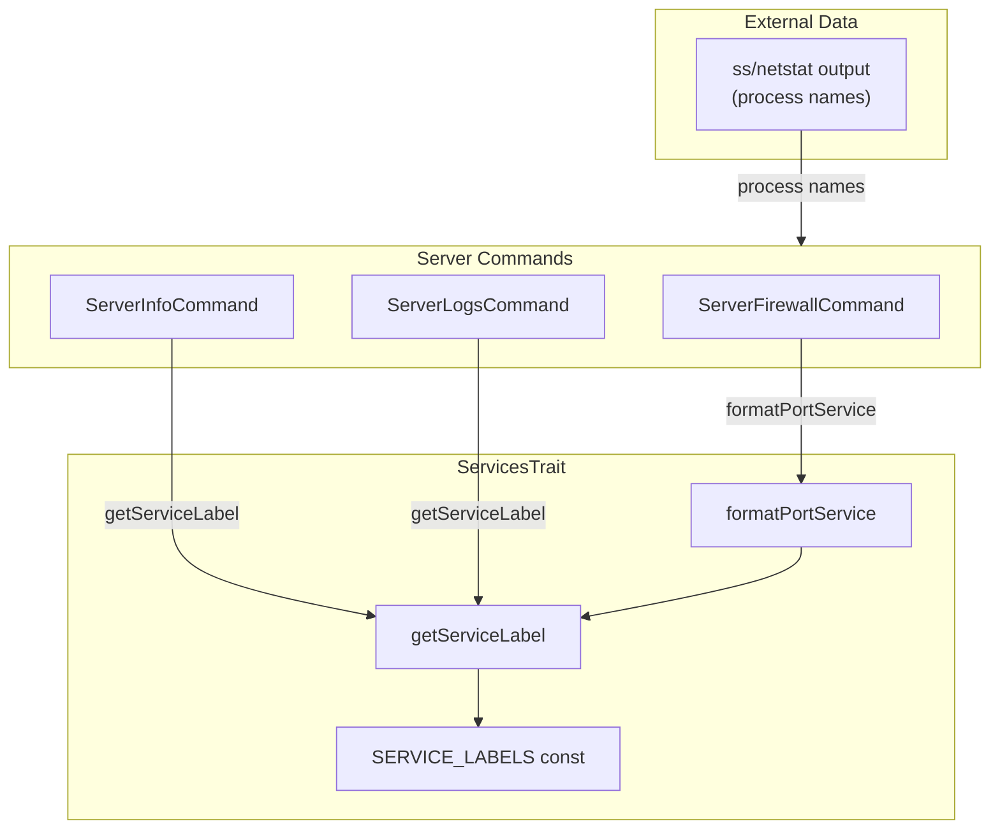

# Schematic: ServicesTrait.php

> Auto-generated schematic. Last updated: 2025-12-27

## Recent Changes

- **2025-12-27**: Migrated from Caddy to Nginx - replaced `caddy` entry with `nginx` in `SERVICE_LABELS` constant

## Overview

`ServicesTrait` provides centralized display formatting for system services detected via network port scanning. It maps process names from `ss`/`netstat` output to human-readable labels (e.g., `mysqld` to `MySQL`), ensuring consistent service naming across all server-related commands.

## Logic Flow

### Entry Points

| Method | Visibility | Purpose |
|--------|------------|---------|
| `getServiceLabel(string $process)` | protected | Get display label for a process name |
| `formatPortService(int $port, string $process)` | protected | Format port number with its service label |

### Execution Flow

#### getServiceLabel()

1. Convert input process name to lowercase (`strtolower`)
2. Look up in `SERVICE_LABELS` constant map
3. Return mapped label if found, otherwise return `ucfirst($process)` as fallback

```
Input: "mysqld" -> "MySQL"
Input: "nginx"  -> "Nginx"
Input: "unknown" -> "Unknown" (fallback - ucfirst)
```

#### formatPortService()

1. Call `getServiceLabel()` to get display name
2. Format as `"<port> (<label>)"` using sprintf
3. Return formatted string

```
Input: (3306, "mysqld") -> "3306 (MySQL)"
Input: (80, "nginx")    -> "80 (Nginx)"
```

### Decision Points

| Location | Condition | True Branch | False Branch |
|----------|-----------|-------------|--------------|
| Line 41 | `isset(SERVICE_LABELS[$key])` | Return mapped label | Return `ucfirst($process)` |

### Exit Conditions

Both methods return strings immediately - no early exits or error conditions. Unknown process names gracefully fall back to capitalized input.

## Interaction Diagram



## Dependencies

### Direct Imports

None - this trait is self-contained with no external dependencies.

### Coupled Files

| File | Coupling Type | Description |
|------|---------------|-------------|
| `app/Console/Server/ServerFirewallCommand.php` | Consumer | Uses `formatPortService()` to display selectable ports |
| `app/Console/Server/ServerInfoCommand.php` | Consumer | Uses `getServiceLabel()` to format port list display |
| `app/Console/Server/ServerLogsCommand.php` | Consumer | Uses `getServiceLabel()` for log source labels; references `SERVICE_LABELS` keys in `PORT_SOURCES` constant |

### Implicit Couplings

| Coupling | Description |
|----------|-------------|
| Process Names | Keys in `SERVICE_LABELS` must match process names from `ss`/`netstat` output on target servers |
| PORT_SOURCES | `ServerLogsCommand::PORT_SOURCES` keys align with `SERVICE_LABELS` keys for consistent labeling |

## Data Flow

### Inputs

| Source | Data | Format |
|--------|------|--------|
| Command callers | Process name | String from `ss`/`netstat` (e.g., `mysqld`, `nginx`) |
| Command callers | Port number | Integer (e.g., `3306`, `80`) |

### Outputs

| Destination | Data | Format |
|-------------|------|--------|
| Command display | Service label | Human-readable string (e.g., `MySQL`) |
| Command display | Port with service | Formatted string (e.g., `3306 (MySQL)`) |

### Side Effects

None - purely functional string transformation methods.

## Notes

### Supported Services

| Process Name | Display Label |
|--------------|---------------|
| `nginx` | Nginx |
| `mariadb` | MariaDB |
| `memcached` | Memcached |
| `mysqld` | MySQL |
| `postgres` | PostgreSQL |
| `redis-server` | Redis |
| `sshd` | SSH |
| `valkey-server` | Valkey |

### Design Decisions

1. **Case-insensitive lookup**: Process names are lowercased before lookup, making matching robust against case variations
2. **Graceful fallback**: Unknown process names are capitalized rather than failing, allowing new services to work without code changes
3. **Centralized labels**: Single source of truth prevents inconsistent service naming across commands

### Extension Points

To add a new service:

1. Add entry to `SERVICE_LABELS` constant
2. If log viewing is needed, add corresponding entry to `ServerLogsCommand::PORT_SOURCES`
