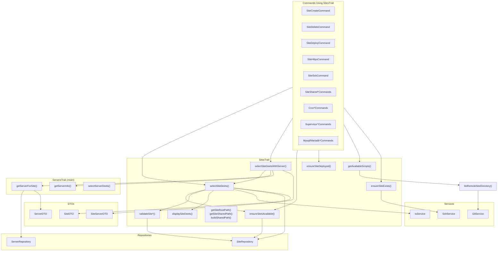

# Schematic: SitesTrait.php

> Auto-generated schematic. Last updated: 2025-12-27

## Recent Changes

- **2025-12-27**: Migrated from Caddy to Nginx - `ensureSiteExists()` now checks `/etc/nginx/sites-available/{domain}` instead of `/etc/caddy/conf.d/sites/{domain}.caddy`
- Added `buildSharedPath(SiteDTO $site, string $relative = ''): string` method to build full shared paths by joining the shared root with an optional relative path. Uses `$this->fs->joinPaths()` for path concatenation.

## Overview

SitesTrait provides reusable site-related functionality for commands that manage sites. It handles site selection from inventory, site path resolution, remote repository inspection, site validation, and display utilities. The trait is mixed into ServersTrait (which provides server selection) and depends on IoService, ProcessService, GitService, SshService, ServerRepository, and SiteRepository.

## Logic Flow

### Entry Points

| Method | Purpose | Returns |
|--------|---------|---------|
| `selectSiteDeets()` | Select a site from inventory via CLI option or interactive prompt | `SiteDTO\|int` |
| `selectSiteDeetsWithServer()` | Select site and resolve its associated server with full info | `SiteServerDTO\|int` |
| `ensureSitesAvailable()` | Check if any sites exist in inventory | `array<SiteDTO>\|int` |
| `ensureSiteDeployed()` | Verify site has been deployed (has repo/branch) | `?int` |
| `getAvailableScripts()` | List scripts from a remote site directory | `array<string>\|int` |
| `ensureSiteExists()` | Check if site exists on remote server | `?int` |
| `displaySiteDeets()` | Display site details to console | `void` |

### Execution Flow

#### Site Selection Flow (`selectSiteDeets`)

```
1. ensureSitesAvailable() - Check inventory has sites
   |- Empty: Display warning, return Command::SUCCESS
   +- Has sites: Continue

2. Extract site domains from all sites

3. getValidatedOptionOrPrompt('domain', ...)
   |- CLI option provided: Validate with validateSiteSelection()
   |   |- Invalid: Throw ValidationException
   |   +- Valid: Use value
   +- No option: Show interactive prompt

4. Catch ValidationException
   |- Display error via nay()
   +- Return Command::FAILURE

5. displaySiteDeets() - Show site info

6. Return SiteDTO from sites repository
```

#### Site + Server Selection Flow (`selectSiteDeetsWithServer`)

```
1. selectSiteDeets() - Get site selection (includes displaySiteDeets())
   +- Failure: Propagate return code

2. getServerForSite() - Resolve associated server
   +- Not found: Return Command::FAILURE

3. getServerInfo() [from ServersTrait]
   |- SSH validation
   |- Distribution check
   +- Permissions check

4. Return SiteServerDTO(site, server)
```

#### Remote Script Discovery Flow (`getAvailableScripts`)

```
1. listRemoteSiteDirectory()
   |- No repo/branch: Return empty array
   +- Has repo: Git shallow clone, list files

2. Handle RuntimeException
   +- Display error, return Command::FAILURE

3. Check if scripts found
   |- Empty: Display warning + scaffold hint
   +- Has scripts: Return script list
```

### Decision Points

| Location | Condition | True Branch | False Branch |
|----------|-----------|-------------|--------------|
| `ensureSitesAvailable()` | `[] === $this->sites->all()` | Display warning, return SUCCESS | Return all sites |
| `ensureSiteDeployed()` | `null === $site->repo \|\| null === $site->branch` | Display warning, return FAILURE | Return null (OK) |
| `selectSiteDeetsWithServer()` | `null === $server->info` | Return FAILURE | Continue |
| `checkRemoteSiteFiles()` | `null === $site->repo \|\| null === $site->branch` | Return empty array | Check files via GitService |
| `ensureSiteExists()` | SSH command exit code !== 0 | Display error, return FAILURE | Return null (OK) |
| `normalizeDomain()` | `str_starts_with($domain, 'www.')` | Strip 'www.' prefix | Keep domain as-is |

### Exit Conditions

| Method | Success Return | Failure Return |
|--------|----------------|----------------|
| `selectSiteDeets()` | `SiteDTO` | `Command::SUCCESS` (empty) or `Command::FAILURE` |
| `selectSiteDeetsWithServer()` | `SiteServerDTO` | `Command::SUCCESS`, `Command::FAILURE` |
| `ensureSitesAvailable()` | `array<SiteDTO>` | `Command::SUCCESS` |
| `ensureSiteDeployed()` | `null` | `Command::FAILURE` |
| `getAvailableScripts()` | `array<string>` | `Command::FAILURE` |
| `ensureSiteExists()` | `null` | `Command::FAILURE` |
| Validators | `null` (valid) | Error message string |

## Interaction Diagram



## Dependencies

### Direct Imports

| File/Class | Usage |
|------------|-------|
| `DeployerPHP\DTOs\ServerDTO` | Passed to SSH and validation methods |
| `DeployerPHP\DTOs\SiteDTO` | Returned from selection, passed to display/validation |
| `DeployerPHP\DTOs\SiteServerDTO` | Composite return type combining site + server |
| `DeployerPHP\Exceptions\ValidationException` | Caught during validated option/prompt handling |
| `DeployerPHP\Repositories\ServerRepository` | Server lookup via `getServerForSite()` |
| `DeployerPHP\Repositories\SiteRepository` | Site CRUD and lookups |
| `DeployerPHP\Services\GitService` | Remote repository file checking |
| `DeployerPHP\Services\IoService` | Input prompts and validation |
| `DeployerPHP\Services\ProcessService` | Required property (used by GitService) |
| `DeployerPHP\Services\SshService` | Remote server validation |
| `Symfony\Component\Console\Command\Command` | Return constants (SUCCESS, FAILURE) |

### Coupled Files

| File | Coupling Type | Description |
|------|---------------|-------------|
| `app/Traits/ServersTrait.php` | Mixin | SitesTrait is `@mixin ServersTrait`, uses `getServerForSite()`, `getServerInfo()` |
| `app/Contracts/BaseCommand.php` | Inheritance | Commands using trait extend BaseCommand, provides `nay()`, `warn()`, `info()`, `out()`, `displayDeets()`, `$fs` (FilesystemService) |
| `app/Services/IoService.php` | Service | `getValidatedOptionOrPrompt()`, `promptSelect()` for site selection |
| `app/Services/GitService.php` | Service | `checkRemoteFilesExist()`, `listRemoteDirectoryFiles()` for repository inspection |
| `app/Repositories/SiteRepository.php` | Data | `all()`, `findByDomain()` for site inventory access |
| `/home/deployer/sites/{domain}` | Filesystem | Remote site root path convention |
| `/etc/nginx/sites-available/{domain}` | Config | Nginx configuration file checked by `ensureSiteExists()` |
| `.deployer/crons/` | Convention | Remote repository directory for cron scripts |
| `.deployer/supervisors/` | Convention | Remote repository directory for supervisor scripts |

## Data Flow

### Inputs

| Source | Data | Method |
|--------|------|--------|
| CLI `--domain` option | Site domain string | `selectSiteDeets()` |
| Interactive prompt | Selected domain from list | `selectSiteDeets()` |
| `SiteRepository` | All sites, site by domain | `ensureSitesAvailable()`, validators |
| `ServerRepository` | Server by name | `getServerForSite()` |
| Remote git repository | File existence, directory listings | `checkRemoteSiteFiles()`, `listRemoteSiteDirectory()` |
| Remote server (SSH) | Site existence check | `validateSiteAdded()` |

### Outputs

| Destination | Data | Method |
|-------------|------|--------|
| Console | Site details display | `displaySiteDeets()` |
| Console | Warnings/errors | `nay()`, `warn()`, `info()` |
| Calling command | `SiteDTO` | `selectSiteDeets()` |
| Calling command | `SiteServerDTO` | `selectSiteDeetsWithServer()` |
| Calling command | Script file list | `getAvailableScripts()` |

### Side Effects

| Method | Side Effect |
|--------|-------------|
| `checkRemoteSiteFiles()` | Creates/deletes temp directory for git clone |
| `listRemoteSiteDirectory()` | Creates/deletes temp directory for git clone |
| `ensureSiteExists()` | SSH connection to remote server |
| All display methods | Console output |

## Validation Methods

### Input Validators (return `?string`)

| Method | Validates | Error Cases |
|--------|-----------|-------------|
| `validateSiteBranch()` | Branch name | Not string, empty |
| `validateSiteDomain()` | Domain format + uniqueness | Not string, invalid format, already exists |
| `validateSiteRepo()` | Git URL format | Not string, empty, invalid prefix |
| `validateSiteSelection()` | Site exists in inventory | Not string, not found |

### Heavy I/O Validators (return `?int`)

| Method | Validates | Dependencies |
|--------|-----------|--------------|
| `ensureSiteExists()` | Site exists on remote server | SshService |
| `ensureSiteDeployed()` | Site has repo/branch configured | None (checks DTO) |

## Path Conventions

| Method | Path Pattern |
|--------|--------------|
| `getSiteRootPath()` | `/home/deployer/sites/{domain}` |
| `getSiteSharedPath()` | `/home/deployer/sites/{domain}/shared` |
| `buildSharedPath()` | `/home/deployer/sites/{domain}/shared/{relative}` |

## Notes

- **Nginx Migration**: `ensureSiteExists()` now checks `/etc/nginx/sites-available/{domain}` instead of the old Caddy path at `/etc/caddy/conf.d/sites/{domain}.caddy`

- **Mixin Relationship**: SitesTrait is annotated as `@mixin ServersTrait`, meaning it expects to be used in classes that also use ServersTrait. It directly calls `getServerForSite()` and `getServerInfo()` from ServersTrait.

- **Validation Flow**: Uses IoService's `getValidatedOptionOrPrompt()` pattern where CLI options are validated immediately (throwing `ValidationException`) while interactive prompts re-prompt until valid.

- **Domain Normalization**: `normalizeDomain()` strips `www.` prefix and lowercases domains to ensure consistency in storage and lookup.

- **Remote Repository Inspection**: Methods like `checkRemoteSiteFiles()` and `listRemoteSiteDirectory()` use shallow git clones to minimize data transfer when checking for deployment configuration files.

- **Empty Inventory Handling**: `ensureSitesAvailable()` returns `Command::SUCCESS` (not FAILURE) when no sites exist, treating empty inventory as a valid state that just needs user guidance.

- **Site Server Resolution**: `selectSiteDeetsWithServer()` is a compound operation that handles the common pattern of selecting a site and then resolving + validating its associated server connection. Since `selectSiteDeets()` now displays site details, `selectSiteDeetsWithServer()` no longer needs to call `displaySiteDeets()` separately.

- **Scaffold Hints**: When scripts are not found in remote repositories, methods suggest running scaffold commands (`scaffold:crons`, etc.) to guide users.

- **Display Fields**: `displaySiteDeets()` shows fields in order: Domain, Server, PHP, Repo (if set), Branch (if set). PHP version is always included since `phpVersion` is required on SiteDTO.
