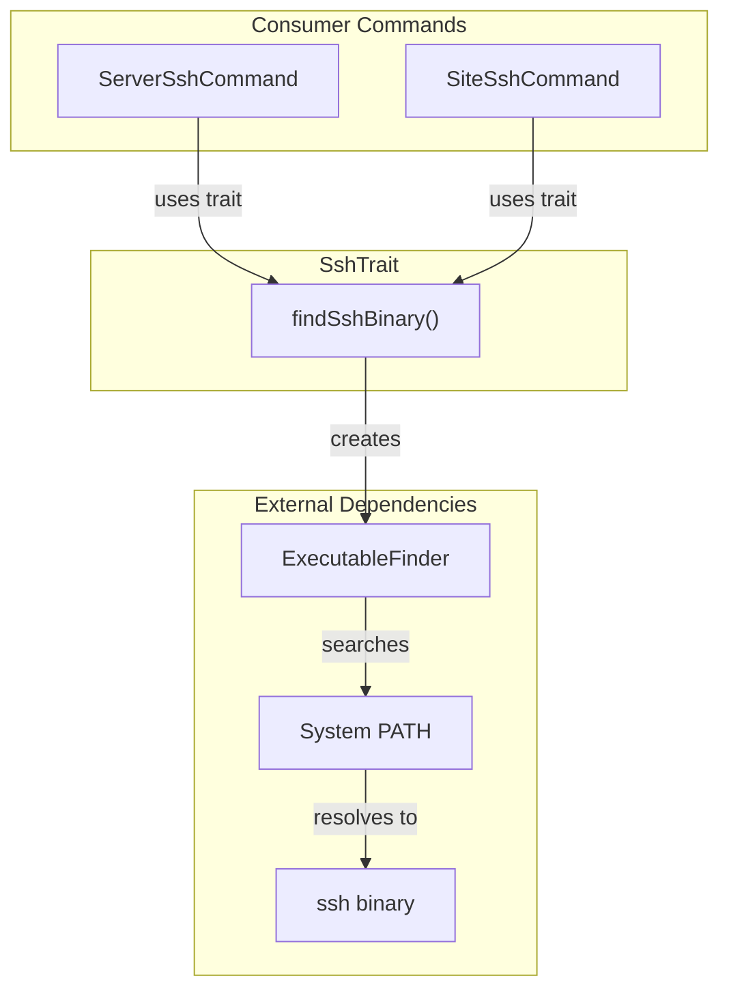

# Schematic: SshTrait.php

> Auto-generated schematic. Last updated: 2025-12-18

## Overview

`SshTrait` provides SSH binary discovery functionality for commands that need to establish SSH connections. It uses Symfony's `ExecutableFinder` to locate the `ssh` binary in the system PATH. This is a minimal utility trait used by SSH-related commands.

## Logic Flow

### Entry Points

| Method | Visibility | Purpose |
|--------|------------|---------|
| `findSshBinary()` | protected | Find SSH binary path in system |

### Execution Flow

**findSshBinary()**

1. Instantiate `Symfony\Component\Process\ExecutableFinder`
2. Search for `ssh` executable in system PATH
3. Return absolute path to SSH binary, or `null` if not found

```
findSshBinary()
    |
    v
[Create ExecutableFinder]
    |
    v
[finder->find('ssh')]
    |
    +---> Found: return "/usr/bin/ssh" (or similar)
    |
    +---> Not found: return null
```

### Decision Points

None - single linear execution path.

### Exit Conditions

- Returns `string` - absolute path to SSH binary when found
- Returns `null` - when SSH binary is not in PATH

## Interaction Diagram



## Dependencies

### Direct Imports

| File/Class | Usage |
|------------|-------|
| `Symfony\Component\Process\ExecutableFinder` | Locates SSH binary in system PATH |

### Coupled Files

| File | Coupling Type | Description |
|------|---------------|-------------|
| `app/Console/Server/ServerSshCommand.php` | Trait Consumer | Uses `findSshBinary()` for SSH into servers |
| `app/Console/Site/SiteSshCommand.php` | Trait Consumer | Uses `findSshBinary()` for SSH into site directories |

### System Dependencies

| Dependency | Type | Description |
|------------|------|-------------|
| `ssh` binary | Environment | OpenSSH client must be installed on host system |
| `pcntl` extension | PHP Extension | Required by consumer commands for `pcntl_exec()` |

## Data Flow

### Inputs

| Source | Type | Description |
|--------|------|-------------|
| System PATH | Environment | Directories searched for SSH binary |

### Outputs

| Destination | Type | Description |
|-------------|------|-------------|
| Consumer Commands | `?string` | Path to SSH binary or null |

### Side Effects

None - this trait is stateless and read-only.

## Notes

### Architectural Observations

1. **Minimal Scope**: This trait contains only one method. It exists to share SSH binary discovery logic between `ServerSshCommand` and `SiteSshCommand`.

2. **Indirect Dependency**: The trait uses `ExecutableFinder` from `symfony/process`, which is an indirect dependency (installed via `symfony/console`), not directly declared in `composer.json`.

3. **Null Return Pattern**: Returns `null` when SSH is not found, requiring consumer commands to handle this case explicitly. Both current consumers display an error and return `Command::FAILURE`.

### Usage Pattern

Consumer commands follow this pattern:

```php
$sshBinary = $this->findSshBinary();

if (null === $sshBinary) {
    $this->nay('SSH binary not found in PATH');
    return Command::FAILURE;
}

// Build SSH args and execute with pcntl_exec()
pcntl_exec($sshBinary, $sshArgs);
```

### Potential Consolidation

The SSH argument building and `pcntl_exec` call patterns are duplicated between `ServerSshCommand` and `SiteSshCommand`. This trait could potentially be extended to include:

- SSH argument builder method
- SSH execution method with proper error handling

However, the current implementation follows the project's minimalism principle by keeping the trait focused on a single responsibility.
