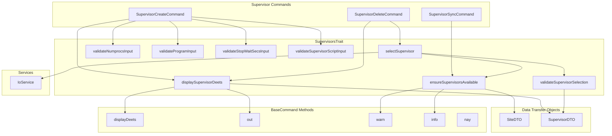
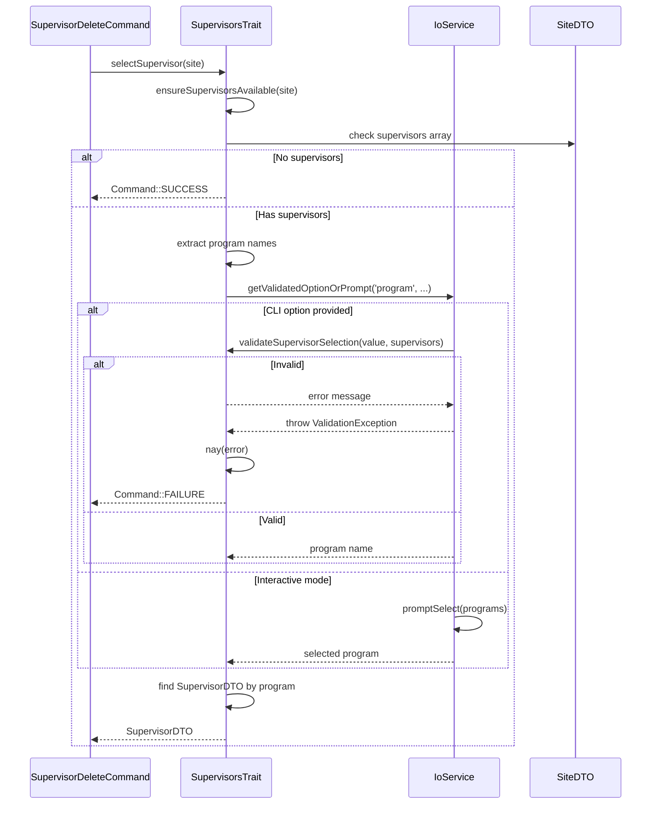

# Schematic: SupervisorsTrait.php

> Auto-generated schematic. Last updated: 2025-12-26

## Overview

SupervisorsTrait provides reusable helper methods for supervisor program management in CLI commands. It handles supervisor selection via interactive prompts or CLI options, displays supervisor configuration details, validates supervisor-related input (program names, process counts, stop wait seconds, script paths), and ensures supervisors exist before operations.

## Logic Flow

### Entry Points

| Method | Purpose | Returns |
|--------|---------|---------|
| `displaySupervisorDeets()` | Display formatted supervisor configuration | `void` |
| `ensureSupervisorsAvailable()` | Check if site has supervisors, warn if empty | `array<SupervisorDTO>\|int` |
| `selectSupervisor()` | Select supervisor by CLI option or prompt | `SupervisorDTO\|int` |
| `validateNumprocsInput()` | Validate number of processes | `?string` |
| `validateProgramInput()` | Validate program name format | `?string` |
| `validateStopWaitSecsInput()` | Validate stop wait seconds | `?string` |
| `validateSupervisorScriptInput()` | Validate script exists in available scripts | `?string` |
| `validateSupervisorSelection()` | Validate program exists in site's supervisors | `?string` |

### Execution Flow

#### displaySupervisorDeets()

```
1. Call displayDeets() with supervisor properties:
   - Program name
   - Script path
   - Autostart (yes/no)
   - Autorestart (yes/no)
   - Stopwaitsecs
   - Numprocs
2. Output separator line "---"
```

#### ensureSupervisorsAvailable()

```
1. Check if site->supervisors is empty array
2. IF empty:
   a. Display warning: "No supervisor configurations found for '{domain}'"
   b. Display info: "Run supervisor:create to create one"
   c. Return Command::SUCCESS (early exit, not failure)
3. ELSE:
   a. Return site->supervisors array
```

#### selectSupervisor()

```
1. Call ensureSupervisorsAvailable() to get supervisors
2. IF result is int (Command::SUCCESS):
   a. Return that int (propagate early exit)
3. Extract program names from supervisors array
4. TRY:
   a. Get validated program selection via getValidatedOptionOrPrompt()
      - Option: 'program'
      - Prompt: Select from program names list
      - Validator: validateSupervisorSelection()
5. CATCH ValidationException:
   a. Display error via nay()
   b. Return Command::FAILURE
6. Find supervisor DTO by matching program name
7. Return SupervisorDTO
```

### Decision Points

| Location | Condition | True Branch | False Branch |
|----------|-----------|-------------|--------------|
| `ensureSupervisorsAvailable()` | `[] === $site->supervisors` | Return SUCCESS with warning | Return supervisors array |
| `selectSupervisor()` | `is_int($allSupervisors)` | Propagate exit code | Continue with selection |
| `validateNumprocsInput()` | `is_string($numprocs)` | Parse and validate as string | Validate as int directly |
| `validateProgramInput()` | `!preg_match('/^[a-zA-Z0-9_-]+$/')` | Return error message | Return null (valid) |
| `validateSupervisorSelection()` | Program found in supervisors | Return null (valid) | Return "not found" error |

### Exit Conditions

| Method | Condition | Return Value |
|--------|-----------|--------------|
| `ensureSupervisorsAvailable()` | No supervisors | `Command::SUCCESS` |
| `selectSupervisor()` | No supervisors | `Command::SUCCESS` (via ensureSupervisorsAvailable) |
| `selectSupervisor()` | Validation fails | `Command::FAILURE` |
| `selectSupervisor()` | Success | `SupervisorDTO` |
| All validators | Invalid input | Error message string |
| All validators | Valid input | `null` |

## Interaction Diagram





## Dependencies

### Direct Imports

| File/Class | Usage |
|------------|-------|
| `DeployerPHP\DTOs\SiteDTO` | Input parameter for site context |
| `DeployerPHP\DTOs\SupervisorDTO` | Return type and iteration target |
| `DeployerPHP\Exceptions\ValidationException` | Caught when CLI validation fails |
| `DeployerPHP\Services\IoService` | Interactive prompts and validated input |
| `Symfony\Component\Console\Command` | Return code constants (SUCCESS, FAILURE) |

### Coupled Files

| File | Coupling Type | Description |
|------|---------------|-------------|
| `app/Contracts/BaseCommand.php` | State | Trait expects `$this->io` (IoService) and output methods |
| `app/DTOs/SiteDTO.php` | Data | Accesses `supervisors` array property |
| `app/DTOs/SupervisorDTO.php` | Data | Uses program, script, autostart, autorestart, stopwaitsecs, numprocs properties |
| `app/Repositories/SiteRepository.php` | Data | Supervisors managed via repository methods |
| `app/Console/Supervisor/SupervisorCreateCommand.php` | Consumer | Uses validation methods for creating supervisors |
| `app/Console/Supervisor/SupervisorDeleteCommand.php` | Consumer | Uses selectSupervisor() and displaySupervisorDeets() |
| `app/Console/Supervisor/SupervisorSyncCommand.php` | Consumer | Uses ensureSupervisorsAvailable() indirectly |
| `.deployer/supervisors/` | Config | Validated script files must exist here |

## Data Flow

### Inputs

| Source | Data | Method |
|--------|------|--------|
| `SiteDTO` | Array of `SupervisorDTO` objects | `ensureSupervisorsAvailable()`, `selectSupervisor()` |
| CLI option `--program` | Program name string | `selectSupervisor()` |
| Interactive prompt | Selected program name | `selectSupervisor()` |
| Mixed user input | Values to validate | All `validate*Input()` methods |
| Available scripts array | List of valid script names | `validateSupervisorScriptInput()` |

### Outputs

| Destination | Data | Method |
|-------------|------|--------|
| Console | Formatted supervisor details | `displaySupervisorDeets()` |
| Console | Warning/info messages | `ensureSupervisorsAvailable()` |
| Calling command | `SupervisorDTO` or exit code | `selectSupervisor()` |
| Calling command | Error message or null | All `validate*()` methods |

### Side Effects

| Method | Side Effect |
|--------|-------------|
| `displaySupervisorDeets()` | Writes to console output |
| `ensureSupervisorsAvailable()` | Writes warning/info to console when empty |
| `selectSupervisor()` | Writes error to console on validation failure |

## Notes

### Validation Rules

| Validator | Rules |
|-----------|-------|
| `validateNumprocsInput` | Must be positive integer (>= 1); accepts string or int |
| `validateProgramInput` | Non-empty; alphanumeric, underscores, hyphens only |
| `validateStopWaitSecsInput` | Must be positive integer (>= 1); accepts string or int |
| `validateSupervisorScriptInput` | Must exist in provided available scripts array |
| `validateSupervisorSelection` | Program must exist in site's supervisors array |

### Design Patterns

1. **Early Exit Pattern**: `ensureSupervisorsAvailable()` returns `Command::SUCCESS` (not FAILURE) when no supervisors exist, allowing commands to exit gracefully without error.

2. **Union Return Types**: Methods return either data objects (`SupervisorDTO`) or integers (`Command::SUCCESS`/`Command::FAILURE`), requiring callers to check `is_int()` before proceeding.

3. **Validation Exception Propagation**: Trait catches `ValidationException` and displays error via `nay()`, then returns `Command::FAILURE`. This follows the project pattern where traits handle exceptions at the method level.

4. **String/Int Input Normalization**: Numeric validators accept both string (from CLI) and int (programmatic) inputs, normalizing strings via `ctype_digit()` check and cast.

### Required Trait Properties

The trait requires these properties/methods from the using class (documented via `@property` and `@method` annotations):

- `$this->io` - IoService instance
- `$this->info()` - Display info message
- `$this->ul()` - Display unordered list
- `$this->nay()` - Display error message
- `$this->warn()` - Display warning message
- `$this->out()` - Display plain output
- `$this->displayDeets()` - Display key-value details

### Consumer Commands

| Command | Methods Used |
|---------|--------------|
| `supervisor:create` | `displaySupervisorDeets()`, `validateProgramInput()`, `validateNumprocsInput()`, `validateStopWaitSecsInput()`, `validateSupervisorScriptInput()` |
| `supervisor:delete` | `selectSupervisor()`, `displaySupervisorDeets()` |
| `supervisor:sync` | Uses trait but primarily for type consistency |
