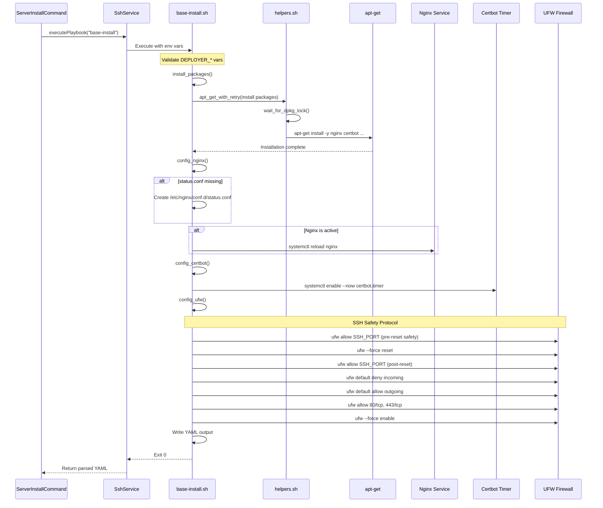

# Schematic: base-install.sh

> Auto-generated schematic. Last updated: 2025-12-27

## Recent Changes

- **2025-12-27**: Migrated from Caddy to Nginx+Certbot - now installs `nginx`, `certbot`, `python3-certbot-nginx` instead of `caddy`. Removed all Caddy configuration functions. Added `config_nginx()` to set up Nginx stub_status endpoint and `config_certbot()` to enable certbot.timer for auto-renewal.

## Overview

`base-install.sh` is the foundational server provisioning playbook that installs core infrastructure packages required for PHP application hosting. It installs Nginx web server, Certbot for SSL certificates, Git, Supervisor, UFW firewall, and other essential utilities, then configures Nginx's stub_status endpoint for metrics and UFW firewall with secure defaults.

## Logic Flow

### Entry Points

| Function | Purpose |
|----------|---------|
| `main()` | Primary entry point, orchestrates installation tasks |

### Execution Flow

1. **Environment Validation** (lines 22-26)
   - Validates required environment variables: `DEPLOYER_OUTPUT_FILE`, `DEPLOYER_DISTRO`, `DEPLOYER_PERMS`, `DEPLOYER_SSH_PORT`
   - Exports `DEPLOYER_PERMS` for use by helper functions

2. **Package Installation** (`install_packages()`)
   - Defines common packages: `curl`, `zip`, `unzip`, `nginx`, `git`, `rsync`, `ufw`, `jq`, `supervisor`, `certbot`, `python3-certbot-nginx`
   - Branches based on `DEPLOYER_DISTRO`:
     - **Ubuntu**: Adds `software-properties-common`
     - **Debian**: Adds `apt-transport-https`, `lsb-release`, `ca-certificates`
   - Uses `apt_get_with_retry` helper for robust package installation

3. **Nginx Configuration** (`config_nginx()`)
   - Creates `/etc/nginx/conf.d/status.conf` for stub_status endpoint
   - Configures status endpoint on `127.0.0.1:8080/nginx_status`
   - Restricts access to localhost only
   - Reloads Nginx if active

4. **Certbot Configuration** (`config_certbot()`)
   - Enables and starts `certbot.timer` for automatic certificate renewal
   - Timer runs twice daily to check for renewals

5. **UFW Firewall Configuration** (`config_ufw()`)
   - Follows SSH safety protocol to prevent lockout:
     1. Allow SSH port before any changes (in case UFW already active)
     2. Force reset UFW to clear existing rules
     3. Re-allow SSH immediately after reset
   - Sets default policies: deny incoming, allow outgoing
   - Allows ports: SSH (from `DEPLOYER_SSH_PORT`), 80/tcp, 443/tcp
   - Enables UFW with `--force` flag

6. **Output Generation**
   - Writes YAML output file with `status: success`

### Decision Points

| Condition | True Branch | False Branch |
|-----------|-------------|--------------|
| `$DEPLOYER_DISTRO` matches case | Ubuntu/Debian-specific packages | N/A (case match required) |
| `/etc/nginx/conf.d/status.conf` exists | Skip creation | Create status config |
| Nginx service active | Reload configuration | Skip reload |
| Certbot timer not enabled | Enable timer | Skip |

### Exit Conditions

| Condition | Exit Code | Message |
|-----------|-----------|---------|
| Missing `DEPLOYER_OUTPUT_FILE` | 1 | "Error: DEPLOYER_OUTPUT_FILE required" |
| Missing `DEPLOYER_DISTRO` | 1 | "Error: DEPLOYER_DISTRO required" |
| Missing `DEPLOYER_PERMS` | 1 | "Error: DEPLOYER_PERMS required" |
| Missing `DEPLOYER_SSH_PORT` | 1 | "Error: DEPLOYER_SSH_PORT required" |
| Package installation fails | 1 | "Error: Failed to install packages" |
| Nginx status config creation fails | 1 | "Error: Failed to create Nginx status config" |
| Certbot timer enable fails | 1 | "Error: Failed to enable certbot timer" |
| UFW reset fails | 1 | "Failed to reset UFW" |
| UFW SSH allow fails | 1 | "Failed to allow SSH port" |
| UFW incoming policy fails | 1 | "Failed to set incoming policy" |
| UFW outgoing policy fails | 1 | "Failed to set outgoing policy" |
| UFW port 80 allow fails | 1 | "Failed to allow port 80" |
| UFW port 443 allow fails | 1 | "Failed to allow port 443" |
| UFW enable fails | 1 | "Failed to enable UFW" |
| Output file write fails | 1 | "Error: Failed to write output file" |
| Success | 0 | YAML output with `status: success` |

## Interaction Diagram

```mermaid
flowchart TD
    subgraph Command["PHP Command Layer"]
        SIC[ServerInstallCommand]
        PT[PlaybooksTrait]
    end

    subgraph Playbook["base-install.sh"]
        main[main]
        install[install_packages]
        nginx[config_nginx]
        certbot[config_certbot]
        ufw[config_ufw]
    end

    subgraph Helpers["helpers.sh (inlined)"]
        run_cmd[run_cmd]
        apt_retry[apt_get_with_retry]
        wait_dpkg[wait_for_dpkg_lock]
        fail[fail]
    end

    subgraph System["System Services"]
        apt[apt-get]
        systemd[systemctl]
        NginxService[Nginx Service]
        CertbotTimer[Certbot Timer]
        UFWService[UFW Firewall]
    end

    subgraph Files["Configuration Files"]
        status_conf[/etc/nginx/conf.d/status.conf]
        sites[/etc/nginx/sites-available/*]
    end

    SIC -->|executePlaybook| PT
    PT -->|SSH + heredoc| main
    main --> install
    main --> nginx
    main --> certbot
    main --> ufw

    install --> apt_retry
    apt_retry --> wait_dpkg
    apt_retry --> run_cmd
    run_cmd --> apt

    nginx --> run_cmd
    nginx --> status_conf
    nginx --> systemd
    systemd --> NginxService

    certbot --> systemd
    systemd --> CertbotTimer

    ufw --> run_cmd
    ufw --> fail
    run_cmd --> UFWService
```

## Sequence Diagram



## Dependencies

### Direct Imports

| File/Module | Usage |
|-------------|-------|
| `helpers.sh` | Inlined at runtime by `PlaybooksTrait` - provides `run_cmd`, `apt_get_with_retry`, `wait_for_dpkg_lock` |

### Coupled Files

| File | Coupling Type | Description |
|------|---------------|-------------|
| `app/Console/Server/ServerInstallCommand.php` | Execution | Invokes this playbook as part of server installation |
| `app/Traits/PlaybooksTrait.php` | Execution | Handles SSH execution, helper inlining, and YAML parsing |
| `playbooks/helpers.sh` | Code | Helper functions inlined before execution |
| `playbooks/php-install.sh` | Config | Installs PHP-FPM with socket permissions for www-data |
| `playbooks/site-create.sh` | Config | Creates site configs in `/etc/nginx/sites-available/` |
| `.claude/rules/playbook.md` | Documentation | Lists guaranteed tools installed by this playbook |

## Data Flow

### Inputs

| Variable | Type | Source | Description |
|----------|------|--------|-------------|
| `DEPLOYER_OUTPUT_FILE` | string | PlaybooksTrait | Path for YAML output file |
| `DEPLOYER_DISTRO` | string | ServerDTO.info | Distribution: `ubuntu` or `debian` |
| `DEPLOYER_PERMS` | string | ServerDTO.info | Permission level: `root`, `sudo`, or `none` |
| `DEPLOYER_SSH_PORT` | string | ServerDTO.port | SSH port to allow through firewall |

### Outputs

| Field | Type | Description |
|-------|------|-------------|
| `status` | string | Always `success` on completion |

### Side Effects

| Effect | Location | Description |
|--------|----------|-------------|
| Package Installation | System | Installs: curl, zip, unzip, nginx, git, rsync, ufw, jq, supervisor, certbot, python3-certbot-nginx |
| Package Installation (Ubuntu) | System | Additional: software-properties-common |
| Package Installation (Debian) | System | Additional: apt-transport-https, lsb-release, ca-certificates |
| Config File | `/etc/nginx/conf.d/status.conf` | Creates Nginx stub_status endpoint config |
| Service Reload | Nginx | Reloads Nginx if already running |
| Timer Enable | Certbot | Enables certbot.timer for auto-renewal |
| Firewall Reset | UFW | Clears all existing firewall rules |
| Firewall Rules | UFW | Allows SSH port, 80/tcp, 443/tcp; denies other incoming |
| Firewall Enable | UFW | Enables UFW firewall |

## Notes

### Idempotency

The playbook is designed to be idempotent:

- Package installation via `apt-get install` is naturally idempotent
- `status.conf` creation checks for file existence before creating
- Nginx reload only occurs if service is active
- Certbot timer enable is idempotent (systemctl enable --now)
- UFW configuration uses `--force reset` to ensure consistent state regardless of prior configuration

### Guaranteed Tools

This playbook establishes the baseline of tools available to all subsequent playbooks. Per `.claude/rules/playbook.md`, these tools should NOT have existence checks in other playbooks:

- `jq` - JSON parsing
- `curl` - HTTP requests
- `rsync` - File synchronization
- `git` - Version control
- `supervisor` - Process management
- `nginx` - Web server
- `certbot` - SSL certificates
- `ufw` - Firewall management

### Nginx Configuration Structure

```
/etc/nginx/
├── nginx.conf                   # Main config (default from package)
├── conf.d/
│   └── status.conf              # stub_status endpoint on 127.0.0.1:8080
├── sites-available/
│   └── {domain}                 # Per-site configurations (created by site-create.sh)
└── sites-enabled/
    └── {domain} -> ../sites-available/{domain}  # Symlinks to enable sites
```

### Nginx Metrics Endpoint

The `status.conf` file configures Nginx stub_status:

```nginx
server {
    listen 127.0.0.1:8080;
    location /nginx_status {
        stub_status;
        allow 127.0.0.1;
        deny all;
    }
}
```

This endpoint is queried by `server-info.sh` to collect Nginx metrics (active connections, total requests, etc.).

### Certbot Auto-Renewal

Certbot timer runs twice daily to check for certificate renewals:

- Timer: `certbot.timer` (systemd)
- Service: `certbot.service` (runs `certbot renew`)
- Default renewal threshold: 30 days before expiry

### UFW Firewall Configuration

The `config_ufw()` function implements a SSH safety protocol to prevent lockout:

1. **Pre-reset SSH allow** - Allows SSH port before any changes (prevents lockout if UFW is already active)
2. **Force reset** - Clears all existing rules for a known clean state
3. **Immediate SSH re-allow** - Re-allows SSH immediately after reset
4. **Default policies** - Deny incoming, allow outgoing
5. **Web ports** - Allows 80/tcp and 443/tcp for HTTP/HTTPS
6. **Enable** - Activates the firewall with `--force` flag

The SSH port is provided via `DEPLOYER_SSH_PORT` environment variable to support non-standard SSH ports.

### Execution Order

Within `server:install`, this playbook runs second:

1. `package-list` - Gathers available packages
2. **`base-install`** - Installs core infrastructure
3. `php-install` - Installs PHP and extensions
4. `bun-install` - Installs Bun JavaScript runtime
5. `user-install` - Sets up deployer user
