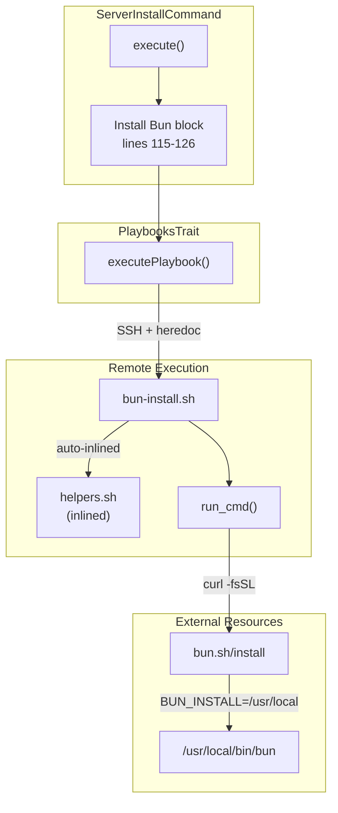
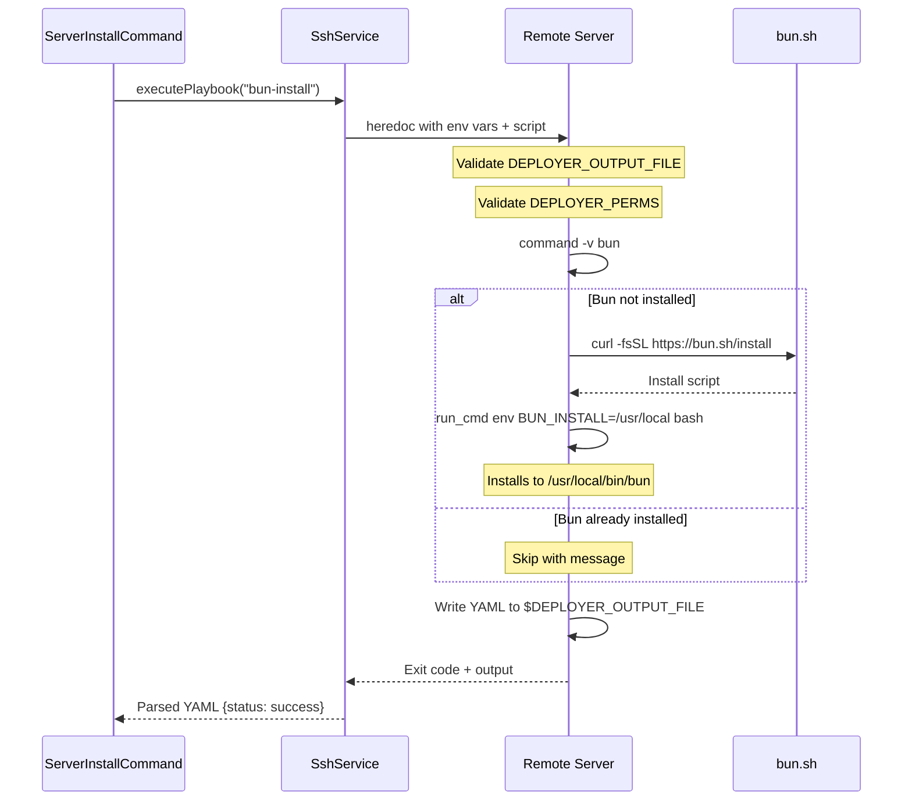

# Schematic: bun-install.sh

> Auto-generated schematic. Last updated: 2025-12-18

## Overview

`bun-install.sh` is an idempotent playbook that installs the Bun JavaScript runtime system-wide to `/usr/local`. It is called during server provisioning via `ServerInstallCommand` after base packages and PHP installation, providing Node.js alternative capabilities for JavaScript build tooling.

## Logic Flow

### Entry Points

| Function | Purpose |
|----------|---------|
| `main()` | Script entry point, orchestrates installation and output |

### Execution Flow

1. **Environment Validation** (lines 15-17)
   - Validates `DEPLOYER_OUTPUT_FILE` is set
   - Validates `DEPLOYER_PERMS` is set
   - Exports `DEPLOYER_PERMS` for helper functions

2. **Bun Existence Check** (line 27)
   - Checks if `bun` command already exists via `command -v`
   - Idempotent: skips installation if already present

3. **Bun Installation** (lines 30-35)
   - Downloads official install script from `https://bun.sh/install`
   - Executes with `BUN_INSTALL=/usr/local` for system-wide install
   - Uses `run_cmd` helper for permission handling (root/sudo)
   - Exits with error if installation fails

4. **YAML Output** (lines 38-44)
   - Writes success status to `$DEPLOYER_OUTPUT_FILE`
   - Exits with error if write fails

### Decision Points

| Location | Condition | Branch |
|----------|-----------|--------|
| Line 15 | `DEPLOYER_OUTPUT_FILE` empty | Exit 1 with error message |
| Line 16 | `DEPLOYER_PERMS` empty | Exit 1 with error message |
| Line 27 | `command -v bun` succeeds | Skip installation, print message |
| Line 32 | curl/install fails | Exit 1 with error message |
| Line 39 | YAML write fails | Exit 1 with error message |

### Exit Conditions

| Exit Code | Condition |
|-----------|-----------|
| 0 | Bun installed successfully or already present |
| 1 | Missing required environment variable |
| 1 | Installation script failed |
| 1 | Failed to write output file |

## Interaction Diagram



## Execution Sequence



## Dependencies

### Direct Imports

| File/Function | Usage |
|---------------|-------|
| `helpers.sh` | Auto-inlined by `PlaybooksTrait` for `run_cmd()` helper |

### Coupled Files

| File | Coupling Type | Description |
|------|---------------|-------------|
| `app/Console/Server/ServerInstallCommand.php` | Caller | Invokes this playbook during server installation |
| `app/Traits/PlaybooksTrait.php` | Infrastructure | Handles playbook execution, env injection, YAML parsing |
| `playbooks/helpers.sh` | Runtime | Provides `run_cmd()` for permission-aware execution |
| `playbooks/base-install.sh` | Sequence | Must run first to ensure `curl` is available |
| `scaffolds/hooks/1-building.sh` | Consumer | Uses installed `bun` for `bun install` and `bun run build` |

## Data Flow

### Inputs

| Source | Variable | Description |
|--------|----------|-------------|
| PlaybooksTrait | `DEPLOYER_OUTPUT_FILE` | Path for YAML output (always required) |
| PlaybooksTrait | `DEPLOYER_PERMS` | Permission level: `root` or `sudo` |
| External | `https://bun.sh/install` | Official Bun install script |

### Outputs

| Destination | Data | Description |
|-------------|------|-------------|
| `$DEPLOYER_OUTPUT_FILE` | YAML | Contains `status: success` |
| `/usr/local/bin/bun` | Binary | Bun executable (system-wide) |
| `/usr/local/lib/bun/` | Files | Bun installation directory |

### Side Effects

| Effect | Location | Description |
|--------|----------|-------------|
| Binary Install | `/usr/local/bin/bun` | Bun executable installed system-wide |
| Directory Creation | `/usr/local/lib/bun/` | Bun installation files |
| PATH Available | System | `bun` command available to all users |

## Environment Variables

| Variable | Required | Default | Description |
|----------|----------|---------|-------------|
| `DEPLOYER_OUTPUT_FILE` | Yes | - | Path for YAML output |
| `DEPLOYER_PERMS` | Yes | - | Permission level (`root`/`sudo`) |
| `BUN_INSTALL` | Set by script | `/usr/local` | Bun installation directory |

## Notes

### System-Wide Installation

Bun is installed to `/usr/local` (not user-local `~/.bun`) to ensure:

- Available to all users including `deployer`
- No PATH modifications needed
- Consistent across deployment hooks

### Idempotency

Script checks `command -v bun` before attempting installation. Re-running is safe:

- Already installed: prints message and continues
- Not installed: performs installation

### Upgrade Path

The script does not handle upgrades. Message indicates users should run `bun upgrade` manually when needed. This is intentional to avoid breaking production deployments with unexpected version changes.

### Installation Method

Uses official install script from `bun.sh`:

```bash
curl -fsSL https://bun.sh/install | run_cmd env BUN_INSTALL=/usr/local bash
```

The `run_cmd` helper handles permission elevation (sudo vs root) based on `DEPLOYER_PERMS`.

### Usage in Deployment

After installation, Bun is available in deployment hooks. The default `1-building.sh` scaffold uses:

```bash
bun install --frozen-lockfile
bun run build
```

### No Distribution Branching

Unlike many playbooks, `bun-install.sh` does not require `DEPLOYER_DISTRO` because:

- Bun's install script auto-detects the platform
- Installation method is identical across Ubuntu/Debian
