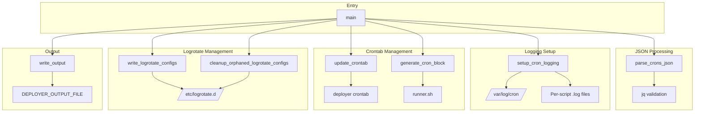
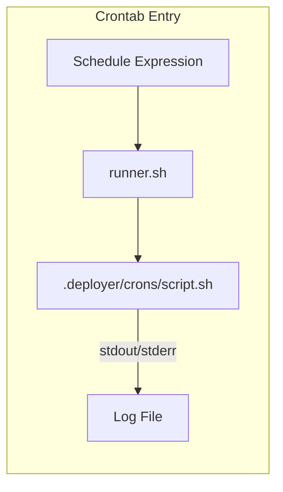
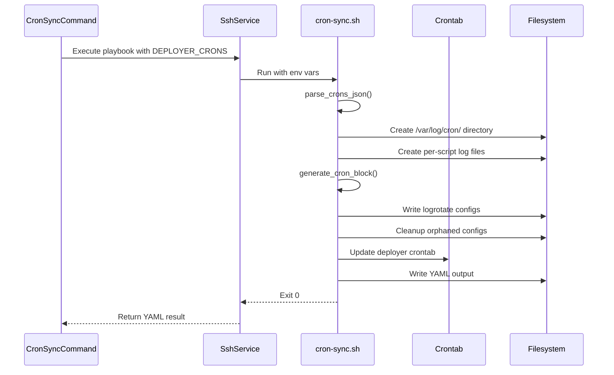

# Schematic: cron-sync.sh

> Auto-generated schematic. Last updated: 2025-12-19

## Overview

Synchronizes cron jobs from the deployer inventory to the `deployer` user's crontab on a remote server. Each cron script is configured to log to its own file under `/var/log/cron/`, with automatic logrotate configuration for log management. Uses the existing `runner.sh` created during site deployment.

## Logic Flow

### Entry Points

| Function | Purpose |
|----------|---------|
| `main()` | Primary entry point, orchestrates all sync operations |

### Execution Flow

1. **Environment Validation** (lines 17-22)
   - Validates required `DEPLOYER_*` environment variables
   - Exports `DEPLOYER_PERMS` for helper functions

2. **Path Configuration** (lines 27-31)
   - Sets `SITE_ROOT` to `/home/deployer/sites/${DEPLOYER_SITE_DOMAIN}`
   - Sets `SHARED_PATH` to `${SITE_ROOT}/shared`
   - Sets `CRON_LOG_DIR` to `/var/log/cron`
   - Sets `LOGROTATE_DIR` to `/etc/logrotate.d`

3. **JSON Parsing** (`parse_crons_json`, lines 48-65)
   - Validates `DEPLOYER_CRONS` JSON structure using `jq`
   - Extracts cron count and builds parallel arrays:
     - `SCRIPT_NAMES[]`: Full script names (e.g., `scheduler.sh`)
     - `SCRIPT_BASES[]`: Script names without `.sh` extension

4. **Conditional Setup** (lines 290-294)
   - If crons exist (`CRON_COUNT > 0`):
     - Setup logging directories and files
     - Generate crontab block
     - Write logrotate configurations

5. **Orphan Cleanup** (`cleanup_orphaned_logrotate_configs`, lines 230-263)
   - Always runs, even with zero crons
   - Removes logrotate configs for scripts no longer in inventory

6. **Crontab Update** (`update_crontab`, lines 112-160)
   - Removes existing cron block for this domain (using markers)
   - Appends new cron block if crons exist
   - Handles empty crontab case (removes entirely)

7. **Output** (`write_output`, lines 272-280)
   - Writes YAML status to `DEPLOYER_OUTPUT_FILE`

### Decision Points

| Location | Condition | True Branch | False Branch |
|----------|-----------|-------------|--------------|
| Line 49-52 | Invalid JSON | Exit with error | Continue parsing |
| Line 139 | `CRON_COUNT > 0` | Append new block | Skip (results in empty/removal) |
| Line 151-159 | Updated crontab non-empty | Write to crontab | Remove crontab entirely |
| Line 194 | `CRON_COUNT == 0` | Skip logrotate config | Write configs |

### Exit Conditions

| Exit Code | Condition | Location |
|-----------|-----------|----------|
| 1 | Missing `DEPLOYER_OUTPUT_FILE` | Line 17 |
| 1 | Missing `DEPLOYER_DISTRO` | Line 18 |
| 1 | Missing `DEPLOYER_PERMS` | Line 19 |
| 1 | Missing `DEPLOYER_SITE_DOMAIN` | Line 20 |
| 1 | Missing `DEPLOYER_CRONS` | Line 21 |
| 1 | Invalid JSON in `DEPLOYER_CRONS` | Line 51 |
| 1 | Failed to create logs directory | Line 121 |
| 1 | Failed to update crontab | Line 153 |
| 1 | Failed to write logrotate config | Line 219 |
| 1 | Failed to write output file | Line 278 |
| 0 | Successful sync | End of `main()` |

## Interaction Diagram



### Crontab Structure Diagram



### Execution Context Diagram



## Dependencies

### Direct Imports

| File/Module | Usage |
|-------------|-------|
| `helpers.sh` | Provides `run_cmd`, `fail` helpers (inlined at execution) |
| `jq` | JSON parsing and validation |
| `awk` | Crontab section removal |
| `sed` | Trailing blank line removal |
| `crontab` | System crontab management |
| `tee` | Writing logrotate configs |
| `find` | Locating orphaned configs |

### Coupled Files

| File | Coupling Type | Description |
|------|---------------|-------------|
| `playbooks/site-deploy.sh` | Data | Creates `runner.sh` that cron entries invoke |
| `playbooks/helpers.sh` | Code | Provides `run_cmd`, `fail` helpers |
| `app/Console/Cron/CronSyncCommand.php` | Caller | PHP command that invokes this playbook |
| `app/DTOs/CronDTO.php` | Data | Defines cron structure (script, schedule) |
| `app/Traits/PlaybooksTrait.php` | Integration | Handles playbook execution and env var injection |

## Data Flow

### Inputs

| Variable | Source | Format | Example |
|----------|--------|--------|---------|
| `DEPLOYER_OUTPUT_FILE` | PlaybooksTrait | File path | `/tmp/deployer-output-xxx.yml` |
| `DEPLOYER_DISTRO` | Server info | String | `ubuntu`, `debian` |
| `DEPLOYER_PERMS` | Server info | String | `root`, `sudo`, `none` |
| `DEPLOYER_SITE_DOMAIN` | SiteDTO | Domain string | `example.com` |
| `DEPLOYER_CRONS` | CronDTO array | JSON array | `[{"script":"scheduler.sh","schedule":"* * * * *"}]` |

### Outputs

| Output | Location | Format |
|--------|----------|--------|
| YAML status | `$DEPLOYER_OUTPUT_FILE` | `status: success\ncrons_synced: N` |
| Crontab entries | `deployer` user crontab | Standard cron format |
| Log files | `/var/log/cron/{domain}-{script}.log` | Empty files with proper ownership |
| Logrotate configs | `/etc/logrotate.d/cron-{domain}-{script}.conf` | Logrotate config format |

### Side Effects

| Effect | Location | Condition |
|--------|----------|-----------|
| Creates directory | `/var/log/cron/` | If not exists |
| Creates directory | `/home/deployer/sites/{domain}/shared/logs` | If not exists |
| Creates files | `/var/log/cron/{domain}-{script}.log` | Per cron script |
| Writes files | `/etc/logrotate.d/cron-{domain}-{script}.conf` | Per cron script |
| Removes files | `/etc/logrotate.d/cron-{domain}-*.conf` | Orphaned configs |
| Modifies crontab | `deployer` user crontab | Always (add/update/remove) |

## Crontab Block Format

The playbook manages cron entries using domain-specific markers:

```
# DEPLOYER-CRON-START example.com
* * * * * /home/deployer/sites/example.com/runner.sh .deployer/crons/scheduler.sh >> /var/log/cron/example.com-scheduler.log 2>&1
0 * * * * /home/deployer/sites/example.com/runner.sh .deployer/crons/hourly.sh >> /var/log/cron/example.com-hourly.log 2>&1
# DEPLOYER-CRON-END example.com
```

### Marker-Based Management

- `START_MARKER`: `# DEPLOYER-CRON-START {domain}`
- `END_MARKER`: `# DEPLOYER-CRON-END {domain}`
- AWK removes everything between markers (inclusive) before adding new block
- Allows multiple domains to coexist in same crontab

## Logrotate Configuration

Per-script logrotate configs use these settings:

| Setting | Value | Purpose |
|---------|-------|---------|
| `daily` | - | Rotate daily |
| `rotate 5` | 5 | Keep 5 rotated files |
| `maxage 30` | 30 days | Remove logs older than 30 days |
| `missingok` | - | Don't error if log missing |
| `notifempty` | - | Don't rotate empty logs |
| `compress` | - | Gzip rotated logs |
| `delaycompress` | - | Compress on next rotation |
| `copytruncate` | - | Truncate in place (cron keeps handle) |
| `su deployer deployer` | - | Run as deployer user |

## Notes

### runner.sh Dependency

This playbook requires `runner.sh` to exist at `/home/deployer/sites/{domain}/runner.sh`. This file is created by `site-deploy.sh` and provides:

- Hard-coded environment variables for the current release
- Security validation (no absolute paths, no `..` traversal)
- Path resolution within current release only
- Automatic chmod +x before execution
- PHP binary path configured during deployment

### Idempotency

The playbook is fully idempotent:

- Log directories: Creates only if not exists
- Log files: Creates only if not exists, always sets ownership/permissions
- Logrotate configs: Overwrites existing configs
- Crontab: Removes existing block before adding new one
- Orphan cleanup: Safe to run with empty cron list

### Zero-Cron Handling

When `DEPLOYER_CRONS` contains an empty array:

- Skips logging setup and cron block generation
- Still runs orphan cleanup (removes all configs for domain)
- Crontab update removes domain's section entirely
- If crontab becomes empty, removes it entirely with `crontab -r`

### Security Considerations

- Cron scripts are executed via `runner.sh`, not directly
- `runner.sh` validates paths are relative and within current release
- Log files owned by `deployer:deployer` with 644 permissions
- Logrotate runs as `deployer` user via `su` directive
