# Schematic: helpers.sh

> Auto-generated schematic. Last updated: 2025-12-18

## Overview

`helpers.sh` is a shared bash library providing common utility functions for all playbooks in the deployer system. It is not executed directly but is automatically inlined into playbooks at runtime by `PlaybooksTrait.php`. The library provides permission management, error handling, PHP detection, package management with retry logic, network service detection, and shared resource linking.

## Logic Flow

### Entry Points

This file has no entry points as it is a library of functions. Functions are called by playbooks after the library content is inlined.

| Function | Purpose | Called By |
|----------|---------|-----------|
| `run_cmd()` | Execute command with root/sudo permissions | Most playbooks (18 files) |
| `run_as_deployer()` | Execute as deployer user with env preservation | site-deploy.sh, site-create.sh, and others |
| `fail()` | Print error and exit | site-deploy.sh, server-firewall.sh, supervisor-sync.sh |
| `detect_php_default()` | Detect system default PHP version | server-info.sh |
| `wait_for_dpkg_lock()` | Wait for dpkg lock release | apt_get_with_retry() |
| `apt_get_with_retry()` | apt-get with automatic lock retry | base-install.sh, php-install.sh, mysql-install.sh |
| `get_listening_services()` | Get port:process pairs of listening services | server-info.sh |
| `link_shared_resources()` | Symlink shared resources to release | site-deploy.sh |

### Execution Flow

#### Permission Management Flow (`run_cmd`, `run_as_deployer`)

```
1. Check DEPLOYER_PERMS environment variable
2. If 'root': Execute command directly
3. If 'sudo': Execute via sudo -n (non-interactive)
4. If 'none': Execute command directly (both functions)
```

#### Package Lock Retry Flow (`apt_get_with_retry`)

```
1. Attempt apt-get command (max 5 attempts)
2. If successful, return 0
3. If lock error detected in output:
   a. Wait (10s, then +5s per retry)
   b. Call wait_for_dpkg_lock()
   c. Retry command
4. If non-lock error, fail immediately
5. After max attempts, return failure
```

#### PHP Detection Flow (`detect_php_default`)

```
1. Check if update-alternatives available
2. If yes: Query php alternative, extract version (e.g., "8.4")
3. If no/fails: Check /usr/bin/php directly
4. Return version string or empty
```

### Decision Points

| Function | Condition | True Path | False Path |
|----------|-----------|-----------|------------|
| `run_cmd` | `DEPLOYER_PERMS == 'root'` | Execute directly | Check sudo/none |
| `run_cmd` | `DEPLOYER_PERMS == 'sudo'` | Use `sudo -n` | Execute directly (none) |
| `run_as_deployer` | `DEPLOYER_PERMS == 'root'\|'sudo'` | Use `sudo -n -u deployer` | Execute directly |
| `wait_for_dpkg_lock` | Lock files in use | Wait 2s, increment counter | Return 0 (success) |
| `apt_get_with_retry` | Lock error in output | Retry with backoff | Fail immediately |
| `get_listening_services` | `ss` available | Use ss | Use netstat fallback |
| `link_shared_resources` | `SHARED_PATH` exists | Link items | Return 0 |

### Exit Conditions

| Function | Exit Condition | Exit Code |
|----------|----------------|-----------|
| `fail()` | Always | 1 |
| `wait_for_dpkg_lock()` | Timeout (60s) | 1 |
| `apt_get_with_retry()` | Max attempts or non-lock error | Command exit code |

## Interaction Diagram

```mermaid
flowchart TD
    subgraph "Runtime Inlining"
        PT[PlaybooksTrait.php]
        H[helpers.sh]
        PB[Playbook Script]
        PT -->|"prepends content"| H
        H -->|"inlined into"| PB
    end

    subgraph "Permission Functions"
        RC[run_cmd]
        RAD[run_as_deployer]
        DP[DEPLOYER_PERMS env]
        DP --> RC
        DP --> RAD
    end

    subgraph "Package Management"
        AGWR[apt_get_with_retry]
        WDL[wait_for_dpkg_lock]
        AGWR -->|"on lock error"| WDL
        WDL -->|"lock released"| AGWR
    end

    subgraph "System Detection"
        DPD[detect_php_default]
        GLS[get_listening_services]
        UA[update-alternatives]
        SS[ss/netstat]
        DPD --> UA
        GLS --> SS
    end

    subgraph "Deployment"
        LSR[link_shared_resources]
        SP[SHARED_PATH]
        RP[RELEASE_PATH]
        LSR --> SP
        LSR --> RP
    end
```



## Dependencies

### Direct Imports

| File/Module | Usage |
|-------------|-------|
| None | This is a standalone bash library with no imports |

### Coupled Files

| File | Coupling Type | Description |
|------|---------------|-------------|
| `app/Traits/PlaybooksTrait.php` | Code | Prepends helpers.sh content to playbooks at runtime (lines 100-105) |
| `playbooks/*.sh` (all 18 files) | Code | All playbooks reference the commented source line for inlining |
| `DEPLOYER_PERMS` | Environment | Controls permission escalation behavior in run_cmd/run_as_deployer |
| `DEPLOYER_OUTPUT_FILE` | Environment | Not used directly but expected by consuming playbooks |
| `SHARED_PATH` | Environment | Required by link_shared_resources() |
| `RELEASE_PATH` | Environment | Required by link_shared_resources() |
| `PRESERVE_ENV_VARS` | Environment | Used by run_as_deployer() for sudo --preserve-env |
| `/var/lib/dpkg/lock-frontend` | State | Lock file checked by wait_for_dpkg_lock() |
| `/var/lib/dpkg/lock` | State | Lock file checked by wait_for_dpkg_lock() |
| `/var/lib/apt/lists/lock` | State | Lock file checked by wait_for_dpkg_lock() |
| `/usr/bin/php*` | Data | PHP binaries queried by detect_php_default() |

## Data Flow

### Inputs

| Input | Source | Used By |
|-------|--------|---------|
| `DEPLOYER_PERMS` | Environment (set by PlaybooksTrait) | `run_cmd()`, `run_as_deployer()` |
| `PRESERVE_ENV_VARS` | Environment (set by consuming playbook) | `run_as_deployer()` |
| `SHARED_PATH` | Environment (set by consuming playbook) | `link_shared_resources()` |
| `RELEASE_PATH` | Environment (set by consuming playbook) | `link_shared_resources()` |
| Command arguments | Function parameters | All functions |

### Outputs

| Output | Destination | Producer |
|--------|-------------|----------|
| PHP version string (e.g., "8.4") | stdout | `detect_php_default()` |
| port:process pairs | stdout | `get_listening_services()` |
| Error messages | stderr | `fail()`, `wait_for_dpkg_lock()`, `apt_get_with_retry()` |
| apt-get output | stdout | `apt_get_with_retry()` |

### Side Effects

| Function | Side Effect |
|----------|-------------|
| `run_cmd()` | Executes arbitrary commands with elevated privileges |
| `run_as_deployer()` | Executes commands as deployer user |
| `fail()` | Terminates script with exit code 1 |
| `wait_for_dpkg_lock()` | Blocks execution up to 60 seconds |
| `apt_get_with_retry()` | May modify system packages |
| `link_shared_resources()` | Creates/removes symlinks in RELEASE_PATH |

## Function Reference

### Permission Management

```bash
# Execute with appropriate permissions (root or sudo)
run_cmd <command> [args...]

# Execute as deployer user with environment preservation
run_as_deployer <command> [args...]
```

### Error Handling

```bash
# Print error message and exit with code 1
fail "Error message"
```

### PHP Detection

```bash
# Returns PHP version string (e.g., "8.4") or empty
php_version=$(detect_php_default)
```

### Package Management

```bash
# Wait for dpkg lock (max 60s), returns 0 on success, 1 on timeout
wait_for_dpkg_lock

# apt-get with automatic retry on lock (max 5 attempts)
apt_get_with_retry install -y -q package-name
```

### Network Services

```bash
# Output: "port:process" lines, sorted and deduplicated
get_listening_services
# Example output:
#   22:sshd
#   80:caddy
#   443:caddy
```

### Deployment Resources

```bash
# Requires: SHARED_PATH, RELEASE_PATH environment variables
link_shared_resources
```

## Notes

### Inlining Mechanism

The file is never sourced at runtime. Instead, `PlaybooksTrait.php` reads this file and prepends its contents to each playbook script before remote execution:

```php
// From PlaybooksTrait.php (lines 100-105)
$helpersPath = $projectRoot . '/playbooks/helpers.sh';
if (file_exists($helpersPath)) {
    $helpersContents = $this->fs->readFile($helpersPath);
    $scriptContents = $helpersContents . "\n\n" . $scriptContents;
}
```

### Permission Escalation Security

- `run_cmd()` uses `sudo -n` (non-interactive) when `DEPLOYER_PERMS='sudo'`
- `run_as_deployer()` preserves specific environment variables via `PRESERVE_ENV_VARS`
- When `DEPLOYER_PERMS='root'` or `'none'`, commands execute directly without sudo

### Lock Retry Strategy

The `apt_get_with_retry()` function implements exponential backoff:

- Initial wait: 10 seconds
- Each retry adds 5 seconds (10s, 15s, 20s, 25s, 30s)
- Maximum 5 attempts before failure
- Only retries on lock-related errors, fails fast on other errors

### get_listening_services() Output Format

Returns sorted, deduplicated lines in `port:process` format. Uses `ss -tlnp` as primary method with `netstat -tlnp` as fallback for older systems.

### Playbooks Using Each Function

| Function | Playbook Usage Count |
|----------|---------------------|
| `run_cmd` | 18 (all playbooks) |
| `run_as_deployer` | 5 (site-deploy, site-create, site-delete, supervisor-sync, bun-install) |
| `fail` | 4 (site-deploy, server-firewall, supervisor-sync, cron-sync) |
| `detect_php_default` | 1 (server-info) |
| `apt_get_with_retry` | 6 (base-install, php-install, mysql-install, mariadb-install, bun-install, user-install) |
| `get_listening_services` | 1 (server-info) |
| `link_shared_resources` | 1 (site-deploy) |
