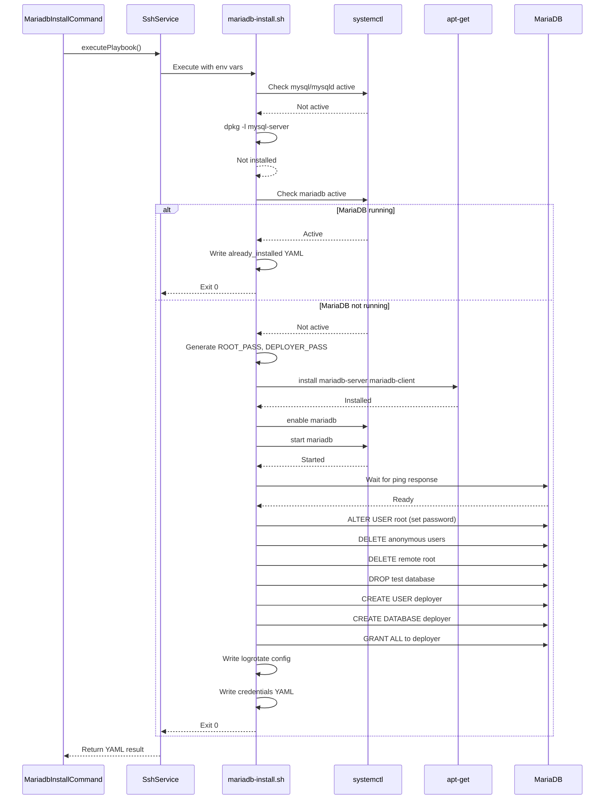

# Schematic: mariadb-install.sh

> Auto-generated schematic. Last updated: 2025-12-18

## Overview

This playbook installs MariaDB server on Ubuntu/Debian systems, secures the installation, creates a `deployer` database user and database, and configures log rotation. It checks for MySQL conflicts before installation and handles idempotent re-runs gracefully.

## Logic Flow

### Entry Points

| Function | Purpose |
|----------|---------|
| `main()` | Primary entry point, orchestrates all installation tasks |

### Execution Flow

```
main()
├── 1. check_mysql_conflict()     # Ensure MySQL not installed (port 3306 conflict)
├── 2. Check if MariaDB already running
│   └── If yes: Write success YAML with already_installed: true, exit 0
├── 3. Generate credentials
│   ├── ROOT_PASS via openssl rand -base64 24
│   └── DEPLOYER_PASS via openssl rand -base64 24
├── 4. install_packages()         # Install mariadb-server, mariadb-client
├── 5. secure_installation()      # Set root password, remove anonymous users
├── 6. create_deployer_user()     # Create deployer@localhost user
├── 7. create_deployer_database() # Create deployer database with grants
├── 8. config_logrotate()         # Configure /etc/logrotate.d/mariadb-deployer
└── 9. Write output YAML with credentials
```

### Decision Points

| Location | Condition | True Branch | False Branch |
|----------|-----------|-------------|--------------|
| `check_mysql_conflict()` | MySQL service running | Exit with error | Continue |
| `check_mysql_conflict()` | mysql-server package installed | Exit with error | Continue |
| `main()` | MariaDB already active | Write already_installed YAML, exit 0 | Proceed with installation |
| `install_packages()` | Service not enabled | Enable service | Skip enable |
| `install_packages()` | Service not active | Start service | Skip start |
| `create_deployer_user()` | User exists | Skip creation | Create user |
| `create_deployer_database()` | Database exists | Ensure grants only | Create database + grants |

### Exit Conditions

| Exit Code | Condition |
|-----------|-----------|
| 0 | MariaDB already installed (idempotent success) |
| 0 | Fresh installation completed successfully |
| 1 | Missing required environment variable |
| 1 | MySQL conflict detected |
| 1 | Package installation failure |
| 1 | Service enable/start failure |
| 1 | MariaDB not accepting connections after timeout |
| 1 | Root password configuration failure |
| 1 | User creation failure |
| 1 | Database creation failure |
| 1 | Privilege grant failure |
| 1 | Logrotate config write failure |
| 1 | Output file write failure |

## Interaction Diagram

```mermaid
flowchart TD
    subgraph Input["Environment Variables"]
        ENV_OUTPUT[DEPLOYER_OUTPUT_FILE]
        ENV_DISTRO[DEPLOYER_DISTRO]
        ENV_PERMS[DEPLOYER_PERMS]
    end

    subgraph Playbook["mariadb-install.sh"]
        MAIN[main]
        CHECK_MYSQL[check_mysql_conflict]
        INSTALL[install_packages]
        SECURE[secure_installation]
        CREATE_USER[create_deployer_user]
        CREATE_DB[create_deployer_database]
        LOGROTATE[config_logrotate]
    end

    subgraph SystemServices["System Services"]
        SYSTEMCTL[systemctl]
        MARIADB_SVC[mariadb.service]
        MYSQL_SVC[mysql.service]
    end

    subgraph PackageManager["Package Manager"]
        APT[apt-get]
        DPKG[dpkg]
    end

    subgraph MariaDB["MariaDB Server"]
        MARIADB_CLI[mariadb CLI]
        MARIADB_ADMIN[mariadb-admin]
        MYSQL_DB[(mysql database)]
    end

    subgraph FileSystem["File System"]
        LOGROTATE_CONF[/etc/logrotate.d/mariadb-deployer]
        OUTPUT_FILE[DEPLOYER_OUTPUT_FILE]
    end

    subgraph Helpers["helpers.sh (inlined)"]
        RUN_CMD[run_cmd]
        APT_RETRY[apt_get_with_retry]
    end

    ENV_OUTPUT --> MAIN
    ENV_DISTRO --> MAIN
    ENV_PERMS --> MAIN

    MAIN --> CHECK_MYSQL
    CHECK_MYSQL --> SYSTEMCTL
    SYSTEMCTL --> MYSQL_SVC
    CHECK_MYSQL --> DPKG

    MAIN --> INSTALL
    INSTALL --> APT_RETRY
    APT_RETRY --> APT
    INSTALL --> SYSTEMCTL
    SYSTEMCTL --> MARIADB_SVC
    INSTALL --> MARIADB_ADMIN

    MAIN --> SECURE
    SECURE --> RUN_CMD
    RUN_CMD --> MARIADB_CLI
    MARIADB_CLI --> MYSQL_DB

    MAIN --> CREATE_USER
    CREATE_USER --> RUN_CMD
    CREATE_USER --> MARIADB_CLI

    MAIN --> CREATE_DB
    CREATE_DB --> RUN_CMD
    CREATE_DB --> MARIADB_CLI

    MAIN --> LOGROTATE
    LOGROTATE --> RUN_CMD
    RUN_CMD --> LOGROTATE_CONF

    MAIN --> OUTPUT_FILE
```

## Dependencies

### Direct Imports

| File/Module | Usage |
|-------------|-------|
| `helpers.sh` | Inlined at runtime by PHP; provides `run_cmd`, `apt_get_with_retry` |

### Coupled Files

| File | Coupling Type | Description |
|------|---------------|-------------|
| `playbooks/mysql-install.sh` | Conflict | Both use port 3306; mutual exclusion enforced |
| `playbooks/mariadb-service.sh` | Service | Controls the same `mariadb.service` systemd unit |
| `app/Console/Mariadb/MariadbInstallCommand.php` | Orchestration | PHP command that invokes this playbook via SSH |
| `app/Traits/PlaybooksTrait.php` | Execution | Handles playbook execution, helper inlining, and YAML parsing |
| `/etc/logrotate.d/mariadb-deployer` | Config | Created by this playbook for log rotation |
| `/var/log/mysql/*.log` | Log | Log files managed by the logrotate config |

## Data Flow

### Inputs

| Variable | Source | Required | Description |
|----------|--------|----------|-------------|
| `DEPLOYER_OUTPUT_FILE` | PlaybooksTrait | Yes | Path for YAML output |
| `DEPLOYER_DISTRO` | Server info | Yes | Distribution: ubuntu or debian |
| `DEPLOYER_PERMS` | Server info | Yes | Permission mode: root, sudo, or none |

### Outputs

**Fresh Installation:**

```yaml
status: success
root_pass: <base64-generated-password>
deployer_user: deployer
deployer_pass: <base64-generated-password>
deployer_database: deployer
```

**Already Installed:**

```yaml
status: success
already_installed: true
```

### Side Effects

| Action | Target | Description |
|--------|--------|-------------|
| Package install | APT | Installs `mariadb-server`, `mariadb-client` packages |
| Service enable | systemd | Enables `mariadb.service` to start on boot |
| Service start | systemd | Starts MariaDB server |
| Database modification | mysql.user | Sets root password, removes anonymous users, removes remote root |
| Database modification | mysql.db | Removes test database entries |
| User creation | mysql.user | Creates `deployer@localhost` user |
| Database creation | MariaDB | Creates `deployer` database with utf8mb4 |
| File write | `/etc/logrotate.d/mariadb-deployer` | Creates logrotate configuration |
| File write | `DEPLOYER_OUTPUT_FILE` | Writes YAML result |

## Sequence Diagram



## Security Considerations

1. **Credential Generation**: Uses `openssl rand -base64 24` for cryptographically secure passwords
2. **Password Protection**: Uses heredoc and `MYSQL_PWD` env var to avoid exposing passwords in process listings
3. **Root Access**: Preserves socket authentication for local root, adds password auth for remote tools
4. **Security Hardening**: Removes anonymous users, remote root access, and test database (equivalent to `mysql_secure_installation`)
5. **Local-only User**: Deployer user is restricted to localhost connections only

## Notes

- The playbook is idempotent: re-running on a server with MariaDB already installed returns `already_installed: true` without making changes
- MySQL and MariaDB are mutually exclusive due to port 3306 conflict; the playbook checks for MySQL presence first
- The `deployer` user and database are created with utf8mb4 character set for full Unicode support
- Logrotate is configured with `copytruncate` to avoid service disruption during log rotation
- Connection verification uses a 30-second timeout with polling before declaring installation complete
- Helper functions (`run_cmd`, `apt_get_with_retry`) are inlined from `helpers.sh` at execution time by `PlaybooksTrait`
