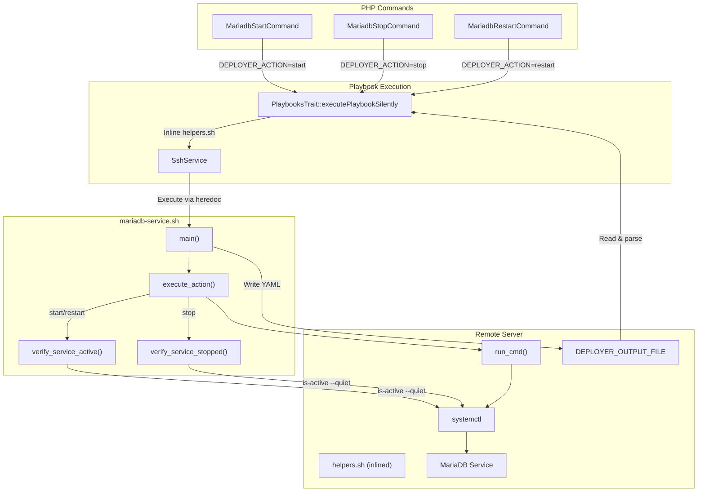
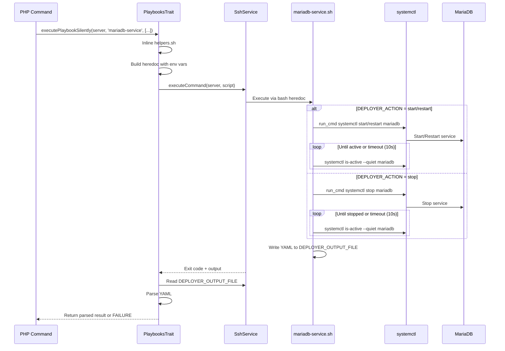

# Schematic: mariadb-service.sh

> Auto-generated schematic. Last updated: 2025-12-18

## Overview

Remote bash playbook that controls the MariaDB service lifecycle (start/stop/restart) via systemctl on Ubuntu/Debian servers. Invoked by PHP commands through SSH to manage database service state with verification polling.

## Logic Flow

### Entry Points

| Entry Point | Description |
|-------------|-------------|
| `main()` | Single entry point, called at script end with `main "$@"` |

### Execution Flow

1. **Environment Validation** (lines 15-19)
   - Validate required environment variables: `DEPLOYER_OUTPUT_FILE`, `DEPLOYER_DISTRO`, `DEPLOYER_PERMS`, `DEPLOYER_ACTION`
   - Export `DEPLOYER_PERMS` for use by helper functions
   - Exit with code 1 if any required variable is missing

2. **Main Execution** (lines 98-107)
   - Call `execute_action()` to perform the requested service operation
   - Write success status to YAML output file

3. **Action Dispatch** (lines 33-56)
   - Route based on `DEPLOYER_ACTION` value:
     - `start` or `restart`: Execute systemctl command, then verify service is active
     - `stop`: Execute systemctl stop, then verify service is stopped
     - Any other value: Exit with error

4. **Service Verification** (lines 61-92)
   - Poll service state using `systemctl is-active`
   - Wait up to 10 seconds with 1-second intervals
   - Fail if state change doesn't complete within timeout

### Decision Points

| Location | Condition | True Branch | False Branch |
|----------|-----------|-------------|--------------|
| Line 34 | `$DEPLOYER_ACTION` is `start` or `restart` | Run systemctl action, verify active | Check next case |
| Line 43 | `$DEPLOYER_ACTION` is `stop` | Run systemctl stop, verify stopped | Check next case |
| Line 51 | `$DEPLOYER_ACTION` is other | Exit with invalid action error | N/A |
| Line 37, 45 | `run_cmd` fails | Print error, exit 1 | Continue to verification |
| Line 67, 84 | Waited >= max_wait (10s) | Print timeout error, exit 1 | Sleep and retry |

### Exit Conditions

| Exit Code | Condition | Location |
|-----------|-----------|----------|
| 1 | Missing `DEPLOYER_OUTPUT_FILE` | Line 15 |
| 1 | Missing `DEPLOYER_DISTRO` | Line 16 |
| 1 | Missing `DEPLOYER_PERMS` | Line 17 |
| 1 | Missing `DEPLOYER_ACTION` | Line 18 |
| 1 | Invalid action value | Line 53 |
| 1 | systemctl command fails | Lines 38-39, 46-47 |
| 1 | Service verification timeout | Lines 68-69, 85-86 |
| 1 | Failed to write output file | Lines 104-105 |
| 0 | Success (implicit at end of main) | Line 107 |

## Interaction Diagram

### Action Flow Sequence

## Dependencies

### Direct Imports

| File/Module | Usage |
|-------------|-------|
| `helpers.sh` | Provides `run_cmd()` for permission-aware command execution (auto-inlined by PlaybooksTrait) |

### Coupled Files

| File | Coupling Type | Description |
|------|---------------|-------------|
| `app/Console/Mariadb/MariadbStartCommand.php` | Command | Invokes with `DEPLOYER_ACTION=start` |
| `app/Console/Mariadb/MariadbStopCommand.php` | Command | Invokes with `DEPLOYER_ACTION=stop` |
| `app/Console/Mariadb/MariadbRestartCommand.php` | Command | Invokes with `DEPLOYER_ACTION=restart` |
| `app/Traits/PlaybooksTrait.php` | Execution | Handles SSH execution, env var injection, YAML parsing |
| `playbooks/helpers.sh` | Runtime | `run_cmd()` helper inlined at execution time |
| `playbooks/mysql-service.sh` | Pattern | Parallel implementation for MySQL (identical structure) |

## Data Flow

### Inputs

| Variable | Source | Description |
|----------|--------|-------------|
| `DEPLOYER_OUTPUT_FILE` | PlaybooksTrait | Temp file path for YAML output (e.g., `/tmp/deployer-output-*.yml`) |
| `DEPLOYER_DISTRO` | Server info | Distribution: `ubuntu` or `debian` |
| `DEPLOYER_PERMS` | Server info | Permission level: `root`, `sudo`, or `none` |
| `DEPLOYER_ACTION` | PHP Command | Action to perform: `start`, `stop`, or `restart` |

### Outputs

| Output | Destination | Format |
|--------|-------------|--------|
| `DEPLOYER_OUTPUT_FILE` | PlaybooksTrait reads via SSH | YAML with `status: success` |
| stdout | SSH stream (captured) | Progress messages prefixed with `->` |
| stderr | SSH stream (captured) | Error messages |
| Exit code | SSH result | 0 for success, 1 for failure |

### Side Effects

| Effect | Description |
|--------|-------------|
| Service state change | MariaDB service started, stopped, or restarted via systemctl |
| Process signals | systemctl sends appropriate signals to MariaDB daemon |
| Temp file creation | Output YAML written to `/tmp/deployer-output-*.yml` (cleaned up by PlaybooksTrait) |

## Notes

### Helper Function Usage

The script uses `run_cmd` from `helpers.sh` which adapts command execution based on `DEPLOYER_PERMS`:

- `root`: Execute command directly
- `sudo`: Prefix with `sudo -n` (non-interactive)
- `none`: Execute directly (assumes deployer user has permissions)

### Verification Timeout

Both `verify_service_active()` and `verify_service_stopped()` use identical polling logic:

- Max wait: 10 seconds
- Poll interval: 1 second
- Uses `systemctl is-active --quiet` which returns 0 if active, non-zero otherwise

### Idempotency

The script is idempotent - running start on an already-running service or stop on an already-stopped service will succeed (systemctl handles this gracefully). The verification step confirms the desired end state.

### Error Handling

- Environment validation fails fast before any work
- Each systemctl operation has explicit error checking
- Verification timeout provides clear failure mode
- Output file write has error handling with stderr message

### Comparison with mysql-service.sh

This playbook shares identical structure with `mysql-service.sh`, differing only in the service name (`mariadb` vs `mysqld`). Both handle the same three actions with the same verification logic.
